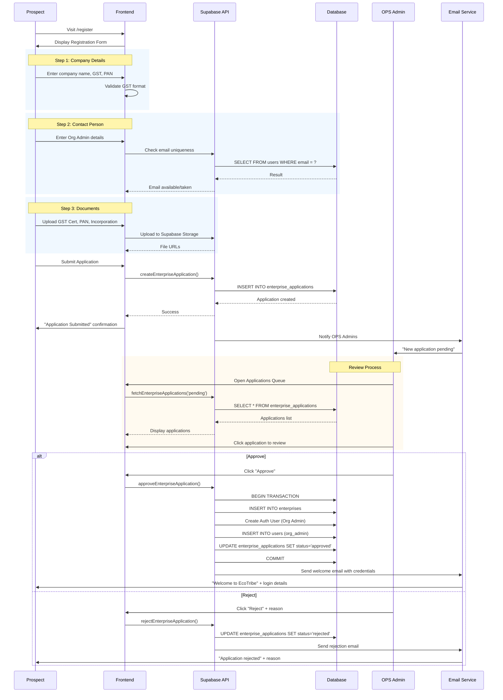
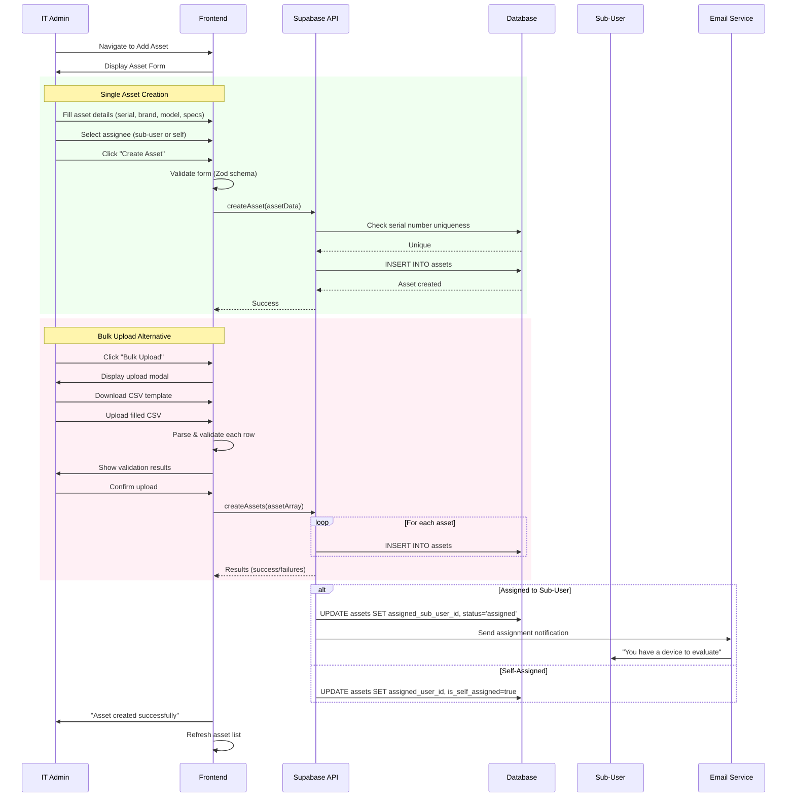
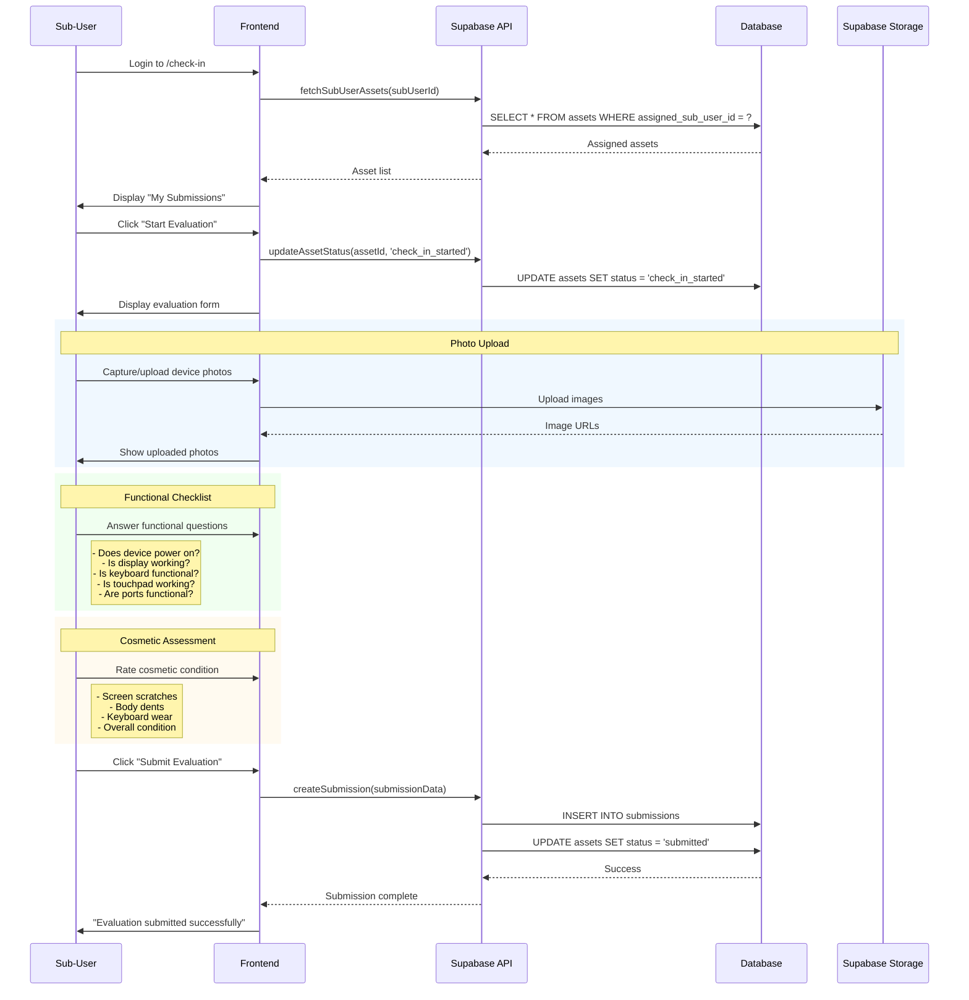
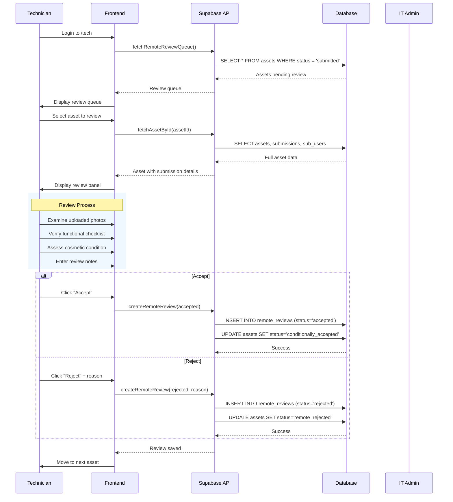
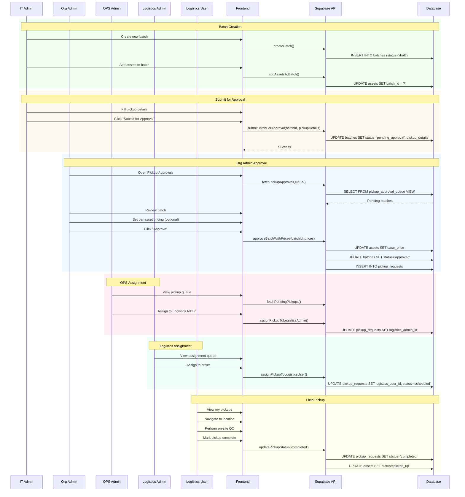
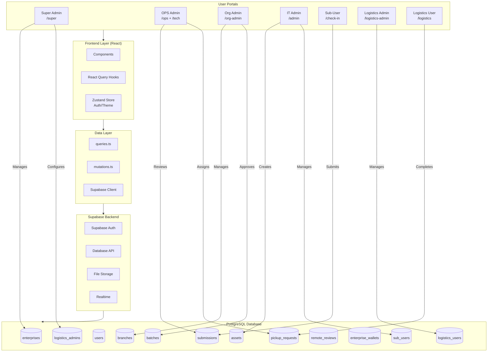
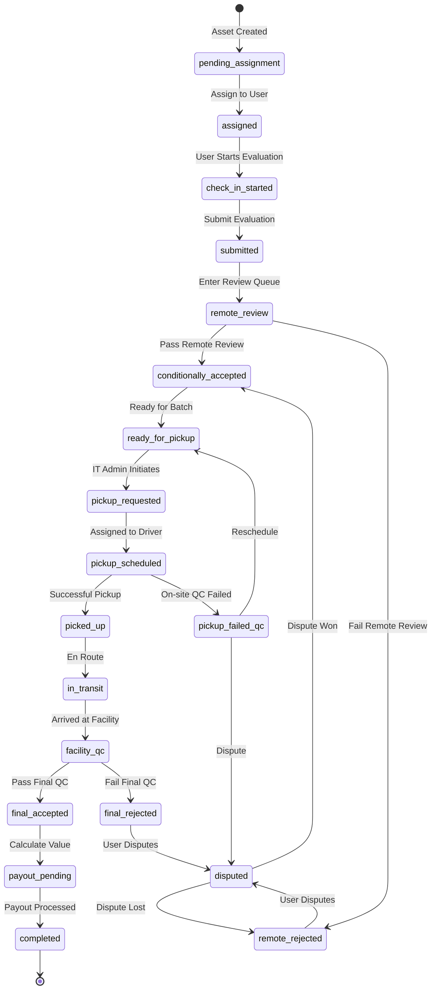

# EcoTribe Platform - End-to-End Product Flow Documentation

## Table of Contents
1. [User Personas](#1-user-personas)
2. [User Journey Maps](#2-user-journey-maps)
3. [Flow Diagrams](#3-flow-diagrams)
4. [Technical Implementation](#4-technical-implementation)

---

# 1. User Personas

## 1.1 Super Admin (Platform Owner)

| Attribute | Details |
|-----------|---------|
| **Role** | Platform oversight and configuration |
| **Organization** | EcoTribe (Platform Owner) |
| **Goals** | Platform health, enterprise onboarding, pricing strategy |
| **Portal Route** | `/super` |
| **Key Permissions** | Full platform access, enterprise creation, pricing config, user management |

**Primary Responsibilities:**
- Approve/reject enterprise registration applications
- Configure platform-wide pricing and policies
- Monitor platform analytics and health
- Manage all user accounts across the platform
- Oversee logistics partner relationships

---

## 1.2 OPS Admin (Operations Manager)

| Attribute | Details |
|-----------|---------|
| **Role** | Day-to-day operations management |
| **Organization** | EcoTribe Operations Team |
| **Goals** | Smooth operations, quality control, pickup coordination |
| **Portal Route** | `/ops`, `/tech` |
| **Key Permissions** | Enterprise management, remote review, pickup assignment, payout processing |

**Primary Responsibilities:**
- Review and approve enterprise applications
- Perform remote device reviews (via /tech portal)
- Assign pickup requests to logistics partners
- Process payouts and handle disputes
- Monitor asset flow through the system

---

## 1.3 Org Admin (Enterprise Administrator)

| Attribute | Details |
|-----------|---------|
| **Role** | Enterprise-level administration |
| **Organization** | Client Enterprise (e.g., TechCorp, Infosys) |
| **Goals** | Manage branches, approve pickups, track financials |
| **Portal Route** | `/org-admin` |
| **Key Permissions** | Branch management, IT admin management, pickup approval, wallet access |

**Primary Responsibilities:**
- Create and manage enterprise branches
- Onboard and manage IT Admins
- Review and approve batch pickup requests
- Monitor enterprise wallet and transactions
- Download EPR certificates and reports

---

## 1.4 IT Admin (Branch Manager)

| Attribute | Details |
|-----------|---------|
| **Role** | Branch-level asset management |
| **Organization** | Assigned to one or more enterprise branches |
| **Goals** | Asset intake, employee coordination, pickup initiation |
| **Portal Route** | `/admin` |
| **Key Permissions** | Asset CRUD, batch management, sub-user management, pickup initiation |

**Primary Responsibilities:**
- Create and manage device assets
- Assign devices to employees for evaluation
- Create batches and submit for pickup approval
- Manage sub-users (employees)
- Initiate and track pickup requests

---

## 1.5 Sub-User (Employee)

| Attribute | Details |
|-----------|---------|
| **Role** | Device self-evaluation |
| **Organization** | Employee at client enterprise |
| **Goals** | Submit devices quickly and accurately |
| **Portal Route** | `/check-in` |
| **Key Permissions** | View assigned devices, submit evaluations, track submissions |

**Primary Responsibilities:**
- Complete device self-evaluation checklist
- Upload device photos (all angles)
- Submit functional and cosmetic assessment
- Track submission status

---

## 1.6 Logistics Admin (Partner Manager)

| Attribute | Details |
|-----------|---------|
| **Role** | Logistics partner company management |
| **Organization** | Third-party logistics company |
| **Goals** | Efficient pickup operations, driver management |
| **Portal Route** | `/logistics-admin` |
| **Key Permissions** | View assigned pickups, manage drivers, assign pickups to drivers |

**Primary Responsibilities:**
- View pickup assignments from EcoTribe
- Manage logistics users (drivers)
- Assign pickups to available drivers
- Track pickup completion status

---

## 1.7 Logistics User (Driver/Field Agent)

| Attribute | Details |
|-----------|---------|
| **Role** | Field pickup and on-site QC |
| **Organization** | Works under Logistics Admin |
| **Goals** | Collect devices, verify quality |
| **Portal Route** | `/logistics` |
| **Key Permissions** | View assigned pickups, perform on-site QC, update pickup status |

**Primary Responsibilities:**
- View daily pickup assignments
- Navigate to pickup locations
- Perform on-site device verification
- Collect devices and update status
- Handle pickup exceptions

---

# 2. User Journey Maps

## 2.1 Enterprise Onboarding Journey (New Customer)

```
┌─────────────────────────────────────────────────────────────────────────────┐
│                     ENTERPRISE ONBOARDING JOURNEY                           │
├─────────────────────────────────────────────────────────────────────────────┤
│                                                                             │
│  PROSPECT                                                                   │
│  ┌──────────────────────────────────────────────────────────────────────┐  │
│  │ 1. Visit Landing Page → 2. Click "Register Enterprise"               │  │
│  │ 3. Fill Multi-Step Form:                                             │  │
│  │    • Company Details (Name, GST, PAN)                                │  │
│  │    • Contact Person (Org Admin details)                              │  │
│  │    • Address Information                                              │  │
│  │    • Document Upload (GST Cert, PAN, Incorporation)                  │  │
│  │ 4. Submit Application                                                │  │
│  └──────────────────────────────────────────────────────────────────────┘  │
│                              ↓                                              │
│  OPS ADMIN / SUPER ADMIN                                                   │
│  ┌──────────────────────────────────────────────────────────────────────┐  │
│  │ 5. Receive Application Notification                                  │  │
│  │ 6. Review Application Details & Documents                            │  │
│  │ 7. Decision:                                                         │  │
│  │    ├─ APPROVE → Creates Enterprise + Org Admin Account              │  │
│  │    ├─ REJECT → Sends Rejection Email with Reason                    │  │
│  │    └─ REQUEST INFO → Asks for Additional Documents                  │  │
│  └──────────────────────────────────────────────────────────────────────┘  │
│                              ↓                                              │
│  ORG ADMIN (New)                                                           │
│  ┌──────────────────────────────────────────────────────────────────────┐  │
│  │ 8. Receive Welcome Email with Credentials                            │  │
│  │ 9. First Login → Change Password                                     │  │
│  │ 10. Create First Branch                                              │  │
│  │ 11. Create First IT Admin                                            │  │
│  │ 12. Assign IT Admin to Branch                                        │  │
│  └──────────────────────────────────────────────────────────────────────┘  │
│                                                                             │
└─────────────────────────────────────────────────────────────────────────────┘
```

### Entry Points
- Marketing website landing page
- Direct URL: `/register`
- Referral from existing customer

### Exit Points
- Successful onboarding → Org Admin portal
- Application rejected → Exit with feedback
- Abandoned registration → Follow-up email

---

## 2.2 Asset Lifecycle Journey (Complete Flow)

```
┌─────────────────────────────────────────────────────────────────────────────┐
│                        ASSET LIFECYCLE JOURNEY                              │
├─────────────────────────────────────────────────────────────────────────────┤
│                                                                             │
│  PHASE 1: ASSET INTAKE (IT Admin)                                          │
│  ┌──────────────────────────────────────────────────────────────────────┐  │
│  │ 1. IT Admin logs in → Dashboard                                      │  │
│  │ 2. Create Asset:                                                     │  │
│  │    • Single: Add Asset form (serial, brand, model, specs)           │  │
│  │    • Bulk: Upload CSV/Excel template                                │  │
│  │ 3. Assign to Employee (Sub-User) OR Self-Evaluation                 │  │
│  │ 4. Employee receives email notification                              │  │
│  │ Status: pending_assignment → assigned                                │  │
│  └──────────────────────────────────────────────────────────────────────┘  │
│                              ↓                                              │
│  PHASE 2: SELF-EVALUATION (Sub-User)                                       │
│  ┌──────────────────────────────────────────────────────────────────────┐  │
│  │ 5. Sub-User logs in → My Submissions                                 │  │
│  │ 6. Click "Start Evaluation" on assigned device                       │  │
│  │ 7. Complete Evaluation:                                              │  │
│  │    • Upload Photos (front, back, screen, keyboard, sides)           │  │
│  │    • Functional Checklist (power, display, keyboard, touchpad...)   │  │
│  │    • Cosmetic Assessment (scratches, dents, screen condition)       │  │
│  │    • Additional Notes                                                │  │
│  │ 8. Submit Evaluation                                                 │  │
│  │ Status: assigned → check_in_started → submitted                     │  │
│  └──────────────────────────────────────────────────────────────────────┘  │
│                              ↓                                              │
│  PHASE 3: REMOTE REVIEW (Technician/OPS Admin)                             │
│  ┌──────────────────────────────────────────────────────────────────────┐  │
│  │ 9. Technician sees device in Remote Review Queue                     │  │
│  │ 10. Review:                                                          │  │
│  │    • Examine uploaded photos                                        │  │
│  │    • Verify functional checklist responses                          │  │
│  │    • Assess cosmetic condition from images                          │  │
│  │ 11. Decision:                                                        │  │
│  │    ├─ ACCEPT → conditionally_accepted                               │  │
│  │    └─ REJECT → remote_rejected (can be disputed)                    │  │
│  │ Status: submitted → remote_review → conditionally_accepted/rejected │  │
│  └──────────────────────────────────────────────────────────────────────┘  │
│                              ↓                                              │
│  PHASE 4: BATCH CREATION & APPROVAL (IT Admin + Org Admin)                 │
│  ┌──────────────────────────────────────────────────────────────────────┐  │
│  │ 12. IT Admin creates Batch (collection of assets)                    │  │
│  │ 13. IT Admin adds conditionally accepted assets to batch            │  │
│  │ 14. IT Admin fills Pickup Details:                                   │  │
│  │    • Select Branch (pickup location)                                │  │
│  │    • Preferred Date & Time Slot                                     │  │
│  │    • Priority Level                                                  │  │
│  │    • Special Instructions                                            │  │
│  │ 15. IT Admin submits for Org Admin approval                         │  │
│  │ 16. Org Admin reviews batch:                                         │  │
│  │    • Views all assets in batch                                      │  │
│  │    • Optionally sets per-asset pricing                              │  │
│  │    • APPROVE or REJECT                                               │  │
│  │ Status: ready_for_pickup → pickup_requested                         │  │
│  └──────────────────────────────────────────────────────────────────────┘  │
│                              ↓                                              │
│  PHASE 5: LOGISTICS ASSIGNMENT (OPS Admin + Logistics)                     │
│  ┌──────────────────────────────────────────────────────────────────────┐  │
│  │ 17. OPS Admin sees pickup in queue                                   │  │
│  │ 18. OPS Admin assigns to Logistics Admin (partner company)          │  │
│  │ 19. Logistics Admin assigns to Logistics User (driver)              │  │
│  │ 20. Driver sees assignment with:                                     │  │
│  │    • Pickup address & contact                                       │  │
│  │    • Asset list with serial numbers                                 │  │
│  │    • Scheduled date/time                                             │  │
│  │ Status: pickup_requested → pickup_scheduled                         │  │
│  └──────────────────────────────────────────────────────────────────────┘  │
│                              ↓                                              │
│  PHASE 6: FIELD PICKUP & ON-SITE QC (Logistics User)                       │
│  ┌──────────────────────────────────────────────────────────────────────┐  │
│  │ 21. Driver navigates to pickup location                              │  │
│  │ 22. On-Site QC:                                                      │  │
│  │    • Verify serial numbers match                                    │  │
│  │    • Quick physical inspection                                      │  │
│  │    • Take verification photos                                       │  │
│  │ 23. Decision per asset:                                              │  │
│  │    ├─ PASS → Collect device                                         │  │
│  │    └─ FAIL → Mark as pickup_failed_qc                               │  │
│  │ 24. Complete pickup, get acknowledgment                              │  │
│  │ Status: pickup_scheduled → picked_up / pickup_failed_qc             │  │
│  └──────────────────────────────────────────────────────────────────────┘  │
│                              ↓                                              │
│  PHASE 7: FACILITY QC & GRADING (Technician)                               │
│  ┌──────────────────────────────────────────────────────────────────────┐  │
│  │ 25. Devices arrive at EcoTribe facility                              │  │
│  │ 26. Status updated: picked_up → in_transit → facility_qc            │  │
│  │ 27. Comprehensive QC:                                                │  │
│  │    • Full functional testing                                        │  │
│  │    • Detailed cosmetic inspection                                   │  │
│  │    • Data verification (wiped?)                                     │  │
│  │ 28. Grading:                                                         │  │
│  │    • Grade A: Like new                                              │  │
│  │    • Grade B: Good condition                                        │  │
│  │    • Grade C: Acceptable                                            │  │
│  │    • Grade D: Poor/parts only                                       │  │
│  │ 29. Decision:                                                        │  │
│  │    ├─ ACCEPT → final_accepted + grade assignment                    │  │
│  │    └─ REJECT → final_rejected (can be disputed)                     │  │
│  │ Status: facility_qc → final_accepted / final_rejected               │  │
│  └──────────────────────────────────────────────────────────────────────┘  │
│                              ↓                                              │
│  PHASE 8: PAYOUT & COMPLETION (Finance/OPS)                                │
│  ┌──────────────────────────────────────────────────────────────────────┐  │
│  │ 30. Calculate final value based on:                                  │  │
│  │    • Base price (set during approval)                               │  │
│  │    • Grade adjustment                                               │  │
│  │    • Any deductions                                                 │  │
│  │ 31. Credit enterprise wallet                                         │  │
│  │ 32. Generate transaction record                                      │  │
│  │ 33. Notify Org Admin                                                 │  │
│  │ Status: final_accepted → payout_pending → completed                 │  │
│  └──────────────────────────────────────────────────────────────────────┘  │
│                                                                             │
└─────────────────────────────────────────────────────────────────────────────┘
```

---

## 2.3 IT Admin Daily Workflow

```
┌─────────────────────────────────────────────────────────────────────────────┐
│                      IT ADMIN DAILY WORKFLOW                                │
├─────────────────────────────────────────────────────────────────────────────┤
│                                                                             │
│  MORNING: Check Dashboard                                                   │
│  ┌──────────────────────────────────────────────────────────────────────┐  │
│  │ • View pending evaluations count                                     │  │
│  │ • Check batch status updates                                         │  │
│  │ • Review pickup schedule for the day                                 │  │
│  │ • Note any rejected assets requiring attention                       │  │
│  └──────────────────────────────────────────────────────────────────────┘  │
│                              ↓                                              │
│  ASSET MANAGEMENT                                                          │
│  ┌──────────────────────────────────────────────────────────────────────┐  │
│  │ • Add new assets (single or bulk upload)                            │  │
│  │ • Assign assets to employees                                        │  │
│  │ • Follow up on pending evaluations                                  │  │
│  │ • Review completed submissions                                       │  │
│  └──────────────────────────────────────────────────────────────────────┘  │
│                              ↓                                              │
│  BATCH OPERATIONS                                                          │
│  ┌──────────────────────────────────────────────────────────────────────┐  │
│  │ • Create new batches for approved assets                            │  │
│  │ • Add assets to existing draft batches                              │  │
│  │ • Fill pickup details for ready batches                             │  │
│  │ • Submit batches for Org Admin approval                             │  │
│  └──────────────────────────────────────────────────────────────────────┘  │
│                              ↓                                              │
│  PICKUP COORDINATION                                                       │
│  ┌──────────────────────────────────────────────────────────────────────┐  │
│  │ • Track approved pickup requests                                     │  │
│  │ • Coordinate with logistics for scheduled pickups                   │  │
│  │ • Handle on-site QC issues                                          │  │
│  │ • Confirm pickup completion                                          │  │
│  └──────────────────────────────────────────────────────────────────────┘  │
│                              ↓                                              │
│  SUB-USER MANAGEMENT                                                       │
│  ┌──────────────────────────────────────────────────────────────────────┐  │
│  │ • Onboard new employees                                              │  │
│  │ • Send evaluation reminders                                          │  │
│  │ • Deactivate departing employees                                    │  │
│  │ • Handle employee queries                                            │  │
│  └──────────────────────────────────────────────────────────────────────┘  │
│                                                                             │
└─────────────────────────────────────────────────────────────────────────────┘
```

---

## 2.4 Org Admin Approval Workflow

```
┌─────────────────────────────────────────────────────────────────────────────┐
│                     ORG ADMIN APPROVAL WORKFLOW                             │
├─────────────────────────────────────────────────────────────────────────────┤
│                                                                             │
│  NOTIFICATION RECEIVED                                                      │
│  ┌──────────────────────────────────────────────────────────────────────┐  │
│  │ • Email: "New batch awaiting approval"                               │  │
│  │ • In-app notification badge                                          │  │
│  │ • Dashboard widget shows pending count                               │  │
│  └──────────────────────────────────────────────────────────────────────┘  │
│                              ↓                                              │
│  REVIEW BATCH                                                              │
│  ┌──────────────────────────────────────────────────────────────────────┐  │
│  │ • Navigate to Pickup Approvals                                       │  │
│  │ • Select pending batch                                               │  │
│  │ • View batch details:                                                │  │
│  │   - Submitting IT Admin & Branch                                    │  │
│  │   - Asset count and types                                           │  │
│  │   - Requested pickup date/time                                      │  │
│  │   - IT Admin notes                                                  │  │
│  └──────────────────────────────────────────────────────────────────────┘  │
│                              ↓                                              │
│  REVIEW ASSETS (Optional Pricing)                                          │
│  ┌──────────────────────────────────────────────────────────────────────┐  │
│  │ • View asset table:                                                  │  │
│  │   | Asset          | Specs              | Price (₹) |               │  │
│  │   | Dell XPS 15    | i7 / 16GB / 512GB  | [15000]   |               │  │
│  │   | HP ProBook     | i5 / 8GB / 256GB   | [8000]    |               │  │
│  │ • Enter pricing for each asset (optional)                           │  │
│  │ • Review total batch value                                          │  │
│  └──────────────────────────────────────────────────────────────────────┘  │
│                              ↓                                              │
│  DECISION                                                                  │
│  ┌──────────────────────────────────────────────────────────────────────┐  │
│  │ APPROVE:                                                             │  │
│  │ • Confirm approval                                                   │  │
│  │ • Pickup request auto-created                                       │  │
│  │ • IT Admin notified                                                  │  │
│  │ • Batch moves to logistics queue                                    │  │
│  │                                                                      │  │
│  │ REJECT:                                                              │  │
│  │ • Enter rejection reason                                            │  │
│  │ • Batch returned to IT Admin                                        │  │
│  │ • IT Admin can modify and resubmit                                  │  │
│  └──────────────────────────────────────────────────────────────────────┘  │
│                                                                             │
└─────────────────────────────────────────────────────────────────────────────┘
```

---

# 3. Flow Diagrams

## 3.1 Enterprise Registration Flow



---

## 3.2 Asset Creation & Assignment Flow



---

## 3.3 Employee Self-Evaluation Flow



---

## 3.4 Remote Review Flow



---

## 3.5 Batch Approval & Pickup Flow



---

## 3.6 Complete System Architecture Flow



---

## 3.7 Asset Status State Machine



---

# 4. Technical Implementation

## 4.1 API Endpoints & Database Operations

### Enterprise Applications

| Operation | Function | Table | Auth Required |
|-----------|----------|-------|---------------|
| Create Application | `createEnterpriseApplication()` | enterprise_applications | No |
| List Applications | `fetchEnterpriseApplications()` | enterprise_applications | OPS/Super |
| Approve Application | `approveEnterpriseApplication()` | enterprises, users | OPS/Super |
| Reject Application | `rejectEnterpriseApplication()` | enterprise_applications | OPS/Super |

### Branches

| Operation | Function | Table | Auth Required |
|-----------|----------|-------|---------------|
| Create Branch | `createBranch()` | branches | Org Admin |
| List Branches | `fetchBranches()` | branches | Org Admin |
| Get by IT Admin | `fetchBranchesByITAdmin()` | branches | IT Admin |
| Update Branch | `updateBranch()` | branches | Org Admin |
| Bulk Create | `bulkCreateBranches()` | branches | Org Admin |

### Assets

| Operation | Function | Table | Auth Required |
|-----------|----------|-------|---------------|
| Create Asset | `createAsset()` | assets | IT Admin |
| Bulk Create | `createAssets()` | assets | IT Admin |
| List by Enterprise | `fetchAssets()` | assets | IT Admin+ |
| List by IT Admin | `fetchAssetsByITAdmin()` | assets | IT Admin |
| Get by ID | `fetchAssetById()` | assets, submissions, reviews | All |
| Update Status | `updateAssetStatus()` | assets | Various |
| Assign to User | `assignAssetToSubUser()` | assets | IT Admin |
| Self-Assign | `assignAssetToSelf()` | assets | IT Admin |

### Batches

| Operation | Function | Table | Auth Required |
|-----------|----------|-------|---------------|
| Create Batch | `createBatch()` | batches | IT Admin |
| List Batches | `fetchBatches()` | batches | IT Admin+ |
| Submit for Approval | `submitBatchForApproval()` | batches | IT Admin |
| Approve Batch | `approveBatch()` | batches, pickup_requests | Org Admin |
| Approve with Prices | `approveBatchWithPrices()` | batches, assets | Org Admin |
| Reject Batch | `rejectBatch()` | batches | Org Admin |

### Pickup Requests

| Operation | Function | Table | Auth Required |
|-----------|----------|-------|---------------|
| Create Request | `createPickupRequest()` | pickup_requests | IT Admin |
| List All | `fetchPickupRequests()` | pickup_requests | IT Admin+ |
| Approval Queue | `fetchPickupApprovalQueue()` | pickup_approval_queue | Org Admin |
| Assign to LA | `assignPickupToLogisticsAdmin()` | pickup_requests | OPS Admin |
| Assign to LU | `assignPickupToLogisticsUser()` | pickup_requests | LA |
| Update Status | `updatePickupRequestStatus()` | pickup_requests | Various |

### Logistics

| Operation | Function | Table | Auth Required |
|-----------|----------|-------|---------------|
| Create LA | `createLogisticsAdmin()` | logistics_admins, auth | OPS/Super |
| Create LU | `createLogisticsUser()` | logistics_users, auth | LA |
| List LAs | `fetchLogisticsAdmins()` | logistics_admins | OPS/Super |
| List LUs | `fetchLogisticsUsers()` | logistics_users | LA+ |
| LA Pickups | `fetchLogisticsAdminPickups()` | pickup_requests | LA |
| LU Pickups | `fetchLogisticsUserPickups()` | pickup_requests | LU |

---

## 4.2 Database Models

### enterprises
```typescript
interface Enterprise {
  id: string;
  name: string;
  gst_number: string;
  pan_number: string;
  address: {
    line1: string;
    line2?: string;
    city: string;
    state: string;
    pin_code: string;
  };
  status: 'active' | 'inactive' | 'suspended';
  created_at: string;
  updated_at: string;
}
```

### branches
```typescript
interface Branch {
  id: string;
  enterprise_id: string;
  branch_name: string;
  branch_code: string;  // 1-10 alphanumeric, unique per enterprise
  it_admin_id?: string; // FK to users
  address_line1: string;
  address_line2?: string;
  city: string;
  state: string;
  pin_code: string;
  site_contact_person?: string;
  site_contact_phone?: string;
  operating_hours?: string;
  status: 'active' | 'inactive' | 'needs_admin';
  created_at: string;
}
```

### assets
```typescript
interface Asset {
  id: string;
  enterprise_id: string;
  branch_id?: string;
  batch_id?: string;
  serial_number: string;  // Unique
  brand: string;
  model: string;
  asset_type: 'laptop' | 'desktop' | 'monitor' | 'phone' | 'tablet' | 'other';
  specs?: {
    processor?: string;
    ram?: string;
    storage?: string;
    screen_size?: string;
  };
  assigned_sub_user_id?: string;
  assigned_user_id?: string;      // For self-evaluation
  is_self_assigned?: boolean;
  status: AssetStatus;
  base_price?: number;
  final_price?: number;
  grade?: 'A' | 'B' | 'C' | 'D';
  created_at: string;
  updated_at: string;
}

type AssetStatus =
  | 'pending_assignment'
  | 'assigned'
  | 'check_in_started'
  | 'submitted'
  | 'remote_review'
  | 'conditionally_accepted'
  | 'remote_rejected'
  | 'disputed'
  | 'ready_for_pickup'
  | 'pickup_requested'
  | 'pickup_scheduled'
  | 'pickup_failed_qc'
  | 'picked_up'
  | 'in_transit'
  | 'facility_qc'
  | 'final_accepted'
  | 'final_rejected'
  | 'payout_pending'
  | 'completed';
```

### batches
```typescript
interface Batch {
  id: string;
  enterprise_id: string;
  branch_id?: string;
  name: string;
  description?: string;
  status: 'draft' | 'pending_approval' | 'approved' | 'rejected' | 'pickup_scheduled' | 'completed';
  created_by: string;
  approved_by?: string;
  approved_at?: string;
  it_admin_notes?: string;
  org_admin_notes?: string;
  preferred_pickup_date?: string;
  preferred_pickup_slot?: 'morning' | 'afternoon' | 'evening';
  pickup_priority?: 'normal' | 'high' | 'urgent';
  estimated_value?: number;
  created_at: string;
  updated_at: string;
}
```

### pickup_requests
```typescript
interface PickupRequest {
  id: string;
  enterprise_id: string;
  branch_id?: string;           // V3.2: Uses branch instead of pickup_location
  batch_id?: string;
  asset_ids: string[];
  status: 'pending_assignment' | 'assigned' | 'scheduled' | 'in_progress' | 'completed' | 'cancelled';
  logistics_admin_id?: string;
  logistics_user_id?: string;
  scheduled_date?: string;
  scheduled_time_slot?: string;
  it_admin_notes?: string;
  ops_notes?: string;
  created_at: string;
  updated_at: string;
}
```

---

## 4.3 Frontend Routes & Components

### Route Structure

```typescript
// App.tsx Routes
<Routes>
  {/* Public */}
  <Route path="/login" element={<Login />} />
  <Route path="/register" element={<EnterpriseRegister />} />

  {/* Super Admin Portal */}
  <Route path="/super" element={<ProtectedRoute allowedRoles={['super_admin']}><SuperLayout /></ProtectedRoute>}>
    <Route index element={<SuperDashboard />} />
    <Route path="enterprises" element={<Enterprises />} />
    <Route path="admins" element={<Admins />} />
    <Route path="logistics" element={<Logistics />} />
    <Route path="pricing" element={<Pricing />} />
    <Route path="analytics" element={<Analytics />} />
    <Route path="settings" element={<Settings />} />
  </Route>

  {/* OPS Admin Portal */}
  <Route path="/ops" element={<ProtectedRoute allowedRoles={['main_admin']}><OpsLayout /></ProtectedRoute>}>
    <Route index element={<OpsDashboard />} />
    <Route path="applications" element={<EnterpriseApplications />} />
    <Route path="enterprises/*" element={<EnterpriseRoutes />} />
    <Route path="pickups" element={<PickupQueue />} />
    <Route path="payouts" element={<PayoutProcessing />} />
    <Route path="disputes" element={<DisputeQueue />} />
    <Route path="logistics" element={<OpsLogistics />} />
  </Route>

  {/* Technician Portal */}
  <Route path="/tech" element={<ProtectedRoute allowedRoles={['main_admin']}><TechLayout /></ProtectedRoute>}>
    <Route index element={<TechDashboard />} />
    <Route path="remote-review" element={<RemoteReview />} />
    <Route path="facility-qc" element={<FacilityQC />} />
  </Route>

  {/* Org Admin Portal */}
  <Route path="/org-admin" element={<ProtectedRoute allowedRoles={['org_admin']}><OrgAdminLayout /></ProtectedRoute>}>
    <Route index element={<OrgAdminDashboard />} />
    <Route path="branches/*" element={<BranchRoutes />} />
    <Route path="it-admins/*" element={<ITAdminRoutes />} />
    <Route path="approvals" element={<PickupApprovals />} />
    <Route path="wallet" element={<Wallet />} />
    <Route path="reports" element={<Reports />} />
    <Route path="epr-certificates" element={<EPRCertificates />} />
  </Route>

  {/* IT Admin Portal */}
  <Route path="/admin" element={<ProtectedRoute allowedRoles={['it_admin']}><AdminLayout /></ProtectedRoute>}>
    <Route index element={<Dashboard />} />
    <Route path="assets/*" element={<AssetRoutes />} />
    <Route path="batches/*" element={<BatchRoutes />} />
    <Route path="pickups/*" element={<PickupRoutes />} />
    <Route path="sub-users/*" element={<SubUserRoutes />} />
    <Route path="my-evaluations" element={<MyEvaluations />} />
    <Route path="settings" element={<Settings />} />
  </Route>

  {/* Sub-User Portal */}
  <Route path="/check-in" element={<ProtectedRoute allowedRoles={['sub_user']}><CheckInLayout /></ProtectedRoute>}>
    <Route index element={<MySubmissions />} />
    <Route path="submit/:assetId" element={<DeviceSubmit />} />
    <Route path="help" element={<Help />} />
  </Route>

  {/* Logistics Admin Portal */}
  <Route path="/logistics-admin" element={<ProtectedRoute allowedRoles={['logistics_admin']}><LogisticsAdminLayout /></ProtectedRoute>}>
    <Route index element={<LogisticsAdminDashboard />} />
    <Route path="assignments" element={<AssignmentQueue />} />
    <Route path="users" element={<UserManagement />} />
  </Route>

  {/* Logistics User Portal */}
  <Route path="/logistics" element={<ProtectedRoute allowedRoles={['logistics_user']}><LogisticsLayout /></ProtectedRoute>}>
    <Route index element={<MyPickups />} />
    <Route path="pickup/:pickupId" element={<PickupDetail />} />
  </Route>
</Routes>
```

### Key Page Components

| Portal | Page | Component | Purpose |
|--------|------|-----------|---------|
| Super | Dashboard | `SuperDashboard.tsx` | Platform overview, key metrics |
| Super | Enterprises | `Enterprises.tsx` | Manage all enterprises |
| Super | Logistics | `Logistics.tsx` | Manage logistics partners |
| OPS | Applications | `EnterpriseApplications.tsx` | Review registration applications |
| OPS | Pickup Queue | `PickupQueue.tsx` | Assign pickups to logistics |
| Tech | Remote Review | `RemoteReview.tsx` | Review device submissions |
| Tech | Facility QC | `FacilityQC.tsx` | Final quality control |
| Org Admin | Branches | `BranchManagement.tsx` | Manage enterprise branches |
| Org Admin | Approvals | `PickupApprovals.tsx` | Approve/reject batch pickups |
| IT Admin | Dashboard | `Dashboard.tsx` | Branch overview, quick actions |
| IT Admin | Assets | `AssetList.tsx` | View/manage all assets |
| IT Admin | Add Asset | `AddAsset.tsx` | Create single asset |
| IT Admin | Upload | `UploadAssets.tsx` | Bulk upload assets |
| IT Admin | Batches | `BatchList.tsx` | View/manage batches |
| IT Admin | Batch Detail | `BatchDetail.tsx` | Manage single batch |
| IT Admin | Pickups | `PickupRequests.tsx` | View pickup status |
| IT Admin | Sub-Users | `SubUserList.tsx` | Manage employees |
| Sub-User | My Submissions | `MySubmissions.tsx` | View assigned devices |
| Sub-User | Submit | `DeviceSubmit.tsx` | Complete evaluation |
| Logistics Admin | Dashboard | `LogisticsAdminDashboard.tsx` | Pickup overview |
| Logistics Admin | Users | `UserManagement.tsx` | Manage drivers |
| Logistics User | My Pickups | `Assignments.tsx` | View daily pickups |

---

## 4.4 Business Logic & Validation Rules

### Enterprise Registration Validation
```typescript
const enterpriseApplicationSchema = z.object({
  company_name: z.string().min(3).max(200),
  gst_number: z.string().regex(/^[0-9]{2}[A-Z]{5}[0-9]{4}[A-Z]{1}[1-9A-Z]{1}Z[0-9A-Z]{1}$/),
  pan_number: z.string().regex(/^[A-Z]{5}[0-9]{4}[A-Z]{1}$/),
  contact_name: z.string().min(2).max(100),
  contact_email: z.string().email(),
  contact_phone: z.string().min(10),
  address: addressSchema,
  documents: z.object({
    gst_certificate: z.string().url(),
    pan_card: z.string().url(),
    incorporation_certificate: z.string().url().optional(),
  }),
});
```

### Branch Code Validation
```typescript
const branchCodeSchema = z
  .string()
  .min(1, 'Branch code is required')
  .max(10, 'Maximum 10 characters')
  .regex(/^[A-Z0-9]+$/, 'Only uppercase letters and numbers')
  .transform(val => val.toUpperCase());
```

### Asset Creation Rules
- Serial number must be unique across entire platform
- Brand and model are required
- If assigned, status changes to 'assigned'
- Self-assignment sets `is_self_assigned = true`

### Batch Submission Rules
- Batch must contain at least 1 asset
- All assets must be in `conditionally_accepted` status
- Pickup details (branch, date, time slot) are required
- Only draft batches can be submitted

### Batch Approval Rules
- Only pending_approval batches can be approved/rejected
- Pricing is optional during approval
- Approval creates pickup_request automatically
- Rejection returns batch to IT Admin

### Pickup Assignment Rules
- Only OPS Admin can assign to Logistics Admin
- Only Logistics Admin can assign to Logistics User
- Cannot assign to inactive users
- Scheduled date cannot be in the past

---

## 4.5 Authentication & Authorization Flow

### Login Flow
```typescript
async function login(email: string, password: string) {
  // 1. Authenticate with Supabase
  const { data: authData, error } = await supabase.auth.signInWithPassword({
    email,
    password,
  });

  if (error) throw new Error('Invalid credentials');

  // 2. Determine user type and fetch profile
  let user = await fetchUser(authData.user.id);  // Check users table
  if (!user) {
    user = await fetchSubUser(authData.user.id); // Check sub_users table
  }
  if (!user) {
    user = await fetchLogisticsAdmin(authData.user.id);
  }
  if (!user) {
    user = await fetchLogisticsUser(authData.user.id);
  }

  // 3. Fetch enterprise data if applicable
  let enterprise = null;
  if (user.enterprise_id) {
    enterprise = await fetchEnterprise(user.enterprise_id);
  }

  // 4. Set auth state
  authStore.setState({ user, enterprise, isAuthenticated: true });

  // 5. Redirect to appropriate portal
  redirectToPortal(user.role);
}
```

### Route Protection
```typescript
function ProtectedRoute({ children, allowedRoles }) {
  const { user, isAuthenticated, isLoading } = useAuth();

  if (isLoading) return <LoadingSpinner />;

  if (!isAuthenticated) {
    return <Navigate to="/login" />;
  }

  if (!allowedRoles.includes(user.role)) {
    return <Navigate to="/unauthorized" />;
  }

  return children;
}
```

### Permission Checking
```typescript
const rolePermissions = {
  super_admin: ['*'],
  main_admin: ['review_applications', 'assign_pickups', 'process_payouts', 'remote_review'],
  org_admin: ['manage_branches', 'manage_it_admins', 'approve_pickups', 'view_wallet'],
  it_admin: ['manage_assets', 'manage_batches', 'manage_sub_users', 'initiate_pickups'],
  sub_user: ['submit_evaluation', 'view_submissions'],
  logistics_admin: ['manage_drivers', 'assign_pickups', 'view_assignments'],
  logistics_user: ['complete_pickups', 'on_site_qc'],
};

function hasPermission(user, permission) {
  const permissions = rolePermissions[user.role];
  return permissions.includes('*') || permissions.includes(permission);
}
```

---

## 4.6 Notification Triggers

| Event | Recipients | Channels |
|-------|------------|----------|
| Application Submitted | OPS Admins | Email, In-app |
| Application Approved | Applicant | Email |
| Application Rejected | Applicant | Email |
| Asset Assigned | Sub-User | Email, In-app |
| Evaluation Submitted | IT Admin | In-app |
| Remote Review Complete | IT Admin | In-app |
| Batch Submitted | Org Admin | Email, In-app |
| Batch Approved | IT Admin | Email, In-app |
| Batch Rejected | IT Admin | Email, In-app |
| Pickup Assigned (LA) | Logistics Admin | Email, In-app |
| Pickup Assigned (LU) | Logistics User | In-app, SMS |
| Pickup Completed | IT Admin, Org Admin | In-app |
| Payout Processed | Org Admin | Email, In-app |

---

This documentation provides a complete reference for understanding the EcoTribe platform's end-to-end flows, from user personas through technical implementation details.
