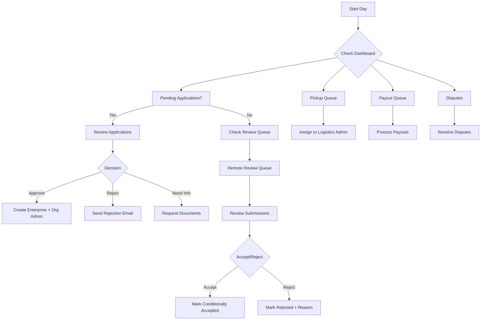
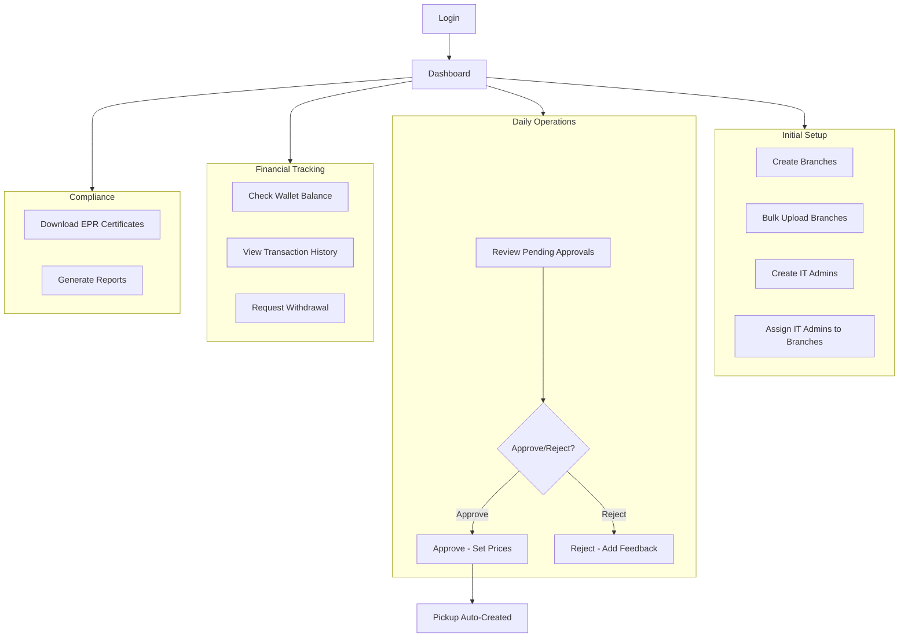
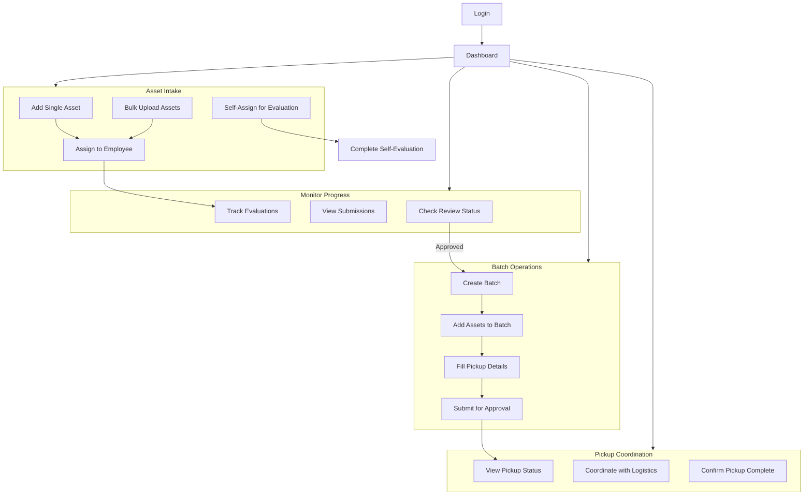
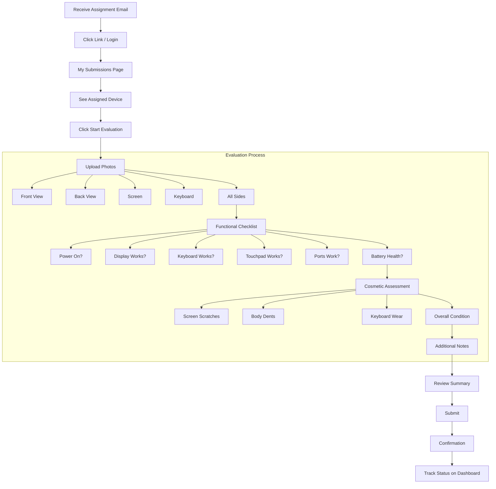
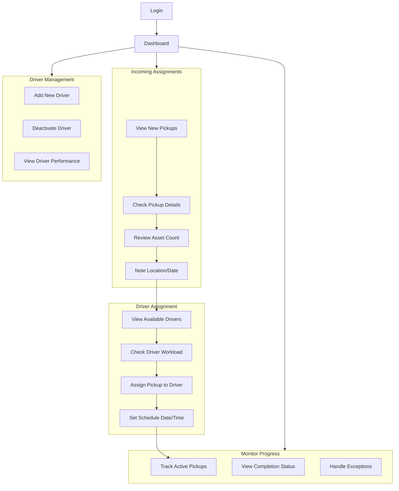
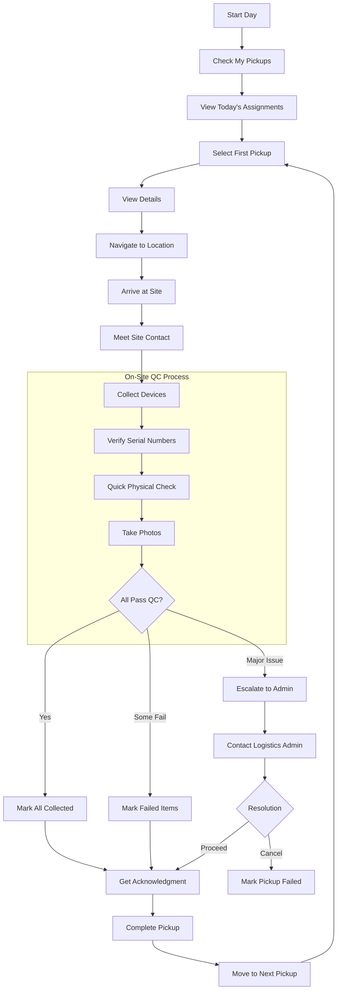
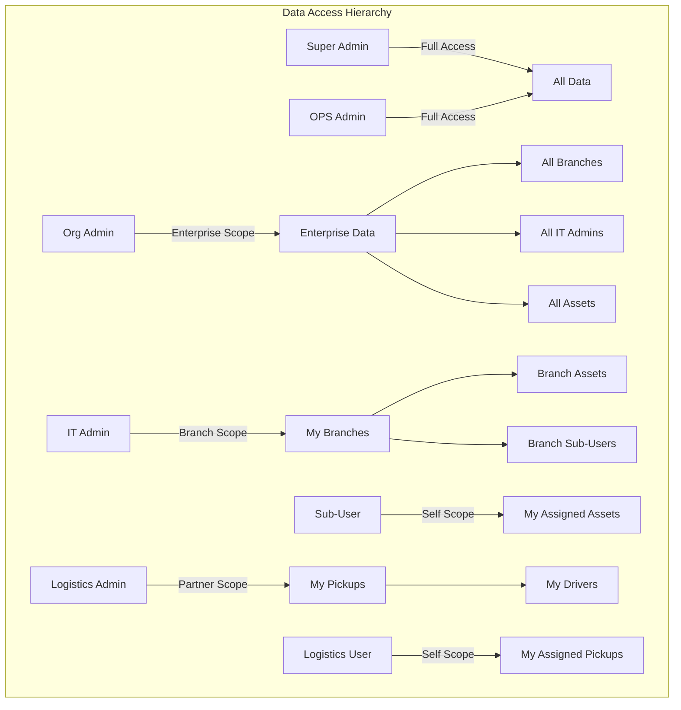
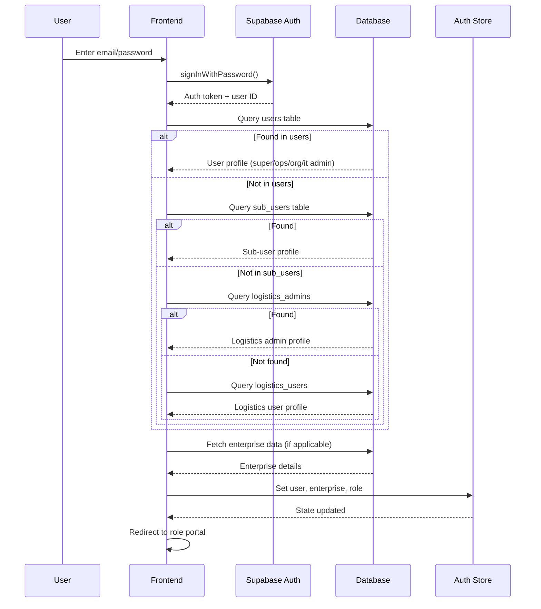

# User Personas

## Overview

EcoTribe serves 7 distinct user personas across 3 organizational contexts:
- **Platform** (EcoTribe): Super Admin, OPS Admin, Technician
- **Enterprise** (Clients): Org Admin, IT Admin, Sub-User
- **Logistics** (Partners): Logistics Admin, Logistics User

---

## 1. Super Admin

### Profile
| Attribute | Value |
|-----------|-------|
| **Role ID** | `super_admin` |
| **Organization** | EcoTribe (Platform Owner) |
| **Portal URL** | `/super` |
| **Access Level** | 5 (Highest) |

### Goals
- Maintain platform health and uptime
- Onboard new enterprise customers
- Configure platform-wide pricing and policies
- Monitor all operations across the platform
- Manage logistics partner relationships

### Permissions
```typescript
permissions: ['*'] // Full access to everything
```

### Key Actions
| Action | Route | Description |
|--------|-------|-------------|
| View Dashboard | `/super` | Platform-wide metrics and health |
| Manage Enterprises | `/super/enterprises` | CRUD all enterprises |
| Review Applications | `/super/applications` | Approve/reject registrations |
| Manage Admins | `/super/admins` | Create OPS admins, org admins |
| Configure Pricing | `/super/pricing` | Set base prices, grades, multipliers |
| Manage Logistics | `/super/logistics` | Add logistics partners |
| View Analytics | `/super/analytics` | Platform-wide reporting |

### Entry Points
- Direct login at `/login`
- SSO integration (if configured)

### Technical Implementation
```
Portal: src/pages/super/
Layout: src/layouts/SuperLayout.tsx
Auth Check: role === 'super_admin'
```

---

## 2. OPS Admin (Operations Administrator)

### Profile
| Attribute | Value |
|-----------|-------|
| **Role ID** | `main_admin` |
| **Organization** | EcoTribe Operations Team |
| **Portal URLs** | `/ops`, `/tech` |
| **Access Level** | 4 |

### Goals
- Process enterprise registration applications
- Monitor asset flow through the system
- Assign pickups to logistics partners
- Process payouts efficiently
- Handle disputes and escalations

### Permissions
```typescript
permissions: [
  'review_applications',
  'manage_enterprises',
  'assign_pickups',
  'process_payouts',
  'handle_disputes',
  'remote_review',
  'facility_qc'
]
```

### Key Actions
| Action | Route | Description |
|--------|-------|-------------|
| View Dashboard | `/ops` | Operations overview |
| Review Applications | `/ops/applications` | Enterprise registration queue |
| Manage Enterprises | `/ops/enterprises/:id` | View/edit enterprise details |
| Review Assets | `/ops/assets` | Asset pipeline view |
| Remote Review | `/tech/remote-review` | Review submitted evaluations |
| Facility QC | `/tech/facility-qc` | Final quality control |
| Assign Pickups | `/ops/pickups` | Assign to logistics partners |
| Process Payouts | `/ops/payouts` | Financial processing |
| Handle Disputes | `/ops/disputes` | Dispute resolution |

### Entry Points
- Direct login at `/login`
- Email notification links

### Technical Implementation
```
Portal: src/pages/ops/, src/pages/tech/
Layout: src/layouts/OpsLayout.tsx
Auth Check: role === 'main_admin'
```

### Workflow Diagram


---

## 3. Org Admin (Enterprise Administrator)

### Profile
| Attribute | Value |
|-----------|-------|
| **Role ID** | `org_admin` |
| **Organization** | Client Enterprise (e.g., TechCorp, Infosys) |
| **Portal URL** | `/org-admin` |
| **Access Level** | 3 |

### Goals
- Manage enterprise branches efficiently
- Onboard and oversee IT Admins
- Approve batch pickup requests
- Track enterprise financials
- Ensure compliance (EPR certificates)

### Permissions
```typescript
permissions: [
  'manage_branches',
  'manage_it_admins',
  'approve_pickups',
  'view_wallet',
  'download_reports',
  'view_epr_certificates'
]
```

### Key Actions
| Action | Route | Description |
|--------|-------|-------------|
| View Dashboard | `/org-admin` | Enterprise overview |
| Manage Branches | `/org-admin/branches` | CRUD branches |
| Bulk Upload Branches | `/org-admin/branches/upload` | CSV/Excel upload |
| Manage IT Admins | `/org-admin/it-admins` | CRUD IT admins |
| Approve Pickups | `/org-admin/approvals` | Review batch submissions |
| View Wallet | `/org-admin/wallet` | Credits, transactions |
| Download Reports | `/org-admin/reports` | Export data |
| EPR Certificates | `/org-admin/epr-certificates` | Compliance docs |

### Entry Points
- Welcome email after enterprise approval
- Direct login at `/login`
- Password reset flow

### Technical Implementation
```
Portal: src/pages/org-admin/
Layout: src/layouts/OrgAdminLayout.tsx
Auth Check: role === 'org_admin' && enterprise_id matches
```

### Workflow Diagram


---

## 4. IT Admin (Branch IT Administrator)

### Profile
| Attribute | Value |
|-----------|-------|
| **Role ID** | `it_admin` |
| **Organization** | Assigned to enterprise branch(es) |
| **Portal URL** | `/admin` |
| **Access Level** | 2 |

### Goals
- Efficiently intake and manage assets
- Coordinate with employees for evaluations
- Create batches and initiate pickups
- Track asset status through lifecycle
- Manage sub-users (employees)

### Permissions
```typescript
permissions: [
  'manage_assets',
  'manage_batches',
  'manage_sub_users',
  'initiate_pickups',
  'view_submissions',
  'self_evaluate'
]
```

### Key Actions
| Action | Route | Description |
|--------|-------|-------------|
| View Dashboard | `/admin` | Branch overview |
| List Assets | `/admin/assets` | All assets table |
| Add Asset | `/admin/assets/add` | Single asset form |
| Bulk Upload | `/admin/assets/upload` | CSV/Excel upload |
| Asset Details | `/admin/assets/:id` | View/edit asset |
| List Batches | `/admin/batches` | All batches |
| Create Batch | `/admin/batches/create` | New batch |
| Batch Details | `/admin/batches/:id` | Manage batch assets |
| Pickup Requests | `/admin/pickups` | View pickup status |
| Initiate Pickup | `/admin/pickups/initiate` | Create pickup request |
| Sub-Users | `/admin/sub-users` | Employee management |
| My Evaluations | `/admin/my-evaluations` | Self-assigned assets |

### Entry Points
- Credentials from Org Admin
- Direct login at `/login`

### Technical Implementation
```
Portal: src/pages/admin/
Layout: src/layouts/AdminLayout.tsx
Auth Check: role === 'it_admin'
Data Scoping: Filter by branches where it_admin_id === user.id
```

### Workflow Diagram


---

## 5. Sub-User (Employee)

### Profile
| Attribute | Value |
|-----------|-------|
| **Role ID** | `sub_user` |
| **Organization** | Employee at client enterprise |
| **Portal URL** | `/check-in` |
| **Access Level** | 0 (Lowest) |

### Goals
- Complete device evaluations quickly
- Submit accurate information
- Track submission status
- Get support when needed

### Permissions
```typescript
permissions: [
  'view_assigned_assets',
  'submit_evaluation',
  'view_submission_status'
]
```

### Key Actions
| Action | Route | Description |
|--------|-------|-------------|
| My Submissions | `/check-in` | List of assigned devices |
| Start Evaluation | `/check-in/submit/:assetId` | Begin evaluation |
| View Status | `/check-in` | Track submission progress |
| Get Help | `/check-in/help` | FAQ and support |

### Entry Points
- Email notification when asset assigned
- Link in assignment email
- Direct login at `/login`

### Technical Implementation
```
Portal: src/pages/check-in/
Layout: src/layouts/CheckInLayout.tsx
Auth Check: role === 'sub_user'
Data Scoping: Only assets where assigned_sub_user_id === user.id
```

### Workflow Diagram


---

## 6. Logistics Admin (Partner Manager)

### Profile
| Attribute | Value |
|-----------|-------|
| **Role ID** | `logistics_admin` |
| **Organization** | Third-party logistics company |
| **Portal URL** | `/logistics-admin` |
| **Access Level** | 2 |

### Goals
- Manage pickup assignments efficiently
- Optimize driver routes and schedules
- Ensure timely pickups
- Maintain driver performance

### Permissions
```typescript
permissions: [
  'view_assigned_pickups',
  'manage_logistics_users',
  'assign_pickups_to_drivers',
  'view_pickup_status'
]
```

### Key Actions
| Action | Route | Description |
|--------|-------|-------------|
| View Dashboard | `/logistics-admin` | Pickup overview |
| Assignment Queue | `/logistics-admin/assignments` | Incoming pickups |
| Manage Users | `/logistics-admin/users` | Driver management |
| Assign to Driver | `/logistics-admin/assignments` | Route assignment |

### Entry Points
- Credentials from EcoTribe OPS/Super
- Direct login at `/login`

### Technical Implementation
```
Portal: src/pages/logistics-admin/
Layout: src/layouts/LogisticsAdminLayout.tsx
Auth Check: Verify in logistics_admins table
Data Scoping: pickup_requests.logistics_admin_id === user.id
```

### Workflow Diagram


---

## 7. Logistics User (Driver/Field Agent)

### Profile
| Attribute | Value |
|-----------|-------|
| **Role ID** | `logistics_user` |
| **Organization** | Works under Logistics Admin |
| **Portal URL** | `/logistics` |
| **Access Level** | 1 |

### Goals
- Complete assigned pickups on time
- Perform accurate on-site QC
- Document pickup evidence
- Handle exceptions properly

### Permissions
```typescript
permissions: [
  'view_my_pickups',
  'perform_onsite_qc',
  'update_pickup_status',
  'upload_pickup_evidence'
]
```

### Key Actions
| Action | Route | Description |
|--------|-------|-------------|
| My Pickups | `/logistics` | Today's assignments |
| Pickup Details | `/logistics/pickup/:id` | Full pickup info |
| On-site QC | `/logistics/pickup/:id/qc` | Device verification |
| Complete Pickup | `/logistics/pickup/:id` | Mark complete |

### Entry Points
- Credentials from Logistics Admin
- Mobile-optimized login
- Push notifications for new assignments

### Technical Implementation
```
Portal: src/pages/logistics-user/
Layout: src/layouts/LogisticsLayout.tsx
Auth Check: Verify in logistics_users table
Data Scoping: pickup_requests.logistics_user_id === user.id
```

### Workflow Diagram


---

## Persona Comparison Matrix

| Aspect | Super Admin | OPS Admin | Org Admin | IT Admin | Sub-User | Logistics Admin | Logistics User |
|--------|-------------|-----------|-----------|----------|----------|-----------------|----------------|
| **Org Type** | Platform | Platform | Enterprise | Enterprise | Enterprise | Partner | Partner |
| **Portal** | `/super` | `/ops` | `/org-admin` | `/admin` | `/check-in` | `/logistics-admin` | `/logistics` |
| **Data Scope** | All | All | Own Enterprise | Own Branches | Own Assets | Own Pickups | Own Pickups |
| **Primary Task** | Configure | Operate | Approve | Manage | Evaluate | Assign | Execute |
| **Decision Level** | Strategic | Tactical | Approval | Operational | Task | Assignment | Field |
| **Tech Savviness** | High | High | Medium-High | Medium | Low-Medium | Medium | Low-Medium |
| **Usage Frequency** | Daily | Continuous | Daily | Daily | Per Device | Daily | Continuous |

---

## Role Hierarchy Access Control



---

## Authentication Flow by Persona


