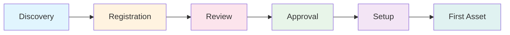
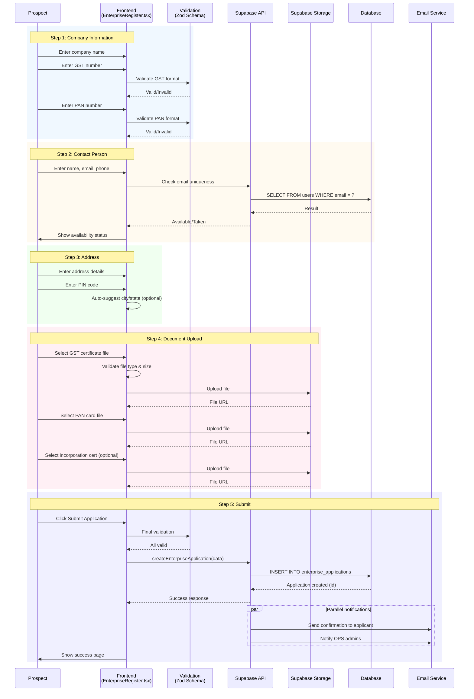
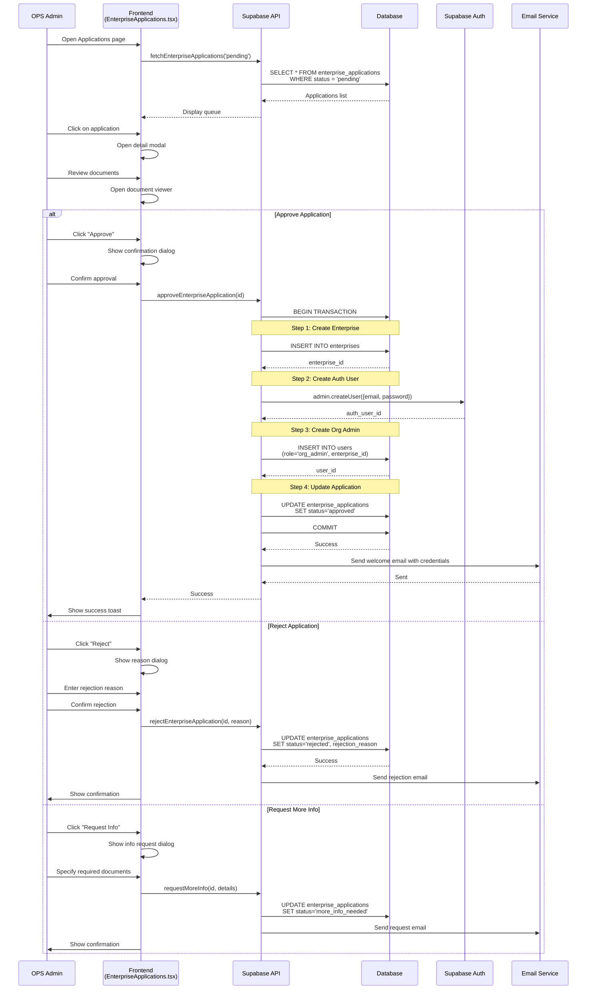
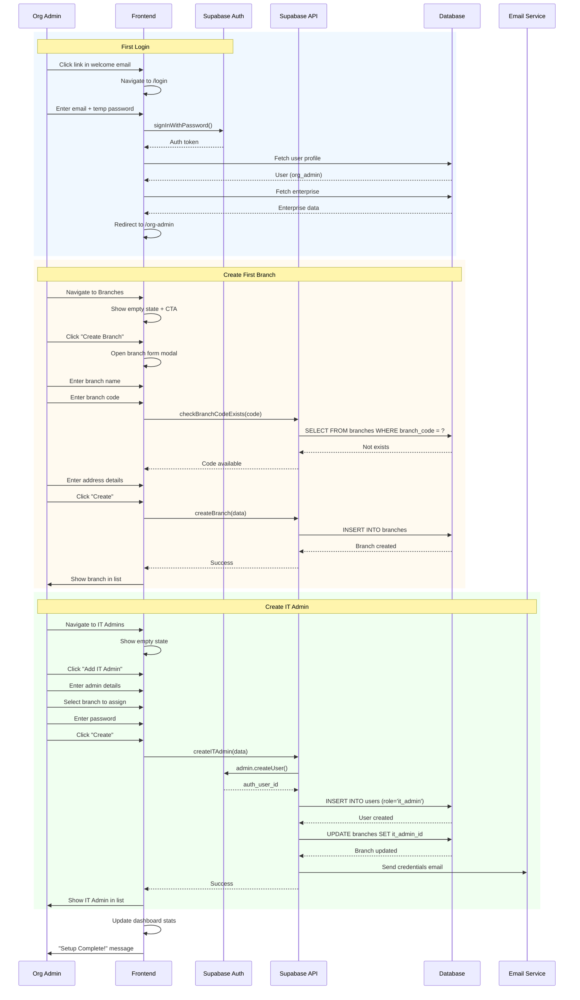
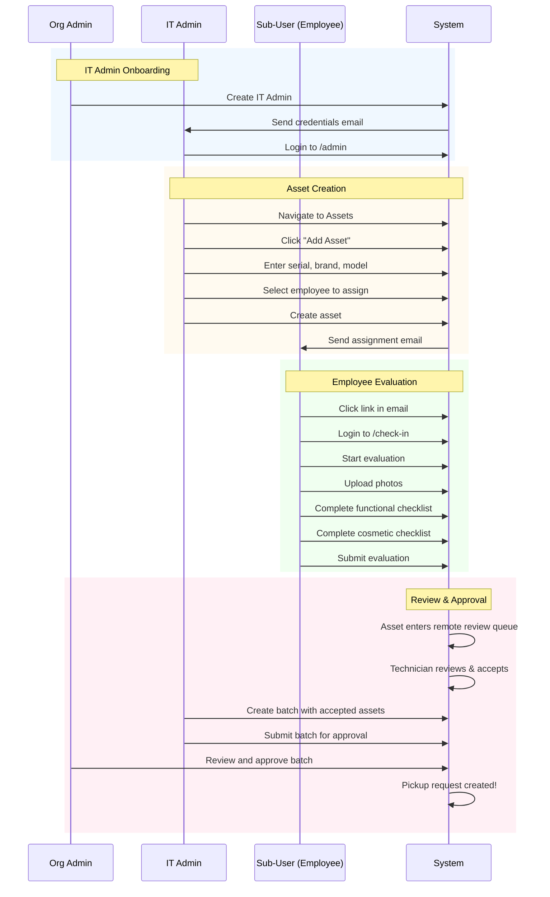
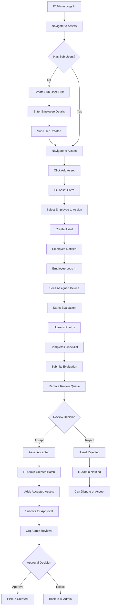
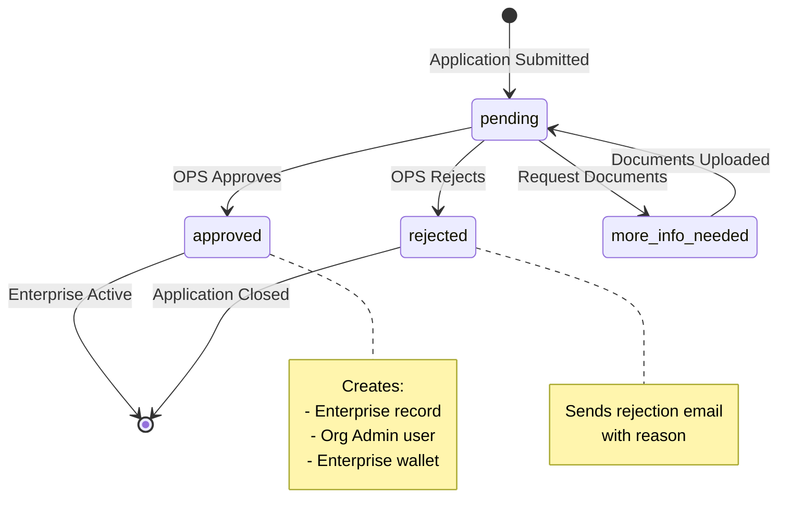

# Enterprise Onboarding Journey

## Overview

This document details the complete enterprise onboarding flow from initial registration through first asset submission.

## Journey Stages



---

## Stage 1: Discovery & Registration

### 1.1 User Journey Map

```
┌─────────────────────────────────────────────────────────────────────────────┐
│                         REGISTRATION JOURNEY                                │
├─────────────────────────────────────────────────────────────────────────────┤
│                                                                             │
│  PROSPECT ACTIONS                           SYSTEM RESPONSES                │
│  ─────────────────                         ─────────────────               │
│                                                                             │
│  1. Visit website                          Landing page loads               │
│         ↓                                                                   │
│  2. Click "Register Enterprise"            Navigate to /register           │
│         ↓                                                                   │
│  3. Enter company details                  Real-time validation            │
│     • Company name                         • GST format check              │
│     • GST number                           • PAN format check              │
│     • PAN number                                                           │
│         ↓                                                                   │
│  4. Enter contact person                   Email uniqueness check          │
│     • Name                                 • Check against existing users  │
│     • Email                                • Show error if duplicate       │
│     • Phone                                                                │
│         ↓                                                                   │
│  5. Enter address                          PIN code validation             │
│     • Address lines                        • City/State auto-fill         │
│     • City, State                                                         │
│     • PIN code                                                            │
│         ↓                                                                   │
│  6. Upload documents                       File validation                 │
│     • GST Certificate (required)           • File type check (PDF/Image)  │
│     • PAN Card (required)                  • Size limit check (5MB)       │
│     • Incorporation Cert (optional)        • Upload to Supabase Storage   │
│         ↓                                                                   │
│  7. Review & Submit                        Show summary for confirmation   │
│         ↓                                                                   │
│  8. Submit Application                     • Create application record    │
│                                            • Send confirmation email       │
│                                            • Notify OPS admins             │
│                                                                             │
└─────────────────────────────────────────────────────────────────────────────┘
```

### 1.2 Registration Form Sequence Diagram



### 1.3 Form Validation Rules

```typescript
// src/lib/validations/enterprise-application.ts

const gstRegex = /^[0-9]{2}[A-Z]{5}[0-9]{4}[A-Z]{1}[1-9A-Z]{1}Z[0-9A-Z]{1}$/;
const panRegex = /^[A-Z]{5}[0-9]{4}[A-Z]{1}$/;
const pinRegex = /^[1-9][0-9]{5}$/;

const enterpriseApplicationSchema = z.object({
  // Company Info
  company_name: z.string()
    .min(3, 'Company name must be at least 3 characters')
    .max(200, 'Company name too long'),

  gst_number: z.string()
    .regex(gstRegex, 'Invalid GST number format'),

  pan_number: z.string()
    .regex(panRegex, 'Invalid PAN number format'),

  // Contact Person (becomes Org Admin)
  contact_name: z.string()
    .min(2, 'Name must be at least 2 characters')
    .max(100),

  contact_email: z.string()
    .email('Invalid email format')
    .transform(v => v.toLowerCase()),

  contact_phone: z.string()
    .min(10, 'Phone must be at least 10 digits')
    .regex(/^[0-9+\-\s]+$/, 'Invalid phone format'),

  // Address
  address_line1: z.string().min(5, 'Address is required'),
  address_line2: z.string().optional(),
  city: z.string().min(2, 'City is required'),
  state: z.string().min(2, 'State is required'),
  pin_code: z.string().regex(pinRegex, 'Invalid PIN code'),

  // Documents
  documents: z.object({
    gst_certificate: z.string().url('GST certificate is required'),
    pan_card: z.string().url('PAN card is required'),
    incorporation_certificate: z.string().url().optional(),
  }),
});
```

### 1.4 Database Operation

```sql
-- Insert new application
INSERT INTO enterprise_applications (
  id,
  company_name,
  gst_number,
  pan_number,
  contact_name,
  contact_email,
  contact_phone,
  address_line1,
  address_line2,
  city,
  state,
  pin_code,
  documents,
  status,
  created_at
) VALUES (
  'ea-{timestamp}-{random}',
  :company_name,
  :gst_number,
  :pan_number,
  :contact_name,
  :contact_email,
  :contact_phone,
  :address_line1,
  :address_line2,
  :city,
  :state,
  :pin_code,
  :documents_json,
  'pending',
  NOW()
);
```

### 1.5 Technical Implementation

| Component | File Path | Purpose |
|-----------|-----------|---------|
| Registration Page | `src/pages/auth/EnterpriseRegister.tsx` | Multi-step form |
| Form Schema | `src/lib/validations/enterprise.ts` | Zod validation |
| Mutation | `src/lib/db/mutations.ts` | `createEnterpriseApplication()` |
| Query | `src/lib/db/queries.ts` | `checkEmailExists()` |

---

## Stage 2: Application Review

### 2.1 OPS Admin Review Journey

```
┌─────────────────────────────────────────────────────────────────────────────┐
│                      APPLICATION REVIEW JOURNEY                             │
├─────────────────────────────────────────────────────────────────────────────┤
│                                                                             │
│  TRIGGER: Email notification / Dashboard indicator                          │
│                                                                             │
│  OPS ADMIN ACTIONS                         SYSTEM RESPONSES                 │
│  ─────────────────                         ─────────────────                │
│                                                                             │
│  1. Login to /ops portal                   Show dashboard with badge        │
│         ↓                                                                   │
│  2. Navigate to Applications               Load application queue           │
│         ↓                                                                   │
│  3. Filter by "Pending"                    Show pending applications        │
│         ↓                                                                   │
│  4. Click application row                  Show application detail modal    │
│         ↓                                                                   │
│  5. Review company details                 Display all submitted data       │
│     • Verify GST/PAN                                                       │
│     • Check address                                                        │
│         ↓                                                                   │
│  6. Review documents                       Show document previews          │
│     • Open GST certificate                 • PDF viewer / image viewer     │
│     • Open PAN card                                                        │
│     • Open incorporation cert                                              │
│         ↓                                                                   │
│  7. Make decision:                                                         │
│                                                                             │
│     ┌─────────────┐  ┌──────────────┐  ┌───────────────┐                   │
│     │   APPROVE   │  │    REJECT    │  │  REQUEST INFO │                   │
│     └──────┬──────┘  └──────┬───────┘  └───────┬───────┘                   │
│            ↓                ↓                   ↓                           │
│     • Create enterprise  • Set status to    • Set status to                │
│     • Create Org Admin     'rejected'         'more_info_needed'           │
│     • Send welcome       • Enter reason     • Specify required docs        │
│       email              • Send rejection   • Send request email           │
│                            email                                           │
│                                                                             │
└─────────────────────────────────────────────────────────────────────────────┘
```

### 2.2 Review Sequence Diagram



### 2.3 Approval Transaction (Database)

```sql
-- Full approval transaction
BEGIN;

-- 1. Create enterprise record
INSERT INTO enterprises (
  id,
  name,
  gst_number,
  pan_number,
  address,
  status,
  created_at
) VALUES (
  'ent-{uuid}',
  :company_name,
  :gst_number,
  :pan_number,
  :address_json,
  'active',
  NOW()
) RETURNING id INTO enterprise_id;

-- 2. Create user record (Org Admin)
INSERT INTO users (
  id,  -- Same as auth user ID
  email,
  name,
  phone,
  role,
  enterprise_id,
  status,
  created_at
) VALUES (
  :auth_user_id,
  :contact_email,
  :contact_name,
  :contact_phone,
  'org_admin',
  enterprise_id,
  'active',
  NOW()
);

-- 3. Create enterprise wallet
INSERT INTO enterprise_wallets (
  id,
  enterprise_id,
  available_balance,
  pending_balance,
  total_earned,
  total_redeemed,
  created_at
) VALUES (
  'wallet-{uuid}',
  enterprise_id,
  0,
  0,
  0,
  0,
  NOW()
);

-- 4. Update application status
UPDATE enterprise_applications
SET
  status = 'approved',
  reviewed_by = :ops_admin_id,
  reviewed_at = NOW(),
  enterprise_id = enterprise_id
WHERE id = :application_id;

-- 5. Create audit log
INSERT INTO audit_logs (
  id,
  entity_type,
  entity_id,
  action,
  performed_by,
  details,
  created_at
) VALUES (
  'audit-{uuid}',
  'enterprise_application',
  :application_id,
  'approved',
  :ops_admin_id,
  :details_json,
  NOW()
);

COMMIT;
```

### 2.4 Technical Implementation

| Component | File Path | Purpose |
|-----------|-----------|---------|
| Applications Queue | `src/pages/ops/EnterpriseApplications.tsx` | List & review |
| Approval Mutation | `src/lib/db/mutations.ts` | `approveEnterpriseApplication()` |
| Rejection Mutation | `src/lib/db/mutations.ts` | `rejectEnterpriseApplication()` |
| Query | `src/lib/db/queries.ts` | `fetchEnterpriseApplications()` |

---

## Stage 3: Initial Setup (Org Admin)

### 3.1 First Login & Setup Journey

```
┌─────────────────────────────────────────────────────────────────────────────┐
│                       ORG ADMIN INITIAL SETUP                               │
├─────────────────────────────────────────────────────────────────────────────┤
│                                                                             │
│  TRIGGER: Welcome email with temporary password                             │
│                                                                             │
│  ORG ADMIN ACTIONS                         SYSTEM RESPONSES                 │
│  ─────────────────                         ─────────────────                │
│                                                                             │
│  1. Click link in welcome email            Navigate to /login               │
│         ↓                                                                   │
│  2. Enter credentials                      Authenticate user                │
│         ↓                                                                   │
│  3. (Optional) Change password             Update auth password             │
│         ↓                                                                   │
│  4. Land on dashboard                      Show empty state UI              │
│         ↓                                                                   │
│  5. Create first branch                    Guide wizard appears             │
│     • Branch name                                                          │
│     • Branch code                          Validate uniqueness              │
│     • Address details                                                      │
│         ↓                                                                   │
│  6. Create first IT Admin                  Create user account              │
│     • Name                                                                 │
│     • Email                                Send invitation email            │
│     • Phone                                                                │
│     • Password                                                             │
│         ↓                                                                   │
│  7. Assign IT Admin to branch              Link admin to branch             │
│         ↓                                                                   │
│  8. Setup complete!                        Show success state               │
│                                                                             │
│  ┌─────────────────────────────────────────────────────────────────────┐   │
│  │                        OPTIONAL BULK SETUP                          │   │
│  ├─────────────────────────────────────────────────────────────────────┤   │
│  │                                                                      │   │
│  │  Alternative path for large enterprises:                             │   │
│  │                                                                      │   │
│  │  5a. Bulk upload branches                                           │   │
│  │      • Download CSV template                                        │   │
│  │      • Fill branch details                                          │   │
│  │      • Upload and validate                                          │   │
│  │      • Create all branches                                          │   │
│  │              ↓                                                       │   │
│  │  6a. Bulk upload IT Admins                                          │   │
│  │      • Download CSV template                                        │   │
│  │      • Fill admin details + branch codes                            │   │
│  │      • Upload and validate                                          │   │
│  │      • Create admins + assignments                                  │   │
│  │                                                                      │   │
│  └─────────────────────────────────────────────────────────────────────┘   │
│                                                                             │
└─────────────────────────────────────────────────────────────────────────────┘
```

### 3.2 Initial Setup Sequence Diagram



### 3.3 Branch Creation Rules

```typescript
// Branch code validation
const branchCodeSchema = z.string()
  .min(1, 'Branch code is required')
  .max(10, 'Maximum 10 characters')
  .regex(/^[A-Z0-9]+$/, 'Only uppercase letters and numbers')
  .transform(val => val.toUpperCase());

// Branch form schema
const branchFormSchema = z.object({
  branch_name: z.string().min(1).max(100),
  branch_code: branchCodeSchema,
  address_line1: z.string().min(1),
  address_line2: z.string().optional(),
  city: z.string().min(1),
  state: z.string().min(1),
  pin_code: z.string().regex(/^\d{6}$/),
  site_contact_person: z.string().optional(),
  site_contact_phone: z.string().optional(),
  it_admin_id: z.string().nullable().optional(),
});
```

### 3.4 Technical Implementation

| Component | File Path | Purpose |
|-----------|-----------|---------|
| Dashboard | `src/pages/org-admin/Dashboard.tsx` | Overview + empty states |
| Branch Management | `src/pages/org-admin/BranchManagement.tsx` | CRUD branches |
| Bulk Upload | `src/pages/org-admin/BulkBranchUpload.tsx` | CSV upload |
| IT Admin Management | `src/pages/org-admin/ITAdminManagement.tsx` | CRUD IT admins |
| Create Branch | `src/lib/db/mutations.ts` | `createBranch()` |
| Create IT Admin | `src/lib/db/mutations.ts` | `createITAdmin()` |

---

## Stage 4: First Asset Submission

### 4.1 Complete First Asset Journey



### 4.2 First Asset Flowchart



---

## Application Status State Machine



---

## API Endpoints Summary

| Endpoint | Method | Auth | Purpose |
|----------|--------|------|---------|
| `createEnterpriseApplication` | Mutation | None | Submit registration |
| `fetchEnterpriseApplications` | Query | OPS+ | List applications |
| `approveEnterpriseApplication` | Mutation | OPS+ | Approve & create enterprise |
| `rejectEnterpriseApplication` | Mutation | OPS+ | Reject with reason |
| `createBranch` | Mutation | Org Admin | Create branch |
| `createITAdmin` | Mutation | Org Admin | Create IT admin |
| `checkBranchCodeExists` | Query | Org Admin | Validate uniqueness |
| `checkEmailExists` | Query | Public | Registration validation |

---

## Error Handling

### Registration Errors

| Error | Cause | User Message | Resolution |
|-------|-------|--------------|------------|
| Email exists | Duplicate registration | "This email is already registered" | Login or use different email |
| Invalid GST | Format mismatch | "Invalid GST number format" | Correct GST format |
| Upload failed | Network/size | "File upload failed" | Retry upload |
| Submission failed | Server error | "Unable to submit. Please try again." | Retry or contact support |

### Approval Errors

| Error | Cause | Admin Message | Resolution |
|-------|-------|---------------|------------|
| Auth creation failed | Email conflict | "Could not create user account" | Check email availability |
| Transaction failed | DB error | "Approval failed. Please retry." | Retry approval |
| Email send failed | SMTP error | "Approval successful but email failed" | Manually send credentials |
