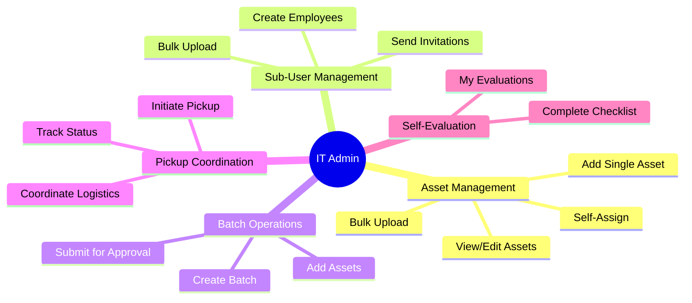
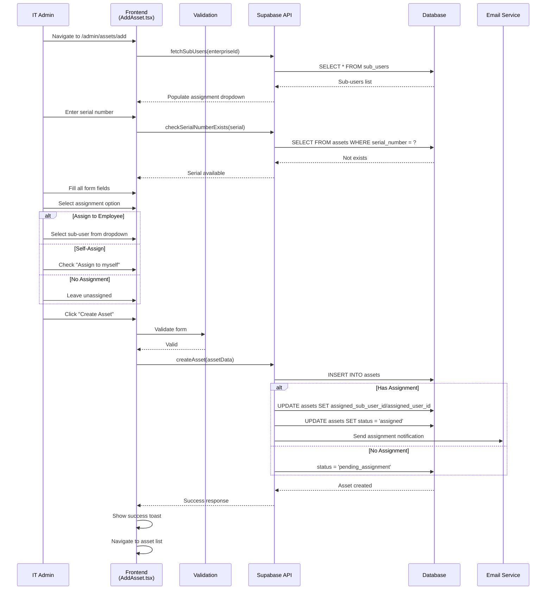
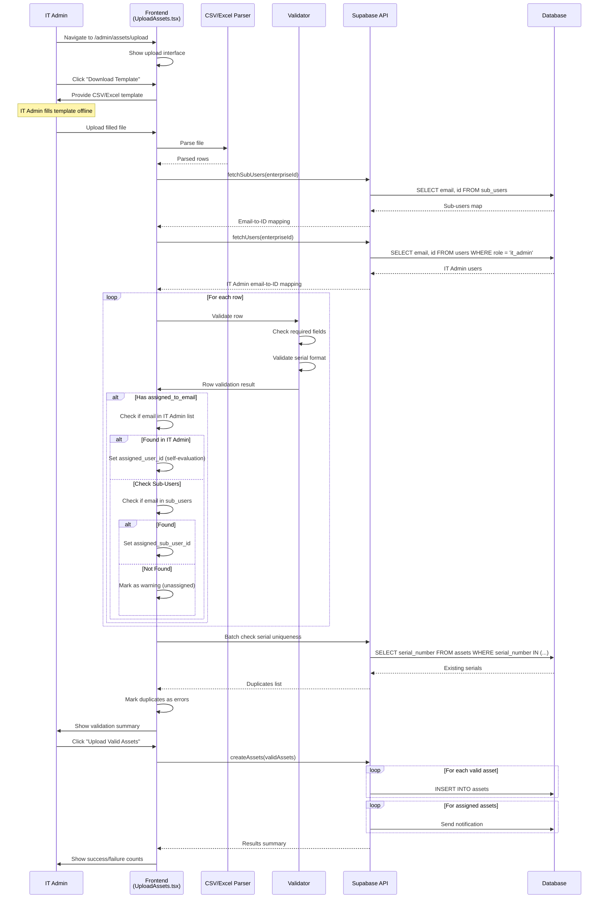
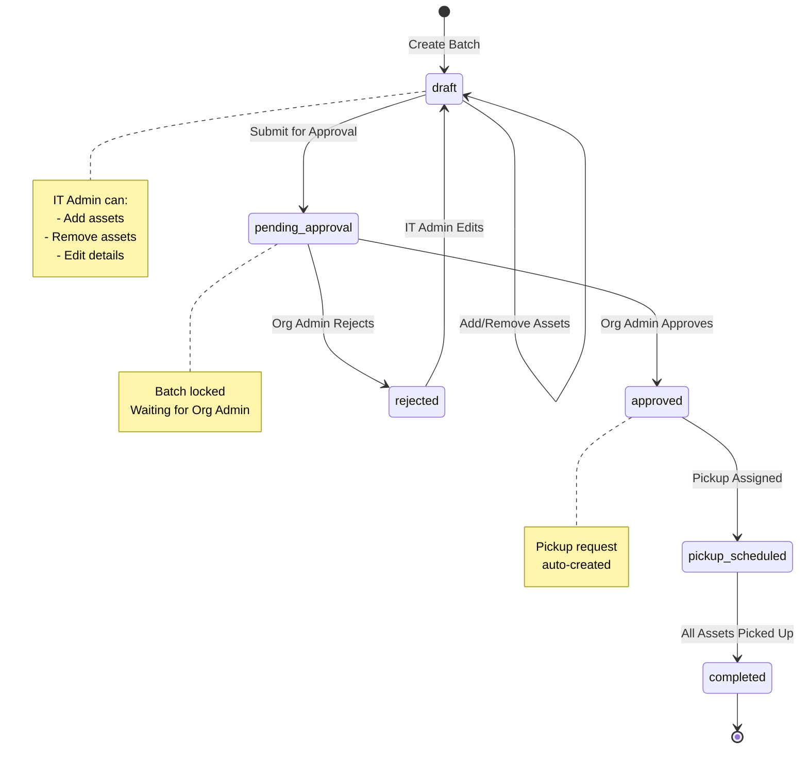
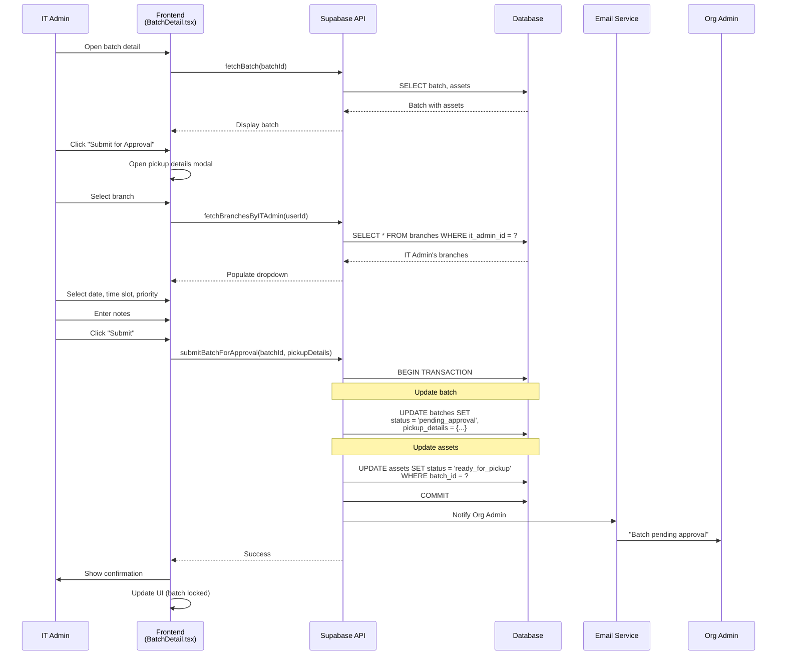
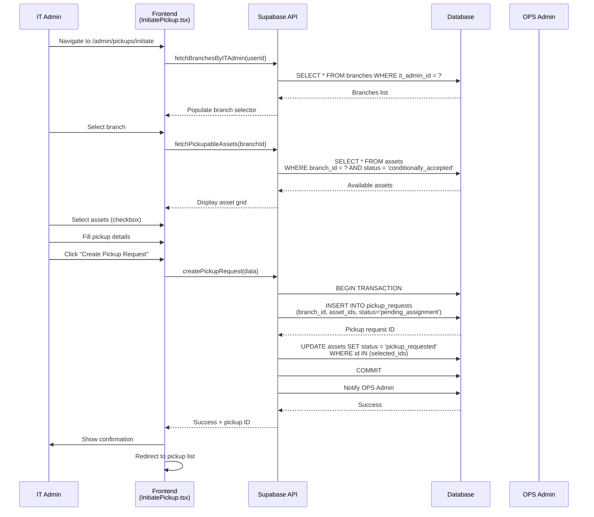
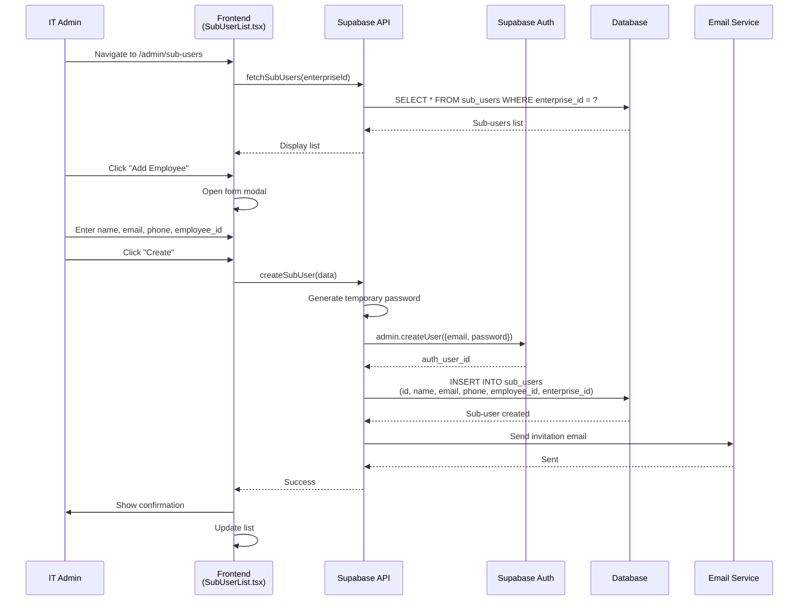
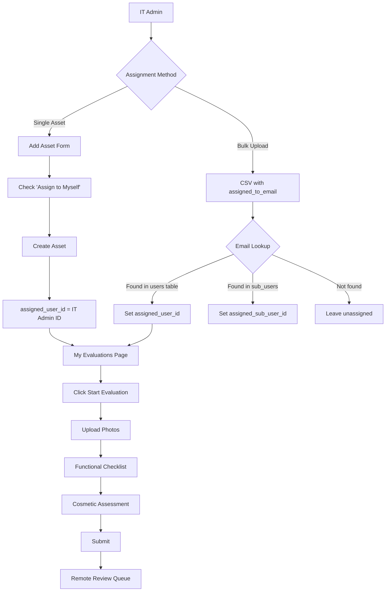
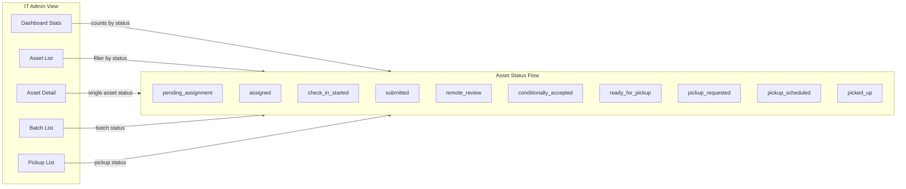

# IT Admin Journeys

## Overview

IT Admin is the primary operational role for day-to-day asset management. This document covers all IT Admin workflows in detail.

## Journey Overview



---

## Journey 1: Asset Creation (Single)

### 1.1 User Journey Map

```
┌─────────────────────────────────────────────────────────────────────────────┐
│                      SINGLE ASSET CREATION                                  │
├─────────────────────────────────────────────────────────────────────────────┤
│                                                                             │
│  IT ADMIN ACTIONS                          SYSTEM RESPONSES                 │
│  ─────────────────                         ─────────────────                │
│                                                                             │
│  1. Login to /admin                        Load dashboard                   │
│         ↓                                                                   │
│  2. Navigate to Assets                     Load asset list                  │
│         ↓                                                                   │
│  3. Click "Add Asset"                      Open asset form                  │
│         ↓                                                                   │
│  4. Enter asset details:                   Real-time validation            │
│     • Serial Number                        • Check uniqueness               │
│     • Brand (select or custom)                                             │
│     • Model                                                                │
│     • Asset Type (laptop/desktop/etc)                                      │
│         ↓                                                                   │
│  5. Enter specifications (optional):       Auto-format inputs              │
│     • Processor                                                            │
│     • RAM                                                                  │
│     • Storage                                                              │
│     • Screen Size                                                          │
│         ↓                                                                   │
│  6. Choose assignment:                                                     │
│     ┌────────────────┐  ┌─────────────────┐  ┌─────────────────┐           │
│     │ No Assignment  │  │ Assign to       │  │ Self-Assign     │           │
│     │ (create only)  │  │ Employee        │  │ (evaluate self) │           │
│     └────────────────┘  └─────────────────┘  └─────────────────┘           │
│         ↓                                                                   │
│  7. Click "Create Asset"                   • Validate all fields           │
│                                            • Check serial uniqueness       │
│                                            • Create asset record           │
│                                            • Send notification if assigned │
│         ↓                                                                   │
│  8. See confirmation                       • Toast notification            │
│                                            • Redirect to asset list        │
│                                            • Asset appears in list         │
│                                                                             │
└─────────────────────────────────────────────────────────────────────────────┘
```

### 1.2 Sequence Diagram



### 1.3 Form Validation Schema

```typescript
const assetFormSchema = z.object({
  serial_number: z.string()
    .min(1, 'Serial number is required')
    .max(100)
    .transform(val => val.toUpperCase().trim()),

  brand: z.string().min(1, 'Brand is required'),

  model: z.string().min(1, 'Model is required'),

  asset_type: z.enum([
    'laptop',
    'desktop',
    'monitor',
    'phone',
    'tablet',
    'printer',
    'other'
  ]),

  specs: z.object({
    processor: z.string().optional(),
    ram: z.string().optional(),
    storage: z.string().optional(),
    screen_size: z.string().optional(),
  }).optional(),

  assigned_sub_user_id: z.string().nullable().optional(),
  is_self_assigned: z.boolean().optional(),
});
```

---

## Journey 2: Bulk Asset Upload

### 2.1 User Journey Map

```
┌─────────────────────────────────────────────────────────────────────────────┐
│                       BULK ASSET UPLOAD                                     │
├─────────────────────────────────────────────────────────────────────────────┤
│                                                                             │
│  IT ADMIN ACTIONS                          SYSTEM RESPONSES                 │
│  ─────────────────                         ─────────────────                │
│                                                                             │
│  1. Navigate to Assets > Upload            Open upload page                 │
│         ↓                                                                   │
│  2. Download CSV/Excel template            Provide template file            │
│         ↓                                                                   │
│  3. Fill template with asset data:                                         │
│     • serial_number (required)                                             │
│     • brand (required)                                                     │
│     • model (required)                                                     │
│     • asset_type (required)                                                │
│     • processor, ram, storage (optional)                                   │
│     • assigned_to_email (optional)         Match with sub_users            │
│         ↓                                                                   │
│  4. Upload filled file                     Parse and validate              │
│         ↓                                                                   │
│  5. Review validation results:                                             │
│     ┌──────────────────────────────────────────────────────────────────┐   │
│     │  ✓ 45 assets valid                                                │   │
│     │  ⚠ 3 assets with warnings (employee not found)                    │   │
│     │  ✗ 2 assets with errors (duplicate serial)                        │   │
│     └──────────────────────────────────────────────────────────────────┘   │
│         ↓                                                                   │
│  6. View detailed errors                   Show row-by-row issues          │
│         ↓                                                                   │
│  7. Choose action:                                                         │
│     ┌─────────────────┐  ┌─────────────────┐                               │
│     │ Upload Valid    │  │ Fix & Re-upload │                               │
│     │ Only (45)       │  │                 │                               │
│     └─────────────────┘  └─────────────────┘                               │
│         ↓                                                                   │
│  8. Confirm upload                         • Create assets batch           │
│                                            • Send notifications            │
│                                            • Show results summary          │
│                                                                             │
└─────────────────────────────────────────────────────────────────────────────┘
```

### 2.2 Sequence Diagram



### 2.3 CSV Template Columns

| Column | Required | Description | Example |
|--------|----------|-------------|---------|
| `serial_number` | Yes | Unique device serial | `SN123456` |
| `brand` | Yes | Manufacturer | `Dell`, `HP`, `Lenovo` |
| `model` | Yes | Model name | `Latitude 5520` |
| `asset_type` | Yes | Device category | `laptop`, `desktop` |
| `processor` | No | CPU details | `Intel Core i7-1165G7` |
| `ram` | No | Memory | `16GB` |
| `storage` | No | Storage | `512GB SSD` |
| `screen_size` | No | Display size | `15.6"` |
| `assigned_to_email` | No | Employee email | `john@techcorp.com` |

### 2.4 Validation Rules

```typescript
const bulkValidationRules = {
  serial_number: {
    required: true,
    unique: true, // Within file and database
    format: /^[A-Z0-9\-]+$/i,
  },
  brand: {
    required: true,
    maxLength: 100,
  },
  model: {
    required: true,
    maxLength: 200,
  },
  asset_type: {
    required: true,
    enum: ['laptop', 'desktop', 'monitor', 'phone', 'tablet', 'printer', 'other'],
  },
  assigned_to_email: {
    required: false,
    format: 'email',
    lookup: 'sub_users.email OR users.email', // Check both tables
  },
};
```

---

## Journey 3: Batch Creation & Management

### 3.1 User Journey Map

```
┌─────────────────────────────────────────────────────────────────────────────┐
│                      BATCH CREATION & SUBMISSION                            │
├─────────────────────────────────────────────────────────────────────────────┤
│                                                                             │
│  PREREQUISITE: Have assets with status "conditionally_accepted"             │
│                                                                             │
│  IT ADMIN ACTIONS                          SYSTEM RESPONSES                 │
│  ─────────────────                         ─────────────────                │
│                                                                             │
│  1. Navigate to Batches                    Load batch list                  │
│         ↓                                                                   │
│  2. Click "Create Batch"                   Open batch form                  │
│         ↓                                                                   │
│  3. Enter batch details:                                                   │
│     • Batch name                                                           │
│     • Description (optional)                                               │
│         ↓                                                                   │
│  4. Create batch (draft)                   Batch created in draft mode     │
│         ↓                                                                   │
│  5. Navigate to batch detail               Show batch detail page          │
│         ↓                                                                   │
│  6. Click "Add Assets"                     Show available assets           │
│         ↓                                                                   │
│  7. Select assets to add:                  Filter by status                │
│     • Filter by brand/type                 Show only eligible assets       │
│     • Select individual assets                                             │
│     • Or "Select All"                                                      │
│         ↓                                                                   │
│  8. Click "Add to Batch"                   Link assets to batch            │
│         ↓                                                                   │
│  9. Review batch contents                  Show asset count, estimated $   │
│         ↓                                                                   │
│  10. Click "Submit for Approval"           Open pickup details modal       │
│         ↓                                                                   │
│  11. Fill pickup details:                                                  │
│      • Select Branch                       Load IT admin's branches        │
│      • Preferred Date                      Date picker (future only)       │
│      • Time Slot                           morning/afternoon/evening       │
│      • Priority                            normal/high/urgent              │
│      • Notes                               Free text                       │
│         ↓                                                                   │
│  12. Confirm submission                    • Update batch status           │
│                                            • Notify Org Admin              │
│                                            • Batch locked for editing      │
│                                                                             │
└─────────────────────────────────────────────────────────────────────────────┘
```

### 3.2 Batch Lifecycle Diagram



### 3.3 Submission Sequence Diagram



### 3.4 Technical Implementation

| Component | File Path | Purpose |
|-----------|-----------|---------|
| Batch List | `src/pages/admin/BatchList.tsx` | List all batches |
| Batch Create | `src/pages/admin/BatchCreate.tsx` | Create new batch |
| Batch Detail | `src/pages/admin/BatchDetail.tsx` | Manage batch assets |
| Create Mutation | `src/lib/db/mutations.ts` | `createBatch()` |
| Submit Mutation | `src/lib/db/mutations.ts` | `submitBatchForApproval()` |
| Add Assets | `src/lib/db/mutations.ts` | `addAssetsToBatch()` |

---

## Journey 4: Pickup Initiation

### 4.1 User Journey Map

```
┌─────────────────────────────────────────────────────────────────────────────┐
│                        PICKUP INITIATION                                    │
├─────────────────────────────────────────────────────────────────────────────┤
│                                                                             │
│  TRIGGER: Have approved assets ready for pickup (not in batch)              │
│                                                                             │
│  IT ADMIN ACTIONS                          SYSTEM RESPONSES                 │
│  ─────────────────                         ─────────────────                │
│                                                                             │
│  1. Navigate to Pickups                    Load pickup requests list        │
│         ↓                                                                   │
│  2. Click "Initiate Pickup"                Open initiate pickup page        │
│         ↓                                                                   │
│  3. Select branch                          Load IT admin's branches         │
│         ↓                                  Show branch address              │
│  4. Select assets:                         Show pickupable assets           │
│     • Filter by status                     "conditionally_accepted" only    │
│     • Select individual or "All"                                           │
│         ↓                                                                   │
│  5. Fill pickup details:                                                   │
│     • Preferred Date                       Future dates only                │
│     • Time Slot                            morning/afternoon/evening        │
│     • Priority                             normal/high/urgent               │
│     • Special Instructions                 Free text                        │
│         ↓                                                                   │
│  6. Review summary:                        Show asset count, address        │
│         ↓                                                                   │
│  7. Submit request                         • Create pickup_request          │
│                                            • Update asset statuses          │
│                                            • Notify OPS Admin               │
│         ↓                                                                   │
│  8. See confirmation                       • Request ID displayed           │
│                                            • Redirect to pickup list        │
│                                            • Status: "pending_assignment"   │
│                                                                             │
└─────────────────────────────────────────────────────────────────────────────┘
```

### 4.2 Sequence Diagram



---

## Journey 5: Sub-User Management

### 5.1 User Journey Map

```
┌─────────────────────────────────────────────────────────────────────────────┐
│                      SUB-USER MANAGEMENT                                    │
├─────────────────────────────────────────────────────────────────────────────┤
│                                                                             │
│  CREATE SINGLE SUB-USER                                                     │
│  ─────────────────────                                                     │
│  1. Navigate to Sub-Users → Click "Add Employee"                           │
│  2. Enter details: Name, Email, Phone, Employee ID                         │
│  3. Create → Account created with temporary password                       │
│  4. System sends invitation email                                          │
│                                                                             │
│  BULK UPLOAD SUB-USERS                                                     │
│  ─────────────────────                                                     │
│  1. Download CSV template                                                  │
│  2. Fill employee details                                                  │
│  3. Upload → Validate all rows                                             │
│  4. Review errors/warnings                                                 │
│  5. Confirm → Create accounts                                              │
│  6. System sends bulk invitations                                          │
│                                                                             │
│  MANAGE SUB-USERS                                                          │
│  ────────────────                                                          │
│  • View list with search/filter                                            │
│  • Edit details (name, phone)                                              │
│  • Resend invitation email                                                 │
│  • Deactivate (status → inactive)                                          │
│  • View assigned assets                                                    │
│                                                                             │
└─────────────────────────────────────────────────────────────────────────────┘
```

### 5.2 Sequence Diagram



---

## Journey 6: Self-Evaluation

### 6.1 User Journey Map

```
┌─────────────────────────────────────────────────────────────────────────────┐
│                       IT ADMIN SELF-EVALUATION                              │
├─────────────────────────────────────────────────────────────────────────────┤
│                                                                             │
│  USE CASE: IT Admin wants to evaluate their own device                      │
│                                                                             │
│  ASSIGNMENT PATH (Option A - During Asset Creation)                         │
│  ─────────────────────────────────────────────────                         │
│  1. Add Asset → Check "Assign to Myself"                                   │
│  2. Asset created with assigned_user_id = current user                     │
│  3. Asset appears in "My Evaluations" page                                 │
│                                                                             │
│  ASSIGNMENT PATH (Option B - Bulk Upload)                                   │
│  ─────────────────────────────────────────                                 │
│  1. In CSV, put IT Admin's email in assigned_to_email column               │
│  2. System detects email belongs to IT Admin (not sub-user)                │
│  3. Sets assigned_user_id instead of assigned_sub_user_id                  │
│  4. Asset appears in "My Evaluations" page                                 │
│                                                                             │
│  EVALUATION FLOW                                                           │
│  ───────────────                                                           │
│  1. Navigate to "My Evaluations" → See assigned devices                    │
│  2. Click "Start Evaluation" → Same form as sub-user                       │
│  3. Upload photos                                                          │
│  4. Complete functional checklist                                          │
│  5. Complete cosmetic checklist                                            │
│  6. Submit → Goes to remote review queue                                   │
│                                                                             │
└─────────────────────────────────────────────────────────────────────────────┘
```

### 6.2 Self-Evaluation Flowchart



---

## Journey 7: Tracking Asset Status

### 7.1 Status Visibility



### 7.2 Dashboard Metrics

| Metric | Calculation | Purpose |
|--------|-------------|---------|
| Total Assets | Count all assets | Overview |
| Pending Assignment | Status = 'pending_assignment' | Action needed |
| Assigned | Status = 'assigned' | Waiting for employee |
| Submitted | Status = 'submitted' | In review |
| Approved | Status = 'conditionally_accepted' | Ready for batch |
| Ready for Pickup | Status = 'ready_for_pickup' | Can initiate pickup |
| In Transit | Status = 'picked_up' or 'in_transit' | Being shipped |
| Completed | Status = 'completed' | Finished |

---

## API Endpoints Summary

| Endpoint | Method | Purpose |
|----------|--------|---------|
| `fetchAssets` | Query | List assets (enterprise/branch scoped) |
| `fetchAssetsByITAdmin` | Query | Assets for IT admin's branches |
| `createAsset` | Mutation | Create single asset |
| `createAssets` | Mutation | Bulk create assets |
| `fetchBatches` | Query | List batches |
| `fetchBatchesByITAdmin` | Query | Batches for IT admin's branches |
| `createBatch` | Mutation | Create batch |
| `submitBatchForApproval` | Mutation | Submit to Org Admin |
| `createPickupRequest` | Mutation | Initiate pickup |
| `fetchPickupsByITAdmin` | Query | Pickup requests |
| `fetchSubUsers` | Query | List sub-users |
| `createSubUser` | Mutation | Create employee |
| `fetchSelfAssignedAssets` | Query | IT admin's own assets |

---

## Error Handling

| Error | User Message | Resolution |
|-------|--------------|------------|
| Duplicate serial | "Serial number already exists" | Use different serial |
| Invalid email | "Employee email not found" | Check email or create sub-user |
| Empty batch | "Batch must have at least 1 asset" | Add assets before submitting |
| No eligible assets | "No assets available for pickup" | Wait for approvals |
| Submission failed | "Failed to submit. Please retry." | Check connection, retry |
