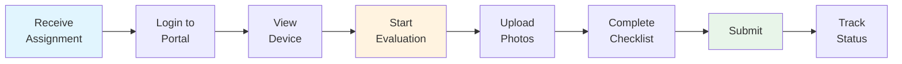
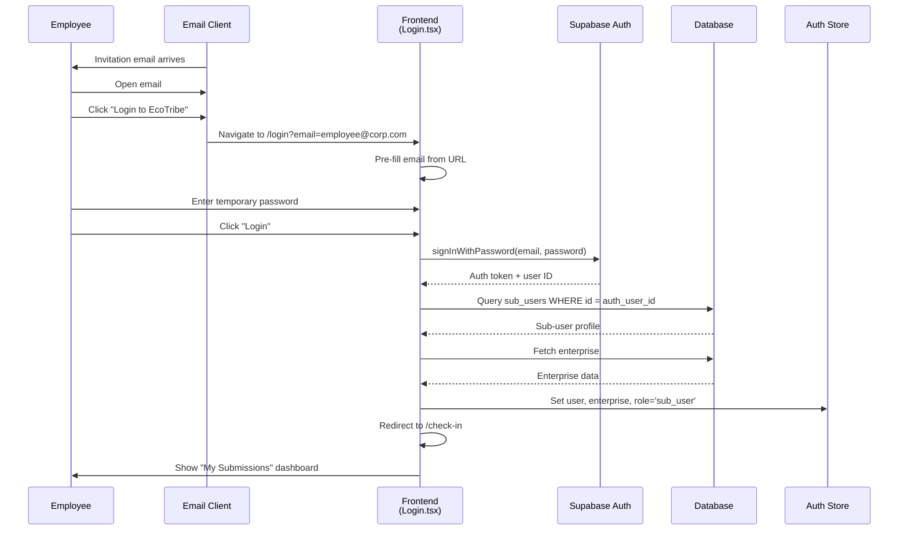
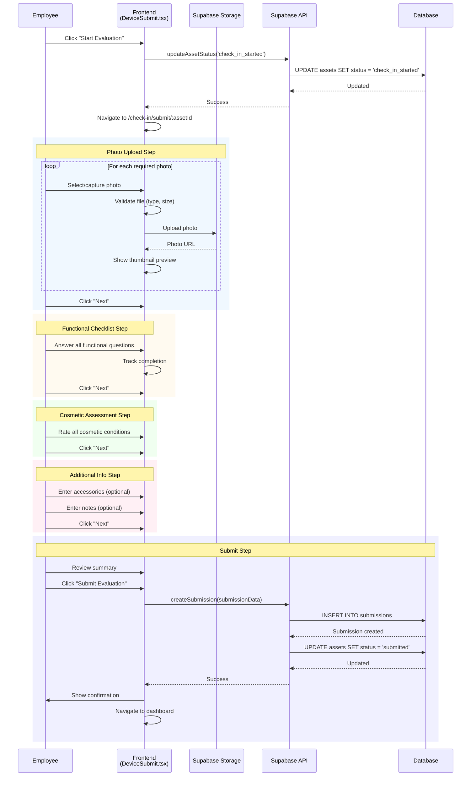
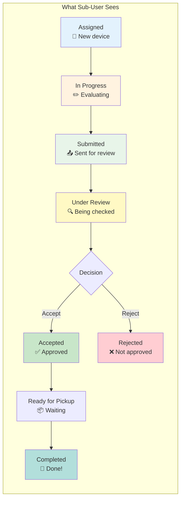
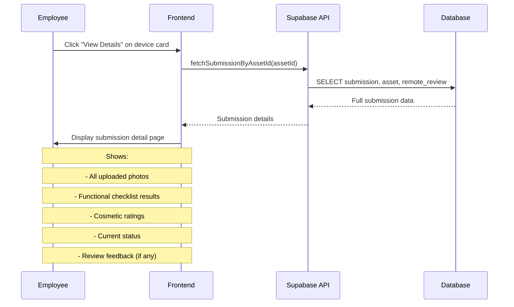
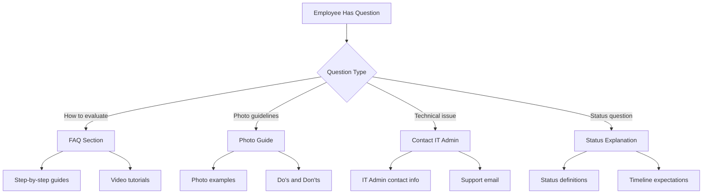

# Sub-User (Employee) Journeys

## Overview

Sub-Users are enterprise employees who perform device self-evaluations. This document covers the complete employee journey from receiving an assignment to tracking submission status.

## Journey Overview



---

## Journey 1: First-Time Login

### 1.1 User Journey Map

```
┌─────────────────────────────────────────────────────────────────────────────┐
│                       FIRST-TIME LOGIN                                      │
├─────────────────────────────────────────────────────────────────────────────┤
│                                                                             │
│  TRIGGER: Receive invitation email from IT Admin                            │
│                                                                             │
│  EMPLOYEE ACTIONS                          SYSTEM RESPONSES                 │
│  ────────────────                          ─────────────────                │
│                                                                             │
│  1. Receive email                          Email contains:                  │
│     • Subject: "Device evaluation"         • Login URL                      │
│     • From: EcoTribe                       • Temp credentials               │
│         ↓                                                                   │
│  2. Click login link                       Navigate to /login               │
│         ↓                                                                   │
│  3. Enter credentials                      Authenticate                     │
│     • Email (pre-filled if from link)                                      │
│     • Temporary password                                                   │
│         ↓                                                                   │
│  4. (Optional) Change password             Update password                  │
│         ↓                                                                   │
│  5. Land on /check-in portal               Show "My Submissions"            │
│         ↓                                                                   │
│  6. See assigned device(s)                 Device cards with status         │
│                                                                             │
└─────────────────────────────────────────────────────────────────────────────┘
```

### 1.2 Login Sequence Diagram



---

## Journey 2: Device Self-Evaluation

### 2.1 Complete Evaluation Journey

```
┌─────────────────────────────────────────────────────────────────────────────┐
│                      DEVICE SELF-EVALUATION                                 │
├─────────────────────────────────────────────────────────────────────────────┤
│                                                                             │
│  PREREQUISITE: Device assigned by IT Admin (status = 'assigned')            │
│                                                                             │
│  EMPLOYEE ACTIONS                          SYSTEM RESPONSES                 │
│  ────────────────                          ─────────────────                │
│                                                                             │
│  1. View "My Submissions"                  Show assigned devices            │
│         ↓                                                                   │
│  2. Click "Start Evaluation"               Navigate to /check-in/submit/:id │
│         ↓                                  Status → "check_in_started"      │
│                                                                             │
│  ┌──────────────────────────────────────────────────────────────────────┐  │
│  │                      STEP 1: PHOTO UPLOAD                            │  │
│  ├──────────────────────────────────────────────────────────────────────┤  │
│  │  3. Upload required photos:                                          │  │
│  │     • Front view (screen visible)       Validate file type/size      │  │
│  │     • Back view (with stickers/labels)  Upload to Supabase Storage   │  │
│  │     • Keyboard close-up                 Show preview thumbnails      │  │
│  │     • Screen (powered on)                                            │  │
│  │     • Left side (ports)                                              │  │
│  │     • Right side (ports)                                             │  │
│  │                                                                      │  │
│  │  4. Click "Next"                        Validate all required photos │  │
│  └──────────────────────────────────────────────────────────────────────┘  │
│         ↓                                                                   │
│  ┌──────────────────────────────────────────────────────────────────────┐  │
│  │                    STEP 2: FUNCTIONAL CHECKLIST                      │  │
│  ├──────────────────────────────────────────────────────────────────────┤  │
│  │  5. Answer functional questions:        Yes/No/Partially             │  │
│  │     • Does device power on?                                          │  │
│  │     • Is display working properly?                                   │  │
│  │     • Is keyboard functioning?                                       │  │
│  │     • Is touchpad working?                                          │  │
│  │     • Are USB ports functional?                                      │  │
│  │     • Is audio working?                                             │  │
│  │     • Is webcam working?                                            │  │
│  │     • Is battery holding charge?                                    │  │
│  │     • Is WiFi working?                                              │  │
│  │     • Is Bluetooth working?                                         │  │
│  │                                                                      │  │
│  │  6. Click "Next"                        Validate all answered        │  │
│  └──────────────────────────────────────────────────────────────────────┘  │
│         ↓                                                                   │
│  ┌──────────────────────────────────────────────────────────────────────┐  │
│  │                    STEP 3: COSMETIC ASSESSMENT                       │  │
│  ├──────────────────────────────────────────────────────────────────────┤  │
│  │  7. Rate cosmetic condition:            Scale: None/Minor/Major      │  │
│  │     • Screen scratches                                               │  │
│  │     • Screen cracks                                                  │  │
│  │     • Body scratches                                                 │  │
│  │     • Body dents                                                     │  │
│  │     • Keyboard wear                                                  │  │
│  │     • Hinge condition                                               │  │
│  │     • Missing parts                                                  │  │
│  │                                                                      │  │
│  │  8. Click "Next"                        Validate all rated           │  │
│  └──────────────────────────────────────────────────────────────────────┘  │
│         ↓                                                                   │
│  ┌──────────────────────────────────────────────────────────────────────┐  │
│  │                    STEP 4: ADDITIONAL INFO                           │  │
│  ├──────────────────────────────────────────────────────────────────────┤  │
│  │  9. Enter optional details:                                          │  │
│  │     • Included accessories               Charger, bag, mouse, etc.   │  │
│  │     • Additional notes                   Free text                   │  │
│  │     • Known issues                       Any problems to report      │  │
│  └──────────────────────────────────────────────────────────────────────┘  │
│         ↓                                                                   │
│  ┌──────────────────────────────────────────────────────────────────────┐  │
│  │                    STEP 5: REVIEW & SUBMIT                           │  │
│  ├──────────────────────────────────────────────────────────────────────┤  │
│  │  10. Review submission summary           Show all entered data       │  │
│  │      • Photo previews                                                │  │
│  │      • Functional status                                             │  │
│  │      • Cosmetic ratings                                              │  │
│  │                                                                      │  │
│  │  11. Click "Submit Evaluation"           Create submission record    │  │
│  │                                          Update asset status         │  │
│  │                                          Show confirmation           │  │
│  └──────────────────────────────────────────────────────────────────────┘  │
│                                                                             │
│  12. See confirmation                      Status → "submitted"            │
│      • Return to dashboard                 • Asset shows "Submitted"       │
│      • Track review progress               • Can view submission details   │
│                                                                             │
└─────────────────────────────────────────────────────────────────────────────┘
```

### 2.2 Evaluation Sequence Diagram



### 2.3 Evaluation Form Data Structure

```typescript
interface EvaluationSubmission {
  asset_id: string;
  sub_user_id: string;

  // Photos
  photos: {
    front: string;      // URL
    back: string;
    keyboard: string;
    screen: string;
    left_side: string;
    right_side: string;
    additional?: string[];
  };

  // Functional Checklist
  functional: {
    powers_on: 'yes' | 'no' | 'partial';
    display_works: 'yes' | 'no' | 'partial';
    keyboard_works: 'yes' | 'no' | 'partial';
    touchpad_works: 'yes' | 'no' | 'partial';
    usb_ports_work: 'yes' | 'no' | 'partial';
    audio_works: 'yes' | 'no' | 'partial';
    webcam_works: 'yes' | 'no' | 'partial';
    battery_health: 'good' | 'fair' | 'poor';
    wifi_works: 'yes' | 'no' | 'partial';
    bluetooth_works: 'yes' | 'no' | 'partial';
  };

  // Cosmetic Assessment
  cosmetic: {
    screen_scratches: 'none' | 'minor' | 'major';
    screen_cracks: 'none' | 'minor' | 'major';
    body_scratches: 'none' | 'minor' | 'major';
    body_dents: 'none' | 'minor' | 'major';
    keyboard_wear: 'none' | 'minor' | 'major';
    hinge_condition: 'good' | 'loose' | 'damaged';
    missing_parts: string[];
  };

  // Additional
  accessories: string[];
  notes: string;
  known_issues: string;

  submitted_at: string;
}
```

### 2.4 Photo Requirements

| Photo | Required | Guidelines |
|-------|----------|------------|
| Front View | Yes | Full device, screen visible, lid open |
| Back View | Yes | All stickers, labels, serial visible |
| Keyboard | Yes | Close-up, all keys visible |
| Screen | Yes | Powered on, showing desktop |
| Left Side | Yes | All ports visible |
| Right Side | Yes | All ports visible |
| Additional | No | Any damage, accessories, special features |

**File Constraints:**
- Formats: JPG, PNG, HEIC
- Max size: 10MB per image
- Min resolution: 640x480

---

## Journey 3: Tracking Submission Status

### 3.1 Status Dashboard

```
┌─────────────────────────────────────────────────────────────────────────────┐
│                         MY SUBMISSIONS                                       │
├─────────────────────────────────────────────────────────────────────────────┤
│                                                                             │
│  ┌─────────────────────────────────────────────────────────────────────┐   │
│  │                     DEVICE CARD                                     │   │
│  ├─────────────────────────────────────────────────────────────────────┤   │
│  │  Dell Latitude 5520                                                 │   │
│  │  Serial: ABC123456                                                  │   │
│  │                                                                     │   │
│  │  Status: ████████████░░░░░░░░  Under Review                        │   │
│  │                                                                     │   │
│  │  ┌─────────┐  ┌─────────┐  ┌─────────┐  ┌─────────┐               │   │
│  │  │ ✓       │  │ ✓       │  │ ●       │  │ ○       │               │   │
│  │  │Assigned │→│Submitted│→│ Review  │→│ Pickup  │               │   │
│  │  └─────────┘  └─────────┘  └─────────┘  └─────────┘               │   │
│  │                                                                     │   │
│  │  [View Details]                    Submitted: Dec 5, 2025          │   │
│  └─────────────────────────────────────────────────────────────────────┘   │
│                                                                             │
│  Status Legend:                                                            │
│  ○ Pending   ● In Progress   ✓ Complete   ✗ Rejected                      │
│                                                                             │
└─────────────────────────────────────────────────────────────────────────────┘
```

### 3.2 Status Progression for Sub-User



### 3.3 Submission Detail View



---

## Journey 4: Handling Rejection

### 4.1 Rejection Notification Flow

```
┌─────────────────────────────────────────────────────────────────────────────┐
│                      REJECTION HANDLING                                     │
├─────────────────────────────────────────────────────────────────────────────┤
│                                                                             │
│  TRIGGER: Technician rejects submission during remote review                │
│                                                                             │
│  SYSTEM ACTIONS                            EMPLOYEE VIEW                    │
│  ──────────────                            ─────────────                    │
│                                                                             │
│  1. Technician clicks "Reject"             Email notification sent          │
│     with reason                                                            │
│         ↓                                                                   │
│  2. Asset status → "remote_rejected"       Dashboard shows rejection        │
│         ↓                                                                   │
│  3. Rejection reason stored                • Red status badge              │
│                                            • "View Details" shows reason    │
│         ↓                                                                   │
│  4. IT Admin notified                      Employee can see feedback        │
│                                                                             │
│  POSSIBLE OUTCOMES                                                         │
│  ─────────────────                                                         │
│  • IT Admin may reassign for re-evaluation                                 │
│  • IT Admin may dispute the rejection                                      │
│  • Asset may be removed from program                                       │
│                                                                             │
└─────────────────────────────────────────────────────────────────────────────┘
```

### 4.2 Rejection Detail View

```
┌─────────────────────────────────────────────────────────────────────────────┐
│                        SUBMISSION REJECTED                                  │
├─────────────────────────────────────────────────────────────────────────────┤
│                                                                             │
│  Dell Latitude 5520 • Serial: ABC123456                                    │
│                                                                             │
│  ┌─────────────────────────────────────────────────────────────────────┐   │
│  │  Status: REJECTED                                               ❌ │   │
│  └─────────────────────────────────────────────────────────────────────┘   │
│                                                                             │
│  Rejection Reason:                                                         │
│  ┌─────────────────────────────────────────────────────────────────────┐   │
│  │  "Photos do not clearly show the screen condition. The screen      │   │
│  │   photo appears to be of a different device. Please re-submit      │   │
│  │   with correct photos."                                            │   │
│  └─────────────────────────────────────────────────────────────────────┘   │
│                                                                             │
│  Reviewed by: Technical Team                                               │
│  Reviewed on: December 5, 2025 at 2:30 PM                                  │
│                                                                             │
│  What happens next?                                                        │
│  Your IT Admin has been notified. They may contact you to arrange          │
│  a re-evaluation or discuss the rejection.                                 │
│                                                                             │
│  Questions? Contact your IT Admin: it-admin@yourcompany.com                │
│                                                                             │
└─────────────────────────────────────────────────────────────────────────────┘
```

---

## Journey 5: Help & Support

### 5.1 Help Resources



### 5.2 FAQ Topics

| Topic | Description |
|-------|-------------|
| Getting Started | How to login, navigate the portal |
| Photo Tips | Best practices for device photos |
| Functional Test | How to test device functions |
| Cosmetic Rating | How to rate device condition |
| After Submission | What happens next |
| Rejection Help | Understanding rejection reasons |
| Contact Support | How to get help |

---

## Technical Implementation

### Components

| Component | File Path | Purpose |
|-----------|-----------|---------|
| My Submissions | `src/pages/check-in/MySubmissions.tsx` | Dashboard listing |
| Device Submit | `src/pages/check-in/DeviceSubmit.tsx` | Multi-step evaluation |
| Help | `src/pages/check-in/Help.tsx` | FAQ and support |
| Layout | `src/layouts/CheckInLayout.tsx` | Portal layout |

### API Endpoints

| Endpoint | Purpose |
|----------|---------|
| `fetchSubUserAssets(subUserId)` | Get assigned devices |
| `createSubmission(data)` | Submit evaluation |
| `updateAssetStatus(assetId, status)` | Update progress |
| `fetchSubmissionByAssetId(assetId)` | Get submission details |

### Database Tables

```sql
-- Assets assigned to sub-user
SELECT * FROM assets
WHERE assigned_sub_user_id = :sub_user_id
ORDER BY created_at DESC;

-- Submission record
INSERT INTO submissions (
  id, asset_id, sub_user_id,
  photos, functional, cosmetic,
  accessories, notes,
  submitted_at
) VALUES (...);
```

---

## Mobile Responsiveness

The Sub-User portal is designed mobile-first since employees often evaluate devices from their phones.

### Key Mobile Considerations

| Feature | Implementation |
|---------|----------------|
| Photo Capture | Direct camera access on mobile |
| Touch-friendly | Large tap targets (min 44px) |
| Offline Draft | LocalStorage for in-progress evaluations |
| Responsive Layout | Single column on mobile |
| Quick Actions | Swipe gestures for navigation |

---

## Error Handling

| Error | User Message | Resolution |
|-------|--------------|------------|
| Upload failed | "Photo upload failed. Please retry." | Retry, check connection |
| Session expired | "Your session has expired." | Re-login |
| No devices | "No devices assigned to you." | Contact IT Admin |
| Already submitted | "This device was already submitted." | View existing submission |
| Missing photos | "Please upload all required photos." | Complete photo step |
