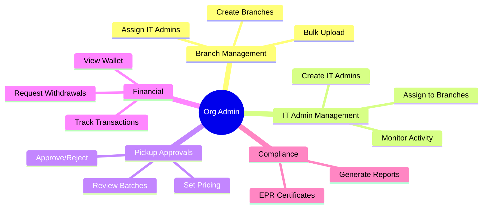
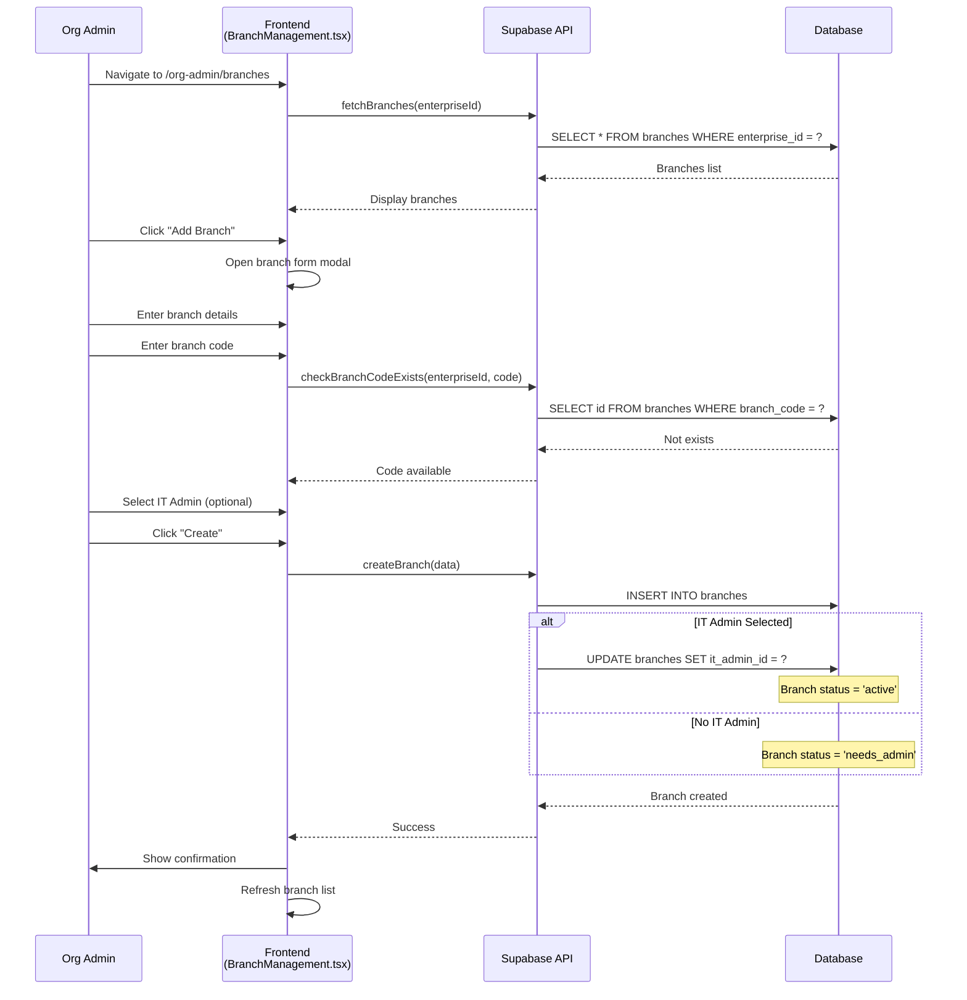
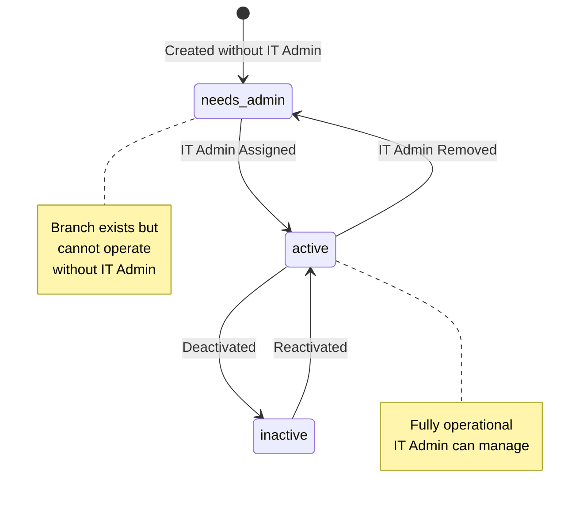
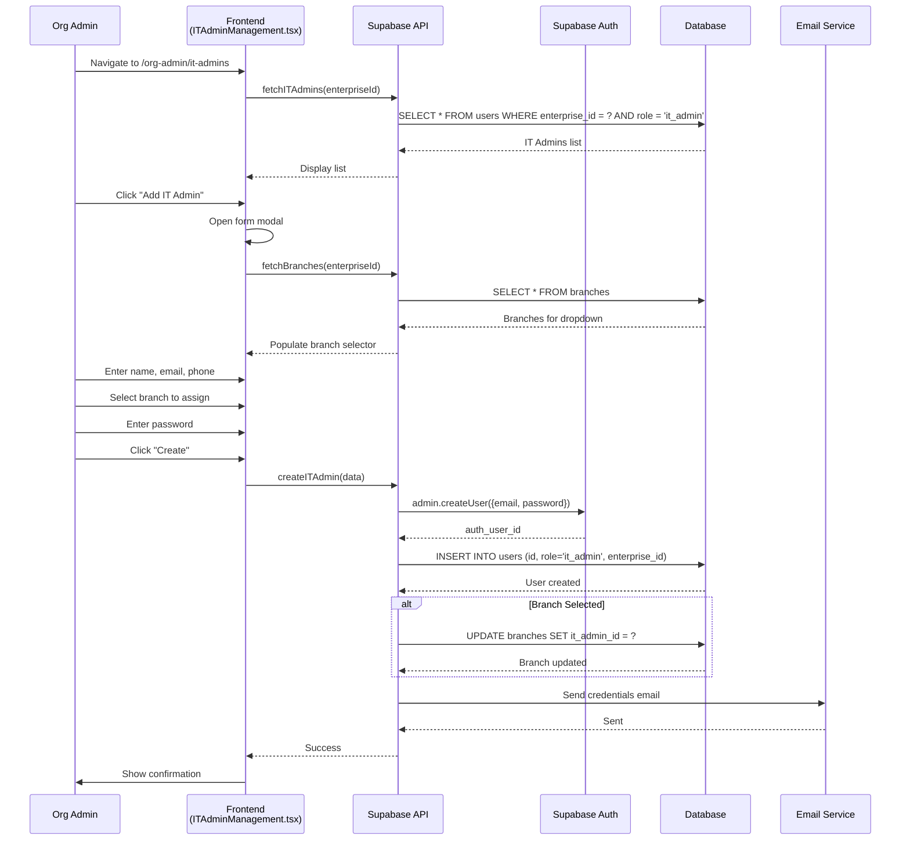
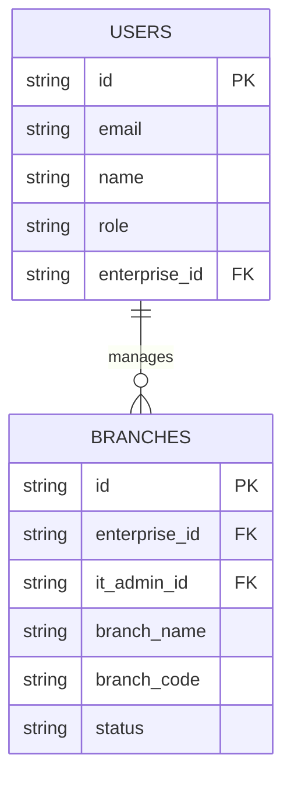
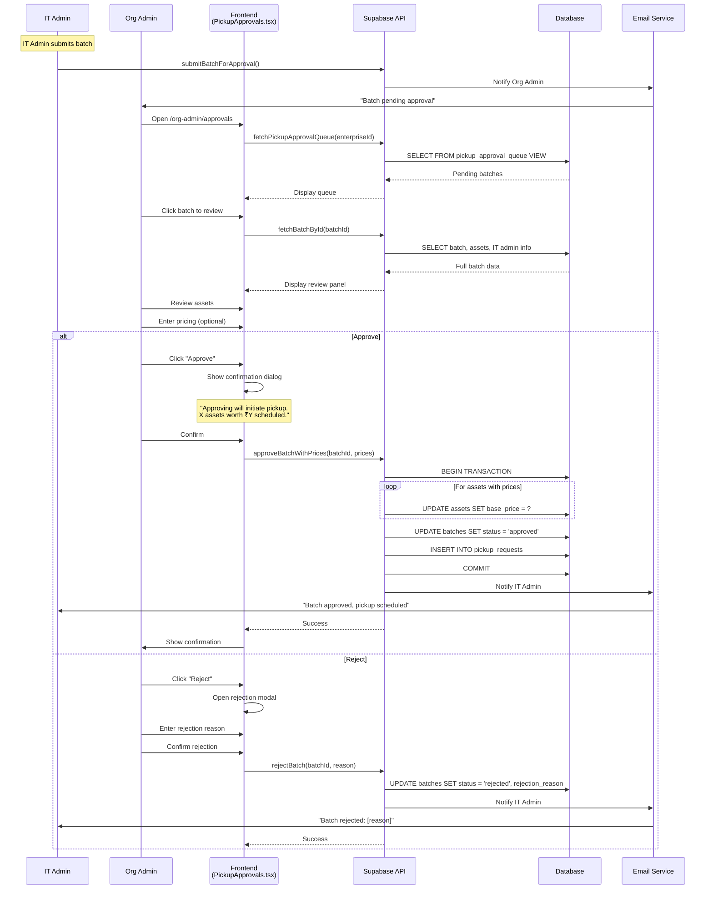
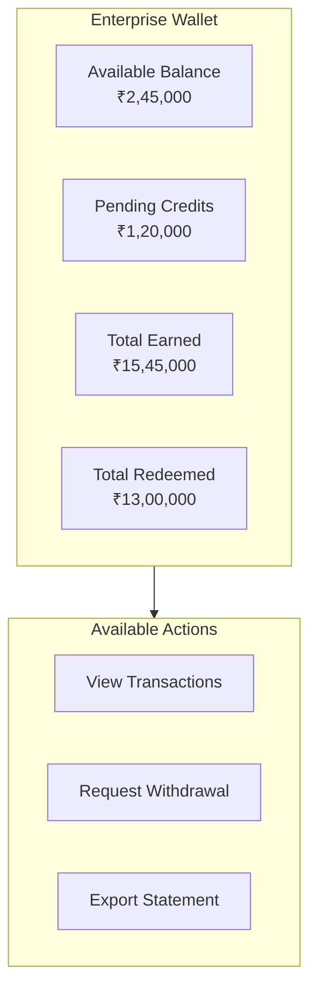
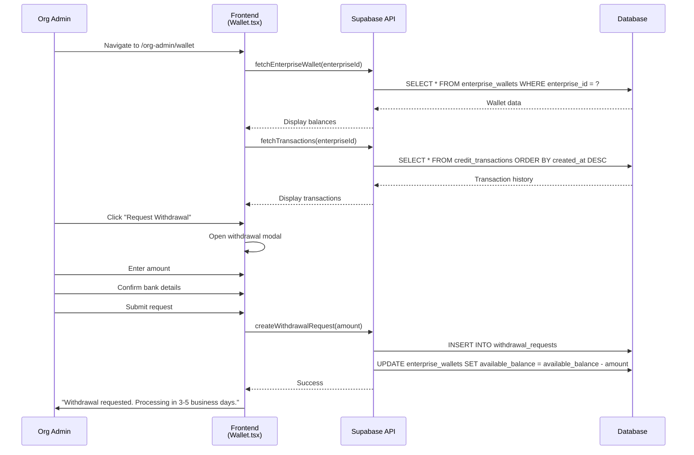
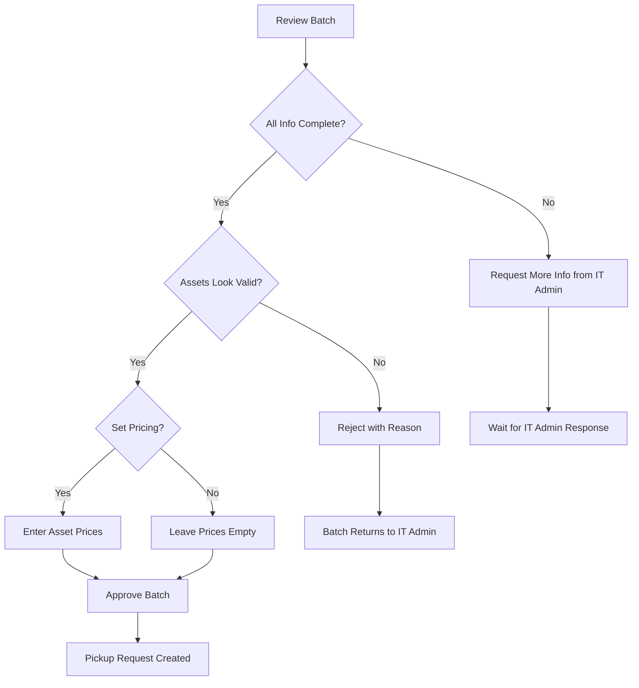

# Org Admin Journeys

## Overview

Org Admin is the enterprise-level administrator responsible for branch management, IT admin oversight, pickup approvals, and financial tracking.

## Journey Overview



---

## Journey 1: Branch Management

### 1.1 Create Single Branch



### 1.2 Bulk Branch Upload

```
┌─────────────────────────────────────────────────────────────────────────────┐
│                      BULK BRANCH UPLOAD                                     │
├─────────────────────────────────────────────────────────────────────────────┤
│                                                                             │
│  CSV TEMPLATE COLUMNS                                                       │
│  ────────────────────                                                      │
│  • branch_name (required)                                                  │
│  • branch_code (required, 1-10 alphanumeric)                               │
│  • address_line1 (required)                                                │
│  • address_line2 (optional)                                                │
│  • city (required)                                                         │
│  • state (required)                                                        │
│  • pin_code (required, 6 digits)                                           │
│  • site_contact_person (optional)                                          │
│  • site_contact_phone (optional)                                           │
│  • it_admin_email (optional - auto-creates if not exists)                  │
│  • it_admin_name (optional - used if creating new IT admin)                │
│                                                                             │
│  AUTO IT ADMIN CREATION                                                    │
│  ──────────────────────                                                    │
│  If it_admin_email is provided:                                            │
│    • Check if email exists in users table                                  │
│    • If exists → assign that IT admin to branch                            │
│    • If not exists → create new IT admin with generated password           │
│    • Password shown in results report for distribution                     │
│                                                                             │
└─────────────────────────────────────────────────────────────────────────────┘
```

### 1.3 Branch Status Flow



---

## Journey 2: IT Admin Management

### 2.1 Create IT Admin Flow



### 2.2 IT Admin - Branch Relationship (V3.2)



---

## Journey 3: Pickup Approvals (Critical Workflow)

### 3.1 Complete Approval Journey

```
┌─────────────────────────────────────────────────────────────────────────────┐
│                      PICKUP APPROVAL WORKFLOW                               │
├─────────────────────────────────────────────────────────────────────────────┤
│                                                                             │
│  TRIGGER: IT Admin submits batch for approval                               │
│                                                                             │
│  ORG ADMIN ACTIONS                         SYSTEM RESPONSES                 │
│  ─────────────────                         ─────────────────                │
│                                                                             │
│  1. Receive notification                   Email + In-app badge             │
│         ↓                                                                   │
│  2. Navigate to Approvals                  Load approval queue              │
│         ↓                                                                   │
│  3. Select pending batch                   Show batch detail panel          │
│         ↓                                                                   │
│  4. Review batch info:                     Display:                         │
│     • Submitting IT Admin                  • Admin name + branch            │
│     • Asset count                          • Total assets in batch          │
│     • Pickup details                       • Date, time, location           │
│     • IT Admin notes                       • Any special instructions       │
│         ↓                                                                   │
│  5. Review all assets:                                                     │
│     ┌────────────────────────────────────────────────────────────────────┐ │
│     │ Asset              │ Specs              │ Price (₹)                │ │
│     ├────────────────────┼────────────────────┼──────────────────────────┤ │
│     │ Dell Latitude 5520 │ i5 / 16GB / 512GB  │ [___15000___]            │ │
│     │ HP ProBook 450     │ i7 / 8GB / 256GB   │ [___12000___]            │ │
│     │ Lenovo ThinkPad    │ i5 / 8GB / 256GB   │ [____________]           │ │
│     ├────────────────────┴────────────────────┼──────────────────────────┤ │
│     │                               Total     │ ₹27,000                  │ │
│     └─────────────────────────────────────────┴──────────────────────────┘ │
│                                                                             │
│  6. Set pricing (OPTIONAL):                Per-asset pricing               │
│     • Enter price for each asset           • Not required to approve       │
│     • System shows running total           • Can leave blank               │
│         ↓                                                                   │
│  7. Make decision:                                                         │
│                                                                             │
│     ┌─────────────────────────────────────────────────────────────────┐    │
│     │                         APPROVE                                  │    │
│     │  • Confirms pickup schedule                                      │    │
│     │  • Creates pickup_request automatically                          │    │
│     │  • Saves asset prices (if entered)                               │    │
│     │  • Notifies IT Admin                                             │    │
│     │  • Batch moves to logistics queue                                │    │
│     └─────────────────────────────────────────────────────────────────┘    │
│                                                                             │
│     ┌─────────────────────────────────────────────────────────────────┐    │
│     │                          REJECT                                  │    │
│     │  • Opens rejection reason modal                                  │    │
│     │  • Enter feedback for IT Admin                                   │    │
│     │  • Batch returns to "draft" status                               │    │
│     │  • IT Admin can edit and resubmit                                │    │
│     └─────────────────────────────────────────────────────────────────┘    │
│                                                                             │
└─────────────────────────────────────────────────────────────────────────────┘
```

### 3.2 Approval Sequence Diagram



### 3.3 Pricing Table UI

```
┌─────────────────────────────────────────────────────────────────────────────┐
│  BATCH: December IT Refresh                                                 │
│  Branch: Mumbai HQ • IT Admin: John Smith                                   │
│  Submitted: Dec 5, 2025 • Assets: 12                                        │
├─────────────────────────────────────────────────────────────────────────────┤
│                                                                             │
│  ASSETS                                                                     │
│  ┌─────────────────────────────────────────────────────────────────────┐   │
│  │ Asset                  │ Specs                │ Price (₹)           │   │
│  ├────────────────────────┼──────────────────────┼─────────────────────┤   │
│  │ Dell Latitude 5520     │ i5-1135G7 / 16GB /   │                     │   │
│  │ SN: DL5520-001         │ 512GB SSD / 15.6"    │ [     15,000     ]  │   │
│  ├────────────────────────┼──────────────────────┼─────────────────────┤   │
│  │ HP ProBook 450 G8      │ i7-1165G7 / 8GB /    │                     │   │
│  │ SN: HPP450-002         │ 256GB SSD / 15.6"    │ [     12,000     ]  │   │
│  ├────────────────────────┼──────────────────────┼─────────────────────┤   │
│  │ Lenovo ThinkPad T14    │ i5-1135G7 / 8GB /    │                     │   │
│  │ SN: LTP14-003          │ 256GB SSD / 14"      │ [              ]    │   │
│  ├────────────────────────┼──────────────────────┼─────────────────────┤   │
│  │ Dell XPS 15 9510       │ i7-11800H / 32GB /   │                     │   │
│  │ SN: DXP15-004          │ 1TB SSD / 15.6"      │ [     35,000     ]  │   │
│  ├────────────────────────┴──────────────────────┼─────────────────────┤   │
│  │                                      Total    │       ₹62,000       │   │
│  └───────────────────────────────────────────────┴─────────────────────┘   │
│                                                                             │
│  IT Admin Notes:                                                           │
│  ┌─────────────────────────────────────────────────────────────────────┐   │
│  │  "End of year refresh batch. All devices have been tested and are   │   │
│  │   ready for pickup. Contact site security for building access."     │   │
│  └─────────────────────────────────────────────────────────────────────┘   │
│                                                                             │
│                                    [ Reject ]   [ ✓ Approve Batch ]         │
│                                                                             │
└─────────────────────────────────────────────────────────────────────────────┘
```

---

## Journey 4: Financial Tracking

### 4.1 Wallet Dashboard



### 4.2 Transaction Types

| Type | Description | Impact |
|------|-------------|--------|
| `credit` | Asset payout credited | +Balance |
| `pending_credit` | Asset in QC, pending payout | +Pending |
| `withdrawal` | Bank transfer requested | -Balance |
| `redemption` | Product purchased with credits | -Balance |
| `adjustment` | Manual adjustment (dispute, correction) | ±Balance |

### 4.3 Wallet Sequence Diagram



---

## Journey 5: EPR Certificates & Reports

### 5.1 EPR Certificate Flow

```
┌─────────────────────────────────────────────────────────────────────────────┐
│                      EPR CERTIFICATES                                       │
├─────────────────────────────────────────────────────────────────────────────┤
│                                                                             │
│  What is EPR?                                                              │
│  Extended Producer Responsibility (EPR) certificates prove                  │
│  environmentally responsible disposal of e-waste.                           │
│                                                                             │
│  Certificate Generation:                                                   │
│  • Auto-generated when assets reach "completed" status                     │
│  • Contains details of all devices processed                               │
│  • Legally valid for compliance reporting                                  │
│                                                                             │
│  Available Actions:                                                        │
│  • View certificate list by date range                                     │
│  • Download individual certificates (PDF)                                  │
│  • Bulk download for period                                                │
│  • Share via email                                                         │
│                                                                             │
└─────────────────────────────────────────────────────────────────────────────┘
```

### 5.2 Reports Available

| Report | Description | Format |
|--------|-------------|--------|
| Asset Summary | All assets by status | PDF, Excel |
| Branch Performance | Assets per branch | PDF, Excel |
| Financial Summary | Credits, payouts, withdrawals | PDF, Excel |
| IT Admin Activity | Actions per IT admin | PDF |
| EPR Compliance | Environmental certificates | PDF |

---

## Technical Implementation

### Components

| Component | File Path | Purpose |
|-----------|-----------|---------|
| Dashboard | `src/pages/org-admin/Dashboard.tsx` | Overview metrics |
| Branch Management | `src/pages/org-admin/BranchManagement.tsx` | CRUD branches |
| Bulk Branch Upload | `src/pages/org-admin/BulkBranchUpload.tsx` | CSV upload |
| IT Admin Management | `src/pages/org-admin/ITAdminManagement.tsx` | CRUD IT admins |
| Pickup Approvals | `src/pages/org-admin/PickupApprovals.tsx` | Batch approvals |
| Wallet | `src/pages/org-admin/Wallet.tsx` | Financial tracking |
| Reports | `src/pages/org-admin/Reports.tsx` | Generate reports |
| EPR Certificates | `src/pages/org-admin/EPRCertificates.tsx` | Compliance docs |

### API Endpoints

| Endpoint | Purpose |
|----------|---------|
| `fetchBranches(enterpriseId)` | List branches |
| `createBranch(data)` | Create branch |
| `bulkCreateBranches(data)` | Bulk create |
| `fetchITAdmins(enterpriseId)` | List IT admins |
| `createITAdmin(data)` | Create IT admin |
| `fetchPickupApprovalQueue(enterpriseId)` | Pending batches |
| `approveBatchWithPrices(batchId, prices)` | Approve with pricing |
| `rejectBatch(batchId, reason)` | Reject batch |
| `fetchEnterpriseWallet(enterpriseId)` | Wallet balance |
| `fetchTransactions(enterpriseId)` | Transaction history |

---

## Decision Points

### Approval Decision Tree


