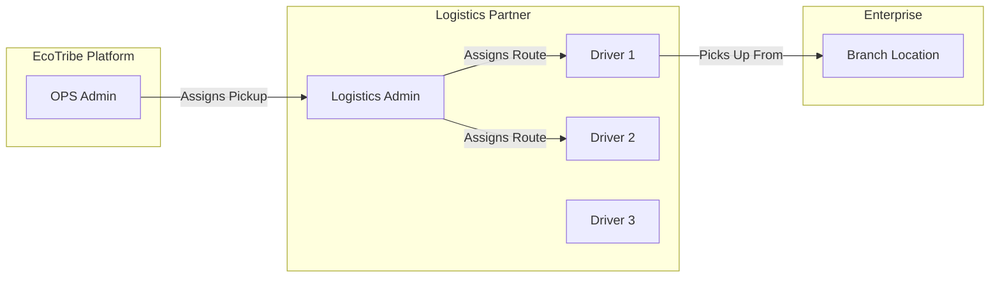
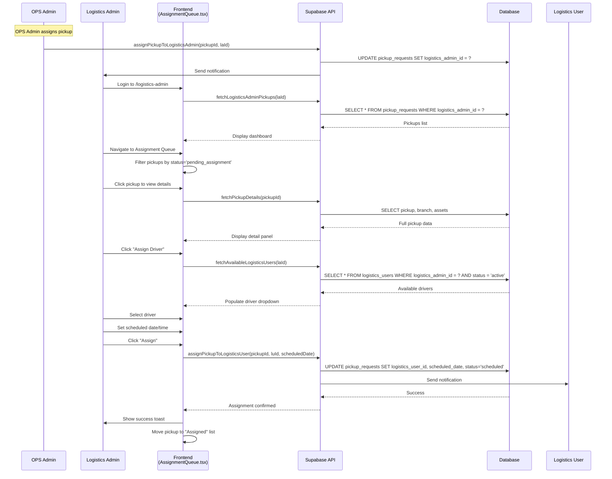
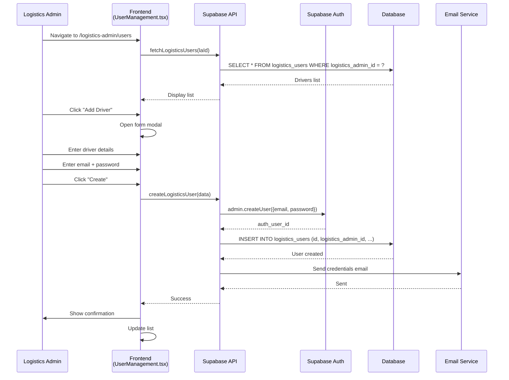
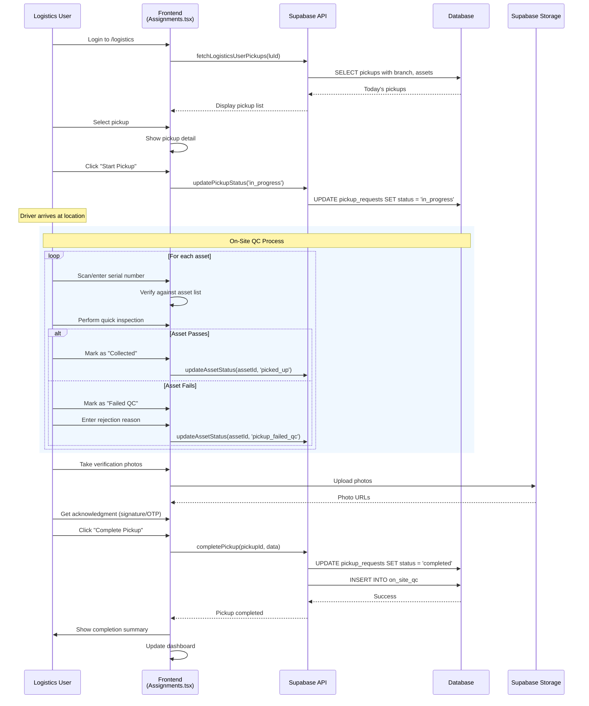
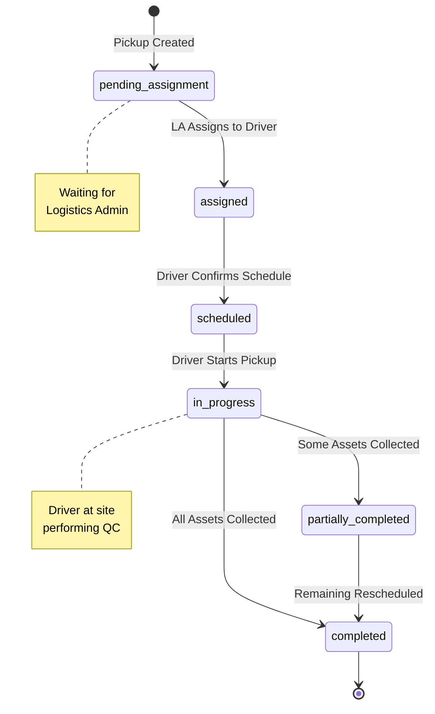

# Logistics Journeys

## Overview

The logistics system involves two personas:
- **Logistics Admin**: Partner company manager who receives and assigns pickups
- **Logistics User**: Field agent (driver) who performs actual pickups

## System Overview



---

## Journey 1: Logistics Admin - Receiving Assignments

### 1.1 Assignment Queue Flow

```
┌─────────────────────────────────────────────────────────────────────────────┐
│                    LOGISTICS ADMIN - ASSIGNMENT QUEUE                       │
├─────────────────────────────────────────────────────────────────────────────┤
│                                                                             │
│  TRIGGER: OPS Admin assigns pickup to this Logistics Admin                  │
│                                                                             │
│  LOGISTICS ADMIN ACTIONS                   SYSTEM RESPONSES                 │
│  ───────────────────────                   ─────────────────                │
│                                                                             │
│  1. Receive notification                   Email + In-app notification      │
│         ↓                                                                   │
│  2. Login to /logistics-admin              Load dashboard                   │
│         ↓                                                                   │
│  3. View dashboard stats:                  Display:                         │
│     • Pending assignments                  • Count of new pickups           │
│     • Assigned to drivers                  • Count scheduled                │
│     • In progress                          • Count active                   │
│     • Completed today                      • Count done                     │
│         ↓                                                                   │
│  4. Navigate to Assignment Queue           Load pending pickups             │
│         ↓                                                                   │
│  5. View pickup details:                                                   │
│     • Enterprise name                                                      │
│     • Branch address                                                       │
│     • Asset count                                                          │
│     • Requested date/time                                                  │
│     • Priority level                                                       │
│         ↓                                                                   │
│  6. Select driver to assign                Show available drivers           │
│         ↓                                                                   │
│  7. Set scheduled date/time                Confirm or modify               │
│         ↓                                                                   │
│  8. Assign pickup                          • Update pickup status          │
│                                            • Notify driver                  │
│                                            • Notify enterprise              │
│                                                                             │
└─────────────────────────────────────────────────────────────────────────────┘
```

### 1.2 Assignment Sequence Diagram



---

## Journey 2: Logistics Admin - Driver Management

### 2.1 Create Driver Flow



### 2.2 Driver Status Management

| Status | Meaning | Can Be Assigned |
|--------|---------|-----------------|
| `active` | Available for pickups | Yes |
| `inactive` | Temporarily unavailable | No |
| `on_leave` | Extended absence | No |

---

## Journey 3: Logistics User - Daily Pickup Flow

### 3.1 Complete Pickup Journey

```
┌─────────────────────────────────────────────────────────────────────────────┐
│                    LOGISTICS USER - PICKUP JOURNEY                          │
├─────────────────────────────────────────────────────────────────────────────┤
│                                                                             │
│  MORNING ROUTINE                                                           │
│  ───────────────                                                           │
│  1. Login to /logistics                    Load "My Pickups"               │
│  2. View today's assignments               • Sorted by time slot           │
│  3. Check route order                      • Map view available            │
│                                                                             │
│  FOR EACH PICKUP                                                           │
│  ───────────────                                                           │
│  4. View pickup details:                                                   │
│     • Enterprise & branch name                                             │
│     • Full address                                                         │
│     • Site contact person + phone                                          │
│     • Asset list (serial numbers)                                          │
│     • Special instructions                                                 │
│         ↓                                                                   │
│  5. Navigate to location                   Open in Maps app                │
│         ↓                                                                   │
│  6. Arrive at site                         Click "Start Pickup"            │
│         ↓                                                                   │
│  7. Meet site contact                      Verify identity                 │
│         ↓                                                                   │
│  ON-SITE QC (per asset)                                                    │
│  ────────────────────                                                      │
│  8. Scan/verify serial number              Match with system               │
│         ↓                                                                   │
│  9. Quick physical check:                                                  │
│     • Device matches description?                                          │
│     • Major damage not shown in photos?                                    │
│     • All reported parts present?                                          │
│         ↓                                                                   │
│  10. Decision per asset:                                                   │
│      ┌──────────────┐  ┌──────────────┐                                   │
│      │    ACCEPT    │  │    REJECT    │                                   │
│      │  Collect it  │  │  Leave it    │                                   │
│      └──────────────┘  └──────────────┘                                   │
│         ↓                                                                   │
│  11. Take verification photo               Document collection             │
│         ↓                                                                   │
│  COMPLETE PICKUP                                                           │
│  ───────────────                                                           │
│  12. Get acknowledgment                    Site contact signature          │
│         ↓                                                                   │
│  13. Complete pickup in app                • Update statuses               │
│                                            • Upload photos                 │
│                                            • Record any issues             │
│         ↓                                                                   │
│  14. Move to next pickup                   Dashboard updates               │
│                                                                             │
└─────────────────────────────────────────────────────────────────────────────┘
```

### 3.2 Pickup Sequence Diagram



### 3.3 On-Site QC Checklist

```
┌─────────────────────────────────────────────────────────────────────────────┐
│                      ON-SITE QC CHECKLIST                                   │
├─────────────────────────────────────────────────────────────────────────────┤
│                                                                             │
│  Asset: Dell Latitude 5520                                                 │
│  Serial: ABC123456                                                         │
│                                                                             │
│  VERIFICATION                                         RESULT               │
│  ────────────────────────────────────────────────────────────              │
│  □ Serial number matches system record               [ ✓ ]                 │
│  □ Device matches brand/model in submission          [ ✓ ]                 │
│  □ Device powers on                                  [ ✓ ]                 │
│  □ No major undisclosed damage                       [ ✓ ]                 │
│  □ All reported accessories present                  [ ✗ ]                 │
│                                                                             │
│  NOTES                                                                     │
│  ─────                                                                     │
│  Missing charger - was listed as included                                  │
│                                                                             │
│  DECISION                                                                  │
│  ────────                                                                  │
│  ○ Accept (collect device)                                                 │
│  ● Accept with note (collect, flag issue)                                  │
│  ○ Reject (leave device)                                                   │
│                                                                             │
│                                        [Cancel]    [Confirm Decision]      │
│                                                                             │
└─────────────────────────────────────────────────────────────────────────────┘
```

---

## Journey 4: Exception Handling

### 4.1 Common Exceptions

```mermaid
flowchart TD
    A[Exception Occurs] --> B{Type?}

    B -->|Site Inaccessible| C[Contact Site Contact]
    C --> C1{Resolved?}
    C1 -->|Yes| D[Proceed with Pickup]
    C1 -->|No| E[Reschedule Pickup]

    B -->|Device Not Available| F[Document in App]
    F --> G[Mark Asset as "Not Available"]
    G --> H[Complete Partial Pickup]

    B -->|Major Discrepancy| I[Take Photos]
    I --> J[Contact Logistics Admin]
    J --> K{Decision}
    K -->|Accept| D
    K -->|Reject| L[Mark Failed QC]
    K -->|Escalate| M[Contact OPS Admin]

    B -->|Site Contact Absent| N[Wait/Call]
    N --> N1{Available in 30min?}
    N1 -->|Yes| O[Wait]
    O --> D
    N1 -->|No| E
```

### 4.2 Exception Handling Actions

| Exception | Driver Action | System Update |
|-----------|---------------|---------------|
| Site locked | Call contact, wait 30min, then reschedule | Add note to pickup |
| Device missing | Mark specific asset as "not available" | Asset status unchanged |
| Wrong device | Take photos, reject | Asset marked "pickup_failed_qc" |
| Severe damage | Document, contact admin for decision | Wait for instruction |
| Contact absent | Attempt contact, reschedule if no response | Update scheduled date |

---

## Journey 5: Pickup Status Flow

### 5.1 Status State Machine



### 5.2 Asset Status During Pickup

| Before Pickup | After Successful QC | After Failed QC |
|---------------|---------------------|-----------------|
| `pickup_scheduled` | `picked_up` | `pickup_failed_qc` |

---

## Technical Implementation

### Logistics Admin Components

| Component | File Path | Purpose |
|-----------|-----------|---------|
| Dashboard | `src/pages/logistics-admin/Dashboard.tsx` | Overview stats |
| Assignment Queue | `src/pages/logistics-admin/AssignmentQueue.tsx` | Pending pickups |
| User Management | `src/pages/logistics-admin/UserManagement.tsx` | Driver CRUD |

### Logistics User Components

| Component | File Path | Purpose |
|-----------|-----------|---------|
| My Pickups | `src/pages/logistics-user/Assignments.tsx` | Today's routes |
| Pickup Detail | `src/pages/logistics-user/PickupDetail.tsx` | Single pickup |
| On-Site QC | `src/pages/logistics-user/OnSiteQC.tsx` | QC checklist |

### API Endpoints

| Endpoint | Auth | Purpose |
|----------|------|---------|
| `fetchLogisticsAdminPickups(laId)` | LA | Get assigned pickups |
| `fetchAvailableLogisticsUsers(laId)` | LA | Get active drivers |
| `assignPickupToLogisticsUser(pickupId, luId)` | LA | Assign to driver |
| `fetchLogisticsUserPickups(luId)` | LU | Get my pickups |
| `updatePickupStatus(pickupId, status)` | LU | Update progress |
| `completePickup(pickupId, data)` | LU | Finish pickup |
| `createLogisticsUser(data)` | LA | Add driver |

### Database Tables

```sql
-- logistics_admins
CREATE TABLE logistics_admins (
  id TEXT PRIMARY KEY,
  name TEXT NOT NULL,
  email TEXT UNIQUE NOT NULL,
  phone TEXT,
  company_name TEXT,
  status TEXT DEFAULT 'active',
  created_at TIMESTAMP DEFAULT NOW()
);

-- logistics_users
CREATE TABLE logistics_users (
  id TEXT PRIMARY KEY,
  logistics_admin_id TEXT REFERENCES logistics_admins(id),
  name TEXT NOT NULL,
  email TEXT UNIQUE NOT NULL,
  phone TEXT,
  vehicle_number TEXT,
  vehicle_type TEXT,
  status TEXT DEFAULT 'active',
  created_at TIMESTAMP DEFAULT NOW()
);

-- on_site_qc (pickup evidence)
CREATE TABLE on_site_qc (
  id TEXT PRIMARY KEY,
  pickup_request_id TEXT REFERENCES pickup_requests(id),
  logistics_user_id TEXT REFERENCES logistics_users(id),
  asset_id TEXT REFERENCES assets(id),
  qc_passed BOOLEAN,
  rejection_reason TEXT,
  photos TEXT[], -- Array of URLs
  notes TEXT,
  collected_at TIMESTAMP
);
```

---

## Mobile Considerations

The Logistics User portal is designed mobile-first for field use.

### Key Features

| Feature | Implementation |
|---------|----------------|
| Offline Support | Cache today's pickups locally |
| GPS Navigation | Deep link to Google Maps/Waze |
| Camera Integration | Native camera for photos |
| Barcode Scanner | Scan serial numbers |
| Push Notifications | New assignment alerts |
| Signature Capture | Touch signature pad |
