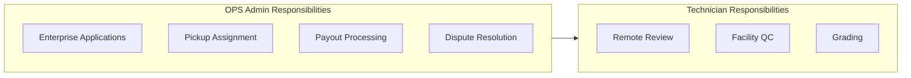
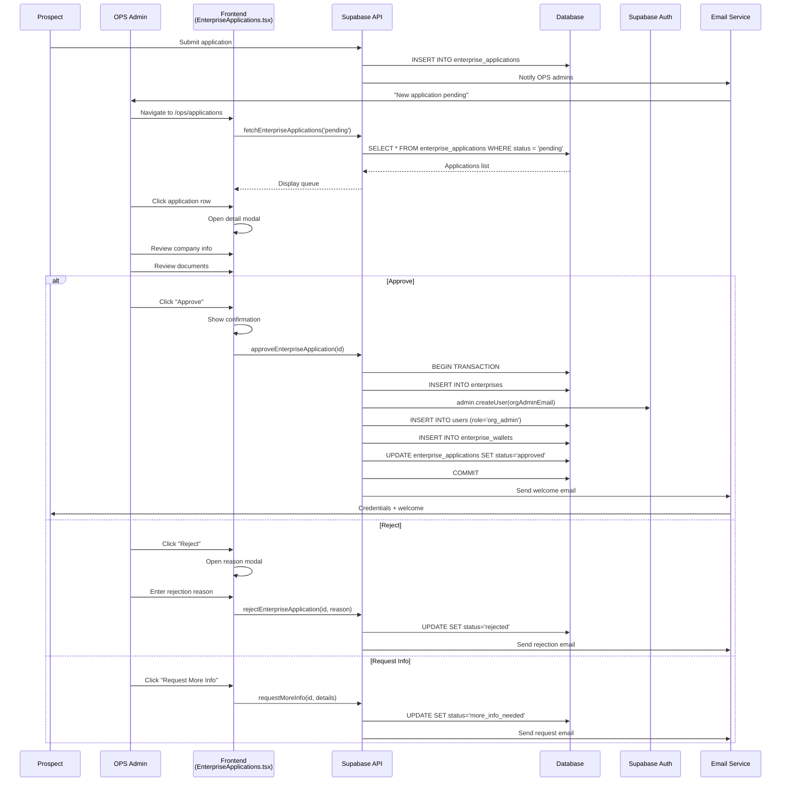
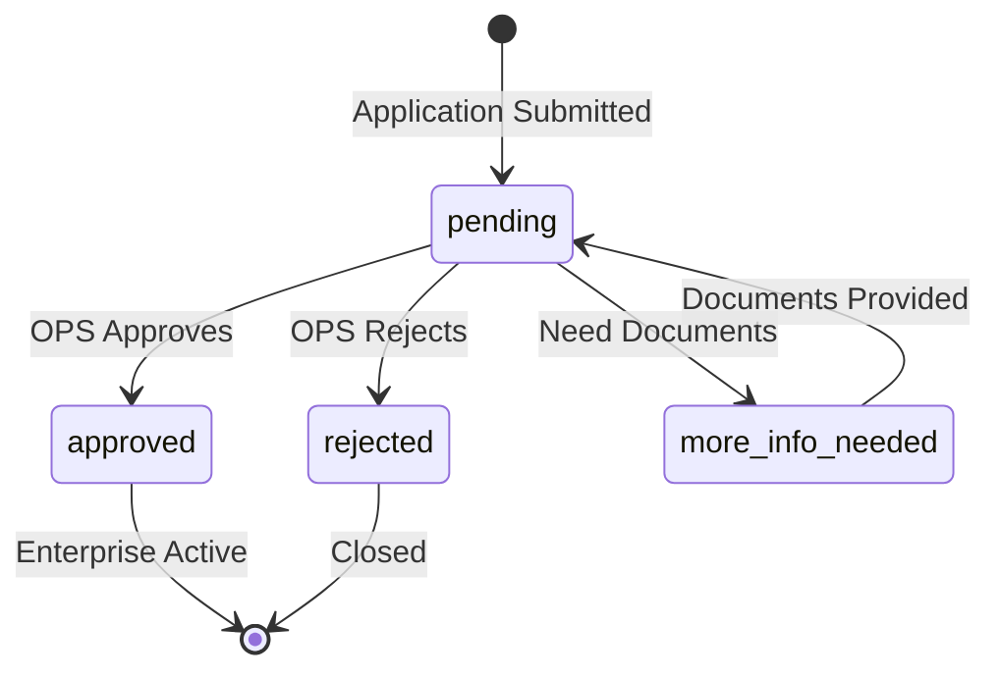
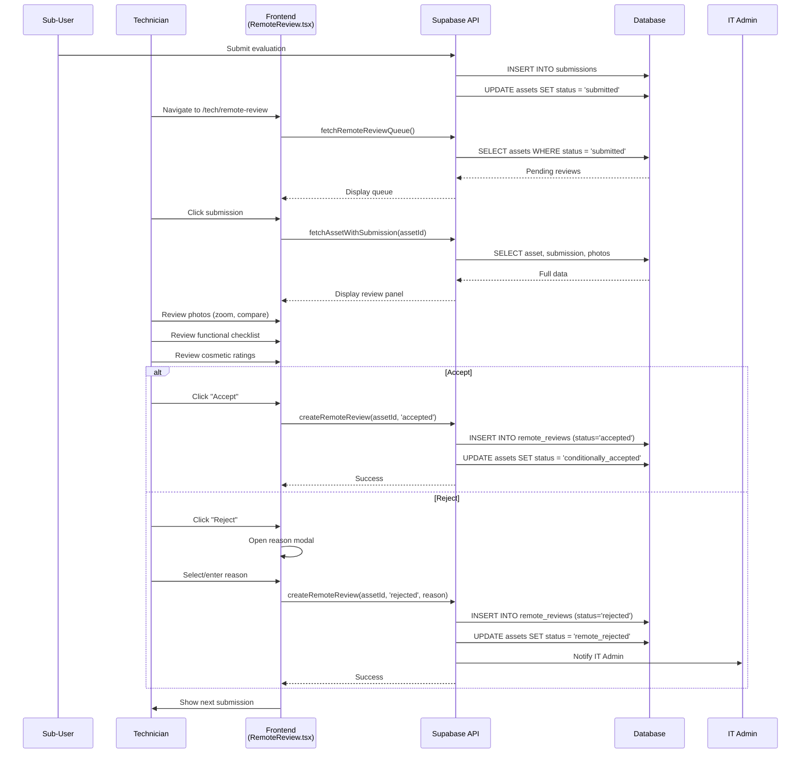
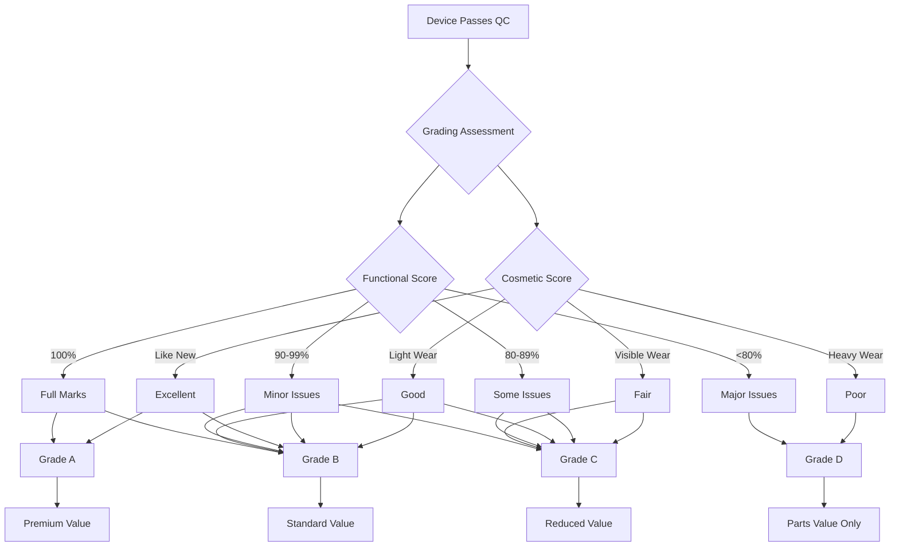
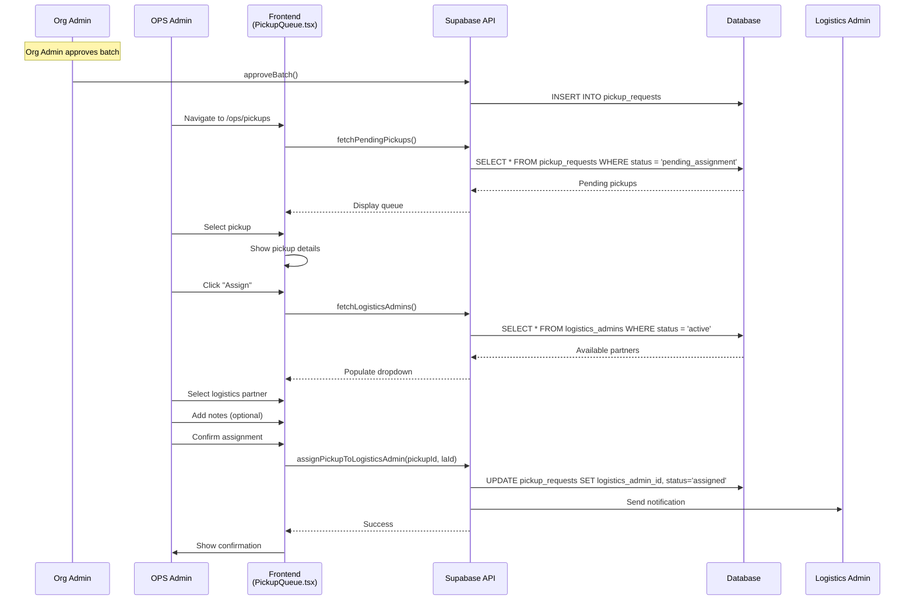
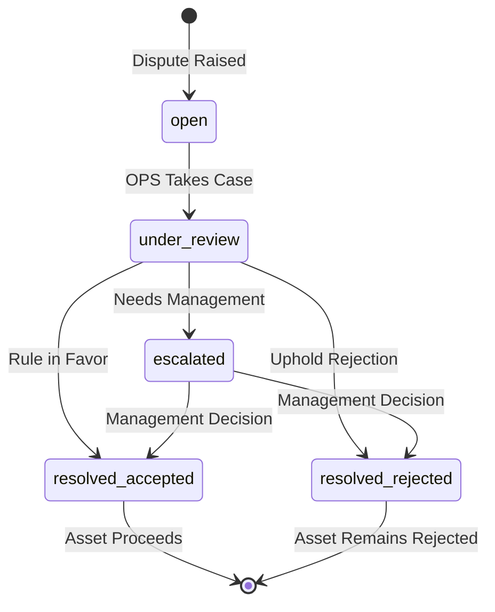

# OPS Admin & Technician Journeys

## Overview

OPS Admin handles platform operations through two portals:
- `/ops` - Operations management (applications, pickups, payouts)
- `/tech` - Technical review (remote review, facility QC)



---

## Journey 1: Enterprise Application Review

### 1.1 Application Review Flow



### 1.2 Application Status Flow



---

## Journey 2: Remote Review (Technician)

### 2.1 Complete Review Flow

```
┌─────────────────────────────────────────────────────────────────────────────┐
│                         REMOTE REVIEW WORKFLOW                              │
├─────────────────────────────────────────────────────────────────────────────┤
│                                                                             │
│  TRIGGER: Sub-user submits device evaluation                                │
│                                                                             │
│  TECHNICIAN ACTIONS                        SYSTEM RESPONSES                 │
│  ──────────────────                        ─────────────────                │
│                                                                             │
│  1. Login to /tech                         Load technician dashboard        │
│         ↓                                                                   │
│  2. Navigate to Remote Review              Load review queue                │
│         ↓                                                                   │
│  3. View queue stats:                      Display:                         │
│     • Total pending                        • Count by enterprise            │
│     • Priority items                       • Oldest submissions             │
│         ↓                                                                   │
│  4. Select submission to review            Open review panel                │
│         ↓                                                                   │
│  5. Examine device photos:                 Full-screen viewer               │
│     • Front view                           • Zoom capability                │
│     • Back view                            • Compare angles                 │
│     • Screen                                                               │
│     • Keyboard                                                             │
│     • All sides                                                            │
│         ↓                                                                   │
│  6. Review functional checklist            Compare with photos              │
│     • Power, display, keyboard             • Look for discrepancies         │
│     • Touchpad, ports, audio                                               │
│         ↓                                                                   │
│  7. Review cosmetic ratings                Verify against photos            │
│     • Screen condition                                                     │
│     • Body condition                                                       │
│     • Keyboard wear                                                        │
│         ↓                                                                   │
│  8. Make assessment decision:                                              │
│                                                                             │
│     ┌─────────────────────────────────────────────────────────────────┐    │
│     │                         ACCEPT                                   │    │
│     │  • Evaluation appears accurate                                   │    │
│     │  • Photos match description                                      │    │
│     │  • Device eligible for program                                   │    │
│     │  → Status: "conditionally_accepted"                              │    │
│     │  → Asset ready for pickup batch                                  │    │
│     └─────────────────────────────────────────────────────────────────┘    │
│                                                                             │
│     ┌─────────────────────────────────────────────────────────────────┐    │
│     │                         REJECT                                   │    │
│     │  • Photos unclear or wrong device                                │    │
│     │  • Functional issues not disclosed                               │    │
│     │  • Device not eligible (too old/damaged)                         │    │
│     │  → Enter rejection reason                                        │    │
│     │  → Status: "remote_rejected"                                     │    │
│     │  → IT Admin notified                                             │    │
│     └─────────────────────────────────────────────────────────────────┘    │
│                                                                             │
│  9. Move to next submission                Update dashboard stats          │
│                                                                             │
└─────────────────────────────────────────────────────────────────────────────┘
```

### 2.2 Review Sequence Diagram



### 2.3 Review Panel UI

```
┌─────────────────────────────────────────────────────────────────────────────┐
│  REMOTE REVIEW                                              [Queue: 45]     │
├─────────────────────────────────────────────────────────────────────────────┤
│                                                                             │
│  Dell Latitude 5520 • SN: ABC123456                                        │
│  Enterprise: TechCorp • Submitted: Dec 5, 2025 at 2:30 PM                  │
│                                                                             │
├──────────────────────────────────┬──────────────────────────────────────────┤
│                                  │                                          │
│  PHOTOS                          │  EVALUATION DETAILS                      │
│  ┌────────────────────────────┐  │                                          │
│  │                            │  │  FUNCTIONAL CHECKLIST                    │
│  │      [Selected Photo]      │  │  ───────────────────                    │
│  │        (Zoomable)          │  │  ✓ Powers on                            │
│  │                            │  │  ✓ Display works                        │
│  └────────────────────────────┘  │  ✓ Keyboard functional                  │
│                                  │  ✓ Touchpad works                       │
│  ┌──┐ ┌──┐ ┌──┐ ┌──┐ ┌──┐ ┌──┐  │  ⚠ USB ports: Partial                   │
│  │F │ │B │ │S │ │K │ │L │ │R │  │  ✓ Audio works                          │
│  └──┘ └──┘ └──┘ └──┘ └──┘ └──┘  │  ✓ Webcam works                         │
│  Front Back Scrn Keyb Left Rght │  ⚠ Battery: Fair                         │
│                                  │                                          │
│                                  │  COSMETIC ASSESSMENT                     │
│                                  │  ────────────────────                   │
│                                  │  Screen scratches: Minor                 │
│                                  │  Body scratches: None                    │
│                                  │  Body dents: None                        │
│                                  │  Keyboard wear: Minor                    │
│                                  │                                          │
│                                  │  NOTES FROM EMPLOYEE                     │
│                                  │  ────────────────────                   │
│                                  │  "One USB-C port loose. Battery lasts   │
│                                  │   about 4 hours. Charger included."     │
│                                  │                                          │
├──────────────────────────────────┴──────────────────────────────────────────┤
│                                                                             │
│  TECHNICIAN NOTES                                                          │
│  ┌─────────────────────────────────────────────────────────────────────┐   │
│  │                                                                      │   │
│  └─────────────────────────────────────────────────────────────────────┘   │
│                                                                             │
│                                    [ ✗ Reject ]       [ ✓ Accept ]          │
│                                                                             │
└─────────────────────────────────────────────────────────────────────────────┘
```

### 2.4 Common Rejection Reasons

| Reason | Description |
|--------|-------------|
| `unclear_photos` | Photos are blurry or don't show device clearly |
| `wrong_device` | Photos appear to be of different device |
| `undisclosed_damage` | Visible damage not mentioned in checklist |
| `device_ineligible` | Device too old or not in supported list |
| `inconsistent_info` | Checklist doesn't match visible condition |
| `missing_photos` | Required photo angles missing |

---

## Journey 3: Facility QC (Grading)

### 3.1 Facility QC Flow

```
┌─────────────────────────────────────────────────────────────────────────────┐
│                         FACILITY QC WORKFLOW                                │
├─────────────────────────────────────────────────────────────────────────────┤
│                                                                             │
│  TRIGGER: Device arrives at EcoTribe facility (status = 'in_transit')       │
│                                                                             │
│  TECHNICIAN ACTIONS                        SYSTEM RESPONSES                 │
│  ──────────────────                        ─────────────────                │
│                                                                             │
│  1. Receive shipment                       Mark devices as "facility_qc"    │
│         ↓                                                                   │
│  2. Navigate to /tech/facility-qc          Load QC queue                    │
│         ↓                                                                   │
│  3. Select device for QC                   Show device details              │
│         ↓                                                                   │
│  4. Scan serial number                     Verify against system            │
│         ↓                                                                   │
│  5. Comprehensive testing:                                                 │
│     ┌──────────────────────────────────────────────────────────────────┐   │
│     │  FUNCTIONAL TESTS                                                │   │
│     │  • Boot to OS                        ✓ Pass / ✗ Fail             │   │
│     │  • Display test pattern              ✓ Pass / ✗ Fail             │   │
│     │  • Keyboard all keys                 ✓ Pass / ✗ Fail             │   │
│     │  • Touchpad/mouse                    ✓ Pass / ✗ Fail             │   │
│     │  • All USB ports                     ✓ Pass / ✗ Fail             │   │
│     │  • Audio output/input                ✓ Pass / ✗ Fail             │   │
│     │  • Webcam/microphone                 ✓ Pass / ✗ Fail             │   │
│     │  • WiFi connectivity                 ✓ Pass / ✗ Fail             │   │
│     │  • Bluetooth pairing                 ✓ Pass / ✗ Fail             │   │
│     │  • Battery health check              ___% capacity               │   │
│     │  • Data wiped verification           ✓ Confirmed                 │   │
│     └──────────────────────────────────────────────────────────────────┘   │
│         ↓                                                                   │
│  6. Cosmetic inspection:                                                   │
│     • Detailed examination under light                                     │
│     • Document all blemishes                                               │
│     • Photograph any new discoveries                                       │
│         ↓                                                                   │
│  7. Decision:                                                              │
│                                                                             │
│     ┌──────────────────────────────────────────────────────────────────┐   │
│     │  FINAL ACCEPT                                                    │   │
│     │  • All tests pass (or acceptable failures)                       │   │
│     │  • Assign grade: A, B, C, or D                                   │   │
│     │  → Status: "final_accepted"                                      │   │
│     │  → Proceeds to payout calculation                                │   │
│     └──────────────────────────────────────────────────────────────────┘   │
│                                                                             │
│     ┌──────────────────────────────────────────────────────────────────┐   │
│     │  FINAL REJECT                                                    │   │
│     │  • Critical functional failure                                   │   │
│     │  • Major undisclosed damage                                      │   │
│     │  • Device ineligible after inspection                            │   │
│     │  → Enter detailed reason                                         │   │
│     │  → Status: "final_rejected"                                      │   │
│     │  → Can be disputed                                               │   │
│     └──────────────────────────────────────────────────────────────────┘   │
│                                                                             │
└─────────────────────────────────────────────────────────────────────────────┘
```

### 3.2 Grading System



### 3.3 Grade Definitions

| Grade | Functional | Cosmetic | Value Impact |
|-------|------------|----------|--------------|
| **A** | 100% working | Like new | 100% base price |
| **B** | Minor issues | Light wear | 80% base price |
| **C** | Some issues | Visible wear | 60% base price |
| **D** | Major issues | Heavy wear | 30% (parts only) |

---

## Journey 4: Pickup Assignment (OPS)

### 4.1 Assignment Flow



---

## Journey 5: Payout Processing

### 5.1 Payout Flow

```
┌─────────────────────────────────────────────────────────────────────────────┐
│                         PAYOUT PROCESSING                                   │
├─────────────────────────────────────────────────────────────────────────────┤
│                                                                             │
│  TRIGGER: Device completes facility QC with "final_accepted" status         │
│                                                                             │
│  SYSTEM CALCULATION                        OPS ACTIONS                      │
│  ──────────────────                        ───────────                      │
│                                                                             │
│  1. Calculate final value:                 Review calculation               │
│     Base Price × Grade Multiplier          • Verify pricing                 │
│     - Any deductions                       • Check for errors               │
│         ↓                                                                   │
│  2. Generate payout record                 Review payout batch              │
│         ↓                                                                   │
│  3. OPS Admin reviews                      Approve or hold                  │
│         ↓                                                                   │
│  4. Process payout:                        Confirm processing               │
│     • Credit enterprise wallet                                             │
│     • Create transaction record                                            │
│     • Update asset status                                                  │
│         ↓                                                                   │
│  5. Notify enterprise                      Track in reports                 │
│     • Org Admin gets notification                                          │
│     • Transaction visible in wallet                                        │
│                                                                             │
└─────────────────────────────────────────────────────────────────────────────┘
```

### 5.2 Payout Calculation

```typescript
interface PayoutCalculation {
  asset_id: string;
  base_price: number;         // Set during approval
  grade: 'A' | 'B' | 'C' | 'D';
  grade_multiplier: number;   // A=1.0, B=0.8, C=0.6, D=0.3
  deductions: {
    reason: string;
    amount: number;
  }[];
  final_value: number;        // base_price * grade_multiplier - deductions
}

// Example calculation
const calculation = {
  asset_id: 'asset-123',
  base_price: 15000,
  grade: 'B',
  grade_multiplier: 0.8,
  deductions: [
    { reason: 'Missing charger', amount: 500 }
  ],
  final_value: 15000 * 0.8 - 500  // = 11,500
};
```

---

## Journey 6: Dispute Resolution

### 6.1 Dispute Flow



### 6.2 Dispute Types

| Type | Trigger | Disputed By |
|------|---------|-------------|
| Remote Review Rejection | Asset rejected during remote review | IT Admin |
| Pickup QC Failure | Asset failed on-site QC | IT Admin |
| Facility QC Rejection | Asset failed final QC | IT Admin |
| Grading Dispute | Disagree with assigned grade | Org Admin |
| Payout Amount | Disagree with calculated value | Org Admin |

---

## Technical Implementation

### OPS Portal Components

| Component | File Path | Purpose |
|-----------|-----------|---------|
| Dashboard | `src/pages/ops/Dashboard.tsx` | Overview metrics |
| Applications | `src/pages/ops/EnterpriseApplications.tsx` | Review registrations |
| Enterprises | `src/pages/ops/Enterprises.tsx` | Manage enterprises |
| Pickup Queue | `src/pages/ops/PickupQueue.tsx` | Assign pickups |
| Payouts | `src/pages/ops/PayoutProcessing.tsx` | Process payouts |
| Disputes | `src/pages/ops/DisputeQueue.tsx` | Handle disputes |
| Logistics | `src/pages/ops/OpsLogistics.tsx` | Manage partners |

### Tech Portal Components

| Component | File Path | Purpose |
|-----------|-----------|---------|
| Dashboard | `src/pages/tech/Dashboard.tsx` | Review metrics |
| Remote Review | `src/pages/tech/RemoteReview.tsx` | Photo/checklist review |
| Facility QC | `src/pages/tech/FacilityQC.tsx` | Hands-on testing |

### API Endpoints

| Endpoint | Purpose |
|----------|---------|
| `fetchEnterpriseApplications(status)` | Get applications |
| `approveEnterpriseApplication(id)` | Approve registration |
| `rejectEnterpriseApplication(id, reason)` | Reject registration |
| `fetchRemoteReviewQueue()` | Get pending reviews |
| `createRemoteReview(assetId, decision)` | Submit review |
| `fetchFacilityQCQueue()` | Get devices at facility |
| `completeFacilityQC(assetId, data)` | Complete QC |
| `fetchPendingPickups()` | Get unassigned pickups |
| `assignPickupToLogisticsAdmin(id, laId)` | Assign pickup |
| `fetchPayoutQueue()` | Get pending payouts |
| `processPayouts(assetIds)` | Process batch payouts |
