# System Architecture

## Overview

This document provides technical architecture documentation for the EcoTribe platform, including component relationships, data flow, and integration points.

---

## High-Level Architecture

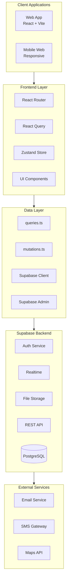

---

## Frontend Architecture

### Component Hierarchy

```mermaid
flowchart TD
    subgraph App["App.tsx"]
        PROVIDERS[Context Providers]
        ROUTER[Router]
    end

    subgraph Routes["Route Structure"]
        PUBLIC[Public Routes]
        PROTECTED[Protected Routes]
    end

    subgraph Portals["User Portals"]
        SUPER[/super]
        OPS[/ops]
        TECH[/tech]
        ORGADMIN[/org-admin]
        ADMIN[/admin]
        CHECKIN[/check-in]
        LOGADMIN[/logistics-admin]
        LOGUSER[/logistics]
    end

    subgraph Layouts["Layout Components"]
        SUPER_L[SuperLayout]
        OPS_L[OpsLayout]
        ORG_L[OrgAdminLayout]
        ADMIN_L[AdminLayout]
        CHECKIN_L[CheckInLayout]
        LOG_L[LogisticsLayout]
    end

    App --> Routes
    Routes --> PUBLIC
    Routes --> PROTECTED
    PROTECTED --> Portals
    Portals --> Layouts
```

### State Management

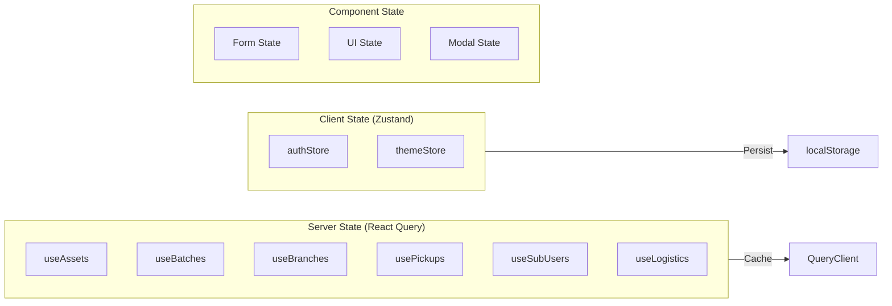

### Query Key Structure

```typescript
// Hierarchical query keys for cache management
const queryKeys = {
  assets: {
    all: ['assets'],
    list: (enterpriseId) => ['assets', 'list', enterpriseId],
    byBranch: (branchId) => ['assets', 'branch', branchId],
    byITAdmin: (userId) => ['assets', 'it-admin', userId],
    detail: (id) => ['assets', 'detail', id],
  },
  batches: {
    all: ['batches'],
    list: (enterpriseId) => ['batches', 'list', enterpriseId],
    byITAdmin: (userId) => ['batches', 'it-admin', userId],
    detail: (id) => ['batches', 'detail', id],
  },
  branches: {
    all: ['branches'],
    list: (enterpriseId) => ['branches', 'list', enterpriseId],
    byITAdmin: (userId) => ['branches', 'it-admin', userId],
    detail: (id) => ['branches', 'detail', id],
  },
  // ... etc
};
```

---

## Database Architecture

### Entity Relationship Diagram

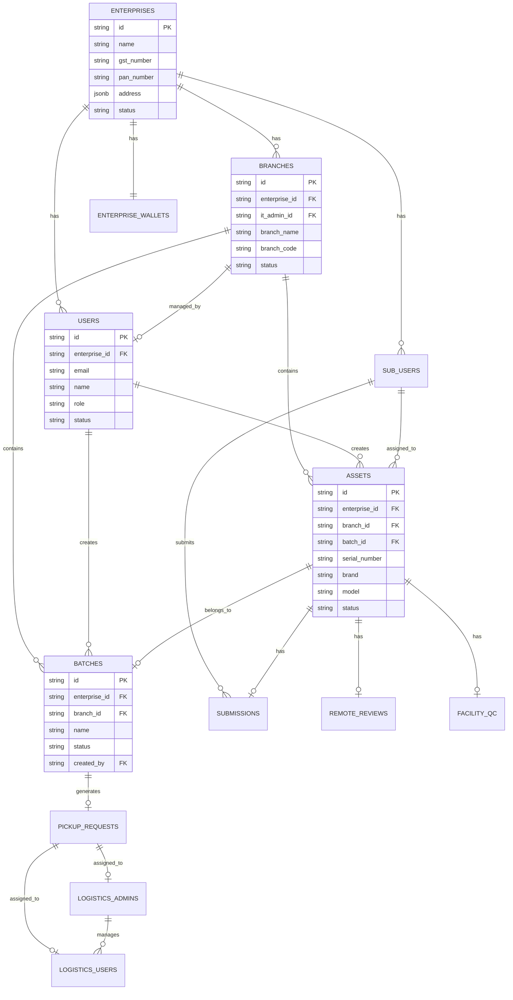

### Core Tables Schema

```sql
-- Enterprises (Client Companies)
CREATE TABLE enterprises (
    id TEXT PRIMARY KEY,
    name TEXT NOT NULL,
    gst_number TEXT UNIQUE,
    pan_number TEXT,
    address JSONB,
    status TEXT DEFAULT 'active',
    created_at TIMESTAMP DEFAULT NOW(),
    updated_at TIMESTAMP DEFAULT NOW()
);

-- Branches (Physical Locations)
CREATE TABLE branches (
    id TEXT PRIMARY KEY,
    enterprise_id TEXT REFERENCES enterprises(id),
    it_admin_id TEXT REFERENCES users(id),
    branch_name TEXT NOT NULL,
    branch_code TEXT NOT NULL,
    address_line1 TEXT,
    city TEXT,
    state TEXT,
    pin_code TEXT,
    site_contact_person TEXT,
    site_contact_phone TEXT,
    status TEXT DEFAULT 'active',
    UNIQUE(enterprise_id, branch_code)
);

-- Users (Admin Accounts)
CREATE TABLE users (
    id TEXT PRIMARY KEY,  -- Same as Supabase Auth user ID
    enterprise_id TEXT REFERENCES enterprises(id),
    email TEXT UNIQUE NOT NULL,
    name TEXT NOT NULL,
    phone TEXT,
    role TEXT NOT NULL,  -- super_admin, main_admin, org_admin, it_admin
    status TEXT DEFAULT 'active',
    created_at TIMESTAMP DEFAULT NOW()
);

-- Sub-Users (Enterprise Employees)
CREATE TABLE sub_users (
    id TEXT PRIMARY KEY,
    enterprise_id TEXT REFERENCES enterprises(id),
    email TEXT UNIQUE NOT NULL,
    name TEXT NOT NULL,
    phone TEXT,
    employee_id TEXT,
    status TEXT DEFAULT 'active',
    created_at TIMESTAMP DEFAULT NOW()
);

-- Assets (Devices)
CREATE TABLE assets (
    id TEXT PRIMARY KEY,
    enterprise_id TEXT REFERENCES enterprises(id),
    branch_id TEXT REFERENCES branches(id),
    batch_id TEXT REFERENCES batches(id),
    serial_number TEXT UNIQUE NOT NULL,
    brand TEXT NOT NULL,
    model TEXT NOT NULL,
    asset_type TEXT NOT NULL,
    specs JSONB,
    assigned_sub_user_id TEXT REFERENCES sub_users(id),
    assigned_user_id TEXT REFERENCES users(id),
    is_self_assigned BOOLEAN DEFAULT FALSE,
    status TEXT DEFAULT 'pending_assignment',
    base_price DECIMAL,
    final_price DECIMAL,
    grade TEXT,
    created_at TIMESTAMP DEFAULT NOW(),
    updated_at TIMESTAMP DEFAULT NOW()
);

-- Batches (Asset Collections)
CREATE TABLE batches (
    id TEXT PRIMARY KEY,
    enterprise_id TEXT REFERENCES enterprises(id),
    branch_id TEXT REFERENCES branches(id),
    name TEXT NOT NULL,
    description TEXT,
    status TEXT DEFAULT 'draft',
    created_by TEXT REFERENCES users(id),
    approved_by TEXT REFERENCES users(id),
    approved_at TIMESTAMP,
    it_admin_notes TEXT,
    org_admin_notes TEXT,
    preferred_pickup_date DATE,
    preferred_pickup_slot TEXT,
    pickup_priority TEXT,
    estimated_value DECIMAL,
    created_at TIMESTAMP DEFAULT NOW()
);

-- Pickup Requests
CREATE TABLE pickup_requests (
    id TEXT PRIMARY KEY,
    enterprise_id TEXT REFERENCES enterprises(id),
    branch_id TEXT REFERENCES branches(id),
    batch_id TEXT REFERENCES batches(id),
    asset_ids TEXT[],
    status TEXT DEFAULT 'pending_assignment',
    logistics_admin_id TEXT REFERENCES logistics_admins(id),
    logistics_user_id TEXT REFERENCES logistics_users(id),
    scheduled_date DATE,
    scheduled_time_slot TEXT,
    it_admin_notes TEXT,
    ops_notes TEXT,
    created_at TIMESTAMP DEFAULT NOW()
);
```

### Database Views

```sql
-- Org Admin Asset View (Nested Hierarchy)
CREATE VIEW org_admin_asset_view AS
SELECT
    b.id as branch_id,
    b.branch_name,
    b.branch_code,
    u.id as it_admin_id,
    u.name as it_admin_name,
    bt.id as batch_id,
    bt.name as batch_name,
    bt.status as batch_status,
    a.id as asset_id,
    a.serial_number,
    a.brand,
    a.model,
    a.status as asset_status,
    su.name as assigned_to
FROM branches b
LEFT JOIN users u ON b.it_admin_id = u.id
LEFT JOIN batches bt ON bt.branch_id = b.id
LEFT JOIN assets a ON a.batch_id = bt.id
LEFT JOIN sub_users su ON a.assigned_sub_user_id = su.id;

-- Pickup Approval Queue
CREATE VIEW pickup_approval_queue AS
SELECT
    bt.id,
    bt.name,
    bt.status,
    bt.created_at,
    bt.preferred_pickup_date,
    bt.it_admin_notes,
    b.branch_name,
    u.name as it_admin_name,
    COUNT(a.id) as asset_count,
    SUM(a.base_price) as total_value
FROM batches bt
JOIN branches b ON bt.branch_id = b.id
JOIN users u ON bt.created_by = u.id
LEFT JOIN assets a ON a.batch_id = bt.id
WHERE bt.status = 'pending_approval'
GROUP BY bt.id, b.branch_name, u.name;
```

---

## API Architecture

### Request Flow

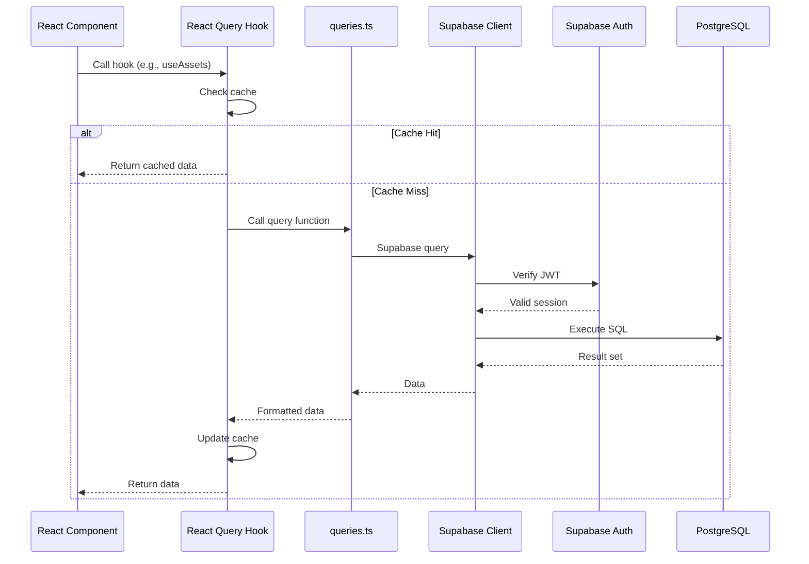

### Mutation Flow

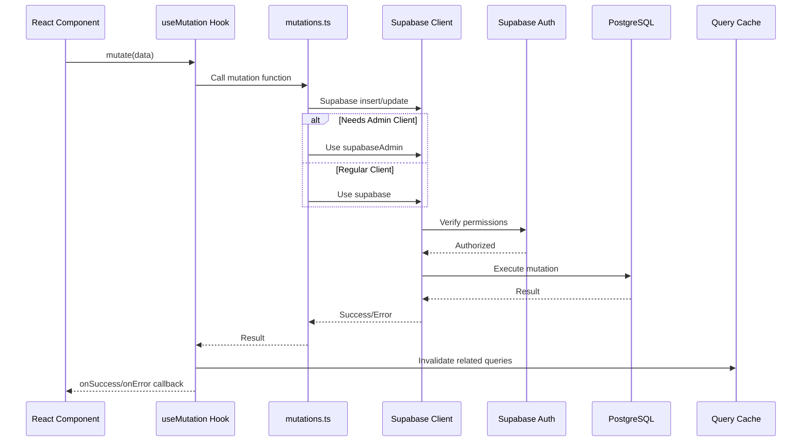

---

## Authentication Architecture

### Auth Flow Diagram

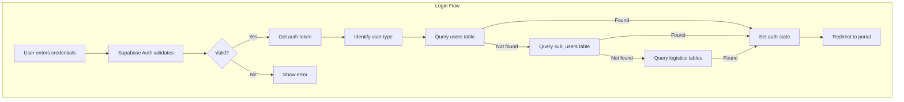

### Role-Based Access Control

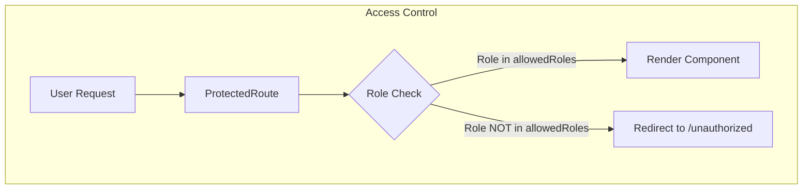

### Permission Matrix

| Permission | super_admin | main_admin | org_admin | it_admin | sub_user | logistics_admin | logistics_user |
|------------|-------------|------------|-----------|----------|----------|-----------------|----------------|
| View all enterprises | ✓ | ✓ | - | - | - | - | - |
| Manage enterprises | ✓ | ✓ | - | - | - | - | - |
| Manage branches | ✓ | ✓ | ✓ | - | - | - | - |
| Manage IT admins | ✓ | ✓ | ✓ | - | - | - | - |
| Manage assets | ✓ | ✓ | - | ✓ | - | - | - |
| Manage batches | ✓ | ✓ | - | ✓ | - | - | - |
| Submit evaluation | - | - | - | ✓ | ✓ | - | - |
| Approve pickups | ✓ | ✓ | ✓ | - | - | - | - |
| Assign logistics | ✓ | ✓ | - | - | - | - | - |
| Manage drivers | - | - | - | - | - | ✓ | - |
| Complete pickups | - | - | - | - | - | - | ✓ |

---

## Data Flow Architecture

### Asset Lifecycle Data Flow

```mermaid
flowchart TB
    subgraph Creation["Asset Creation"]
        IT[IT Admin]
        CREATE[createAsset()]
        ASSET_DB[(assets table)]
    end

    subgraph Assignment["Assignment"]
        ASSIGN[assignAssetToSubUser()]
        SUB[Sub-User]
        EMAIL1[Send notification]
    end

    subgraph Evaluation["Self-Evaluation"]
        EVAL[DeviceSubmit.tsx]
        STORAGE[(Supabase Storage)]
        SUBMIT[createSubmission()]
        SUB_DB[(submissions table)]
    end

    subgraph Review["Remote Review"]
        TECH[Technician]
        REVIEW[createRemoteReview()]
        REVIEW_DB[(remote_reviews table)]
    end

    subgraph Batch["Batch Processing"]
        BATCH[createBatch()]
        BATCH_DB[(batches table)]
        APPROVE[approveBatch()]
    end

    subgraph Pickup["Pickup"]
        PICKUP[createPickupRequest()]
        PICKUP_DB[(pickup_requests table)]
        LA[Logistics Admin]
        LU[Logistics User]
    end

    subgraph QC["Final QC"]
        FACILITY[Facility QC]
        QC_DB[(facility_qc table)]
        GRADE[Assign Grade]
    end

    subgraph Payout["Payout"]
        CALC[Calculate Value]
        WALLET_DB[(enterprise_wallets)]
        TRANS_DB[(credit_transactions)]
    end

    IT --> CREATE --> ASSET_DB
    ASSET_DB --> ASSIGN --> SUB
    ASSIGN --> EMAIL1

    SUB --> EVAL
    EVAL --> STORAGE
    EVAL --> SUBMIT --> SUB_DB

    SUB_DB --> TECH
    TECH --> REVIEW --> REVIEW_DB

    REVIEW_DB --> BATCH --> BATCH_DB
    BATCH_DB --> APPROVE

    APPROVE --> PICKUP --> PICKUP_DB
    PICKUP_DB --> LA --> LU

    LU --> FACILITY --> QC_DB
    QC_DB --> GRADE

    GRADE --> CALC --> WALLET_DB
    CALC --> TRANS_DB
```

---

## File Storage Architecture

### Storage Buckets

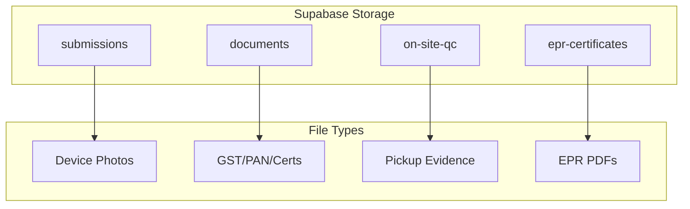

### File Upload Flow

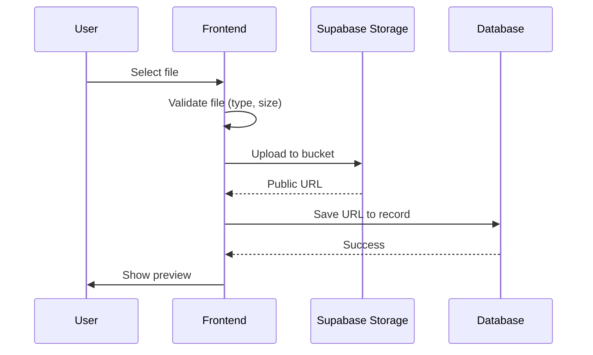

---

## Notification Architecture

### Notification Channels

```mermaid
flowchart LR
    subgraph Triggers["Event Triggers"]
        T1[Asset Assigned]
        T2[Submission Complete]
        T3[Review Decision]
        T4[Batch Submitted]
        T5[Batch Approved]
        T6[Pickup Assigned]
        T7[Payout Processed]
    end

    subgraph System["Notification System"]
        HANDLER[Event Handler]
        TEMPLATE[Template Engine]
        QUEUE[Notification Queue]
    end

    subgraph Channels["Delivery Channels"]
        EMAIL[Email]
        INAPP[In-App]
        SMS[SMS]
        PUSH[Push Notification]
    end

    Triggers --> HANDLER
    HANDLER --> TEMPLATE
    TEMPLATE --> QUEUE
    QUEUE --> Channels
```

### Notification Types

| Event | Recipients | Channels |
|-------|------------|----------|
| Asset assigned | Sub-user | Email, In-app |
| Evaluation submitted | IT Admin | In-app |
| Remote review complete | IT Admin | In-app |
| Batch submitted | Org Admin | Email, In-app |
| Batch approved | IT Admin | Email, In-app |
| Batch rejected | IT Admin | Email, In-app |
| Pickup assigned (LA) | Logistics Admin | Email, In-app |
| Pickup assigned (LU) | Logistics User | In-app, SMS, Push |
| Pickup complete | IT Admin, Org Admin | In-app |
| Payout processed | Org Admin | Email, In-app |

---

## Deployment Architecture

### Environment Setup

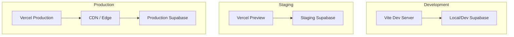

### Environment Variables

```bash
# Development
VITE_SUPABASE_URL=https://dev-project.supabase.co
VITE_SUPABASE_ANON_KEY=eyJ...dev

# Staging
VITE_SUPABASE_URL=https://staging-project.supabase.co
VITE_SUPABASE_ANON_KEY=eyJ...staging

# Production
VITE_SUPABASE_URL=https://prod-project.supabase.co
VITE_SUPABASE_ANON_KEY=eyJ...prod
```

---

## Security Architecture

### Security Layers

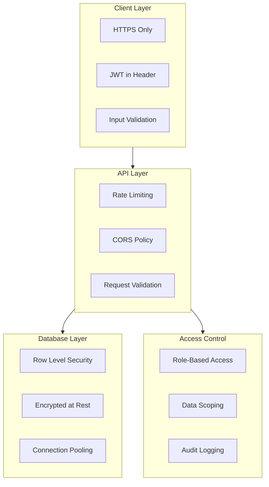

### Row Level Security (RLS)

```sql
-- Example RLS policies (disabled in dev)
-- Enterprise data scoping
CREATE POLICY "Users can view own enterprise" ON assets
    FOR SELECT USING (
        enterprise_id IN (
            SELECT enterprise_id FROM users WHERE id = auth.uid()
        )
    );

-- IT Admin branch scoping
CREATE POLICY "IT Admin can manage branch assets" ON assets
    FOR ALL USING (
        branch_id IN (
            SELECT id FROM branches WHERE it_admin_id = auth.uid()
        )
    );
```

---

## Performance Considerations

### Optimization Strategies

| Area | Strategy | Implementation |
|------|----------|----------------|
| Data Fetching | React Query caching | 60s stale time, background refetch |
| Bundle Size | Code splitting | Lazy load portals |
| Images | Compression | WebP format, responsive sizes |
| Database | Indexes | On foreign keys, frequently queried columns |
| Queries | Pagination | Limit 50 records default |
| Real-time | Selective subscription | Only subscribe to needed tables |

### Query Optimization

```typescript
// Optimized query with pagination
const { data, fetchNextPage } = useInfiniteQuery({
  queryKey: ['assets', enterpriseId],
  queryFn: ({ pageParam = 0 }) =>
    fetchAssets(enterpriseId, { offset: pageParam, limit: 50 }),
  getNextPageParam: (lastPage, pages) =>
    lastPage.length === 50 ? pages.length * 50 : undefined,
  staleTime: 60000,
});
```

---

## Monitoring & Logging

### Log Categories

| Category | Purpose | Examples |
|----------|---------|----------|
| Auth | Login/logout events | User login, session expired |
| Mutations | Data changes | Asset created, batch approved |
| Errors | System errors | API failures, validation errors |
| Audit | Compliance tracking | Who did what, when |

### Error Handling Pattern

```typescript
// Consistent error handling
try {
  const result = await mutation.mutateAsync(data);
  addToast({ type: 'success', message: 'Operation successful' });
} catch (error) {
  console.error('[Mutation Error]', error);
  addToast({
    type: 'error',
    message: error.message || 'Operation failed'
  });
}
```
