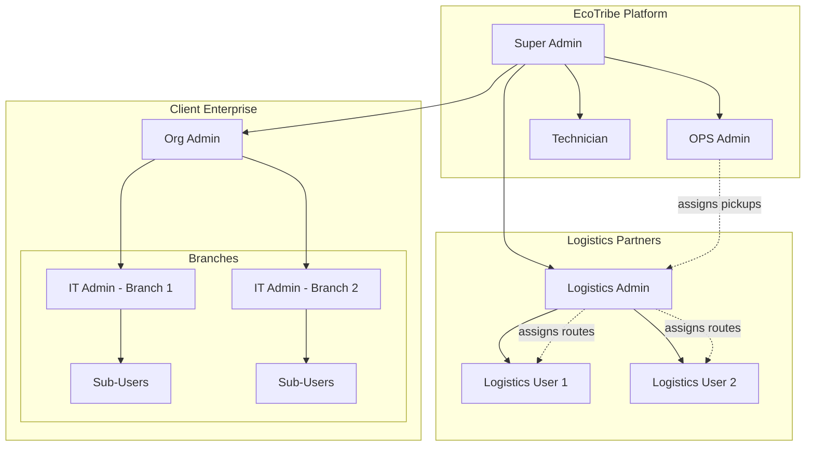

# EcoTribe Product Journey Documentation

## Overview

This documentation provides comprehensive end-to-end user journey flows for all personas in the EcoTribe B2B IT Asset Lifecycle Management Platform.

## Quick Navigation

| Document | Description |
|----------|-------------|
| [User Personas](./01-USER-PERSONAS.md) | Complete persona definitions with goals, permissions, and entry points |
| [Enterprise Onboarding](./02-ENTERPRISE-ONBOARDING.md) | Registration, approval, and initial setup journey |
| [IT Admin Journeys](./03-IT-ADMIN-JOURNEYS.md) | Asset management, batch creation, pickup flows |
| [Sub-User Journeys](./04-SUB-USER-JOURNEYS.md) | Device evaluation and submission flows |
| [Org Admin Journeys](./05-ORG-ADMIN-JOURNEYS.md) | Branch management, approvals, financial tracking |
| [Logistics Journeys](./06-LOGISTICS-JOURNEYS.md) | Pickup assignment and field operations |
| [OPS & Tech Journeys](./07-OPS-TECH-JOURNEYS.md) | Operations, remote review, facility QC |
| [System Architecture](./08-SYSTEM-ARCHITECTURE.md) | Technical architecture and data flow diagrams |

## Platform Summary

### What is EcoTribe?

EcoTribe is a B2B platform that manages the complete lifecycle of enterprise IT asset trade-ins:

```
Enterprise IT Assets → Evaluation → Approval → Pickup → QC → Payout
```

### User Roles Hierarchy



### Core Workflows

```mermaid
flowchart LR
    subgraph Intake["1. Asset Intake"]
        A1[Create Asset]
        A2[Assign to Employee]
    end

    subgraph Evaluation["2. Evaluation"]
        E1[Self-Evaluation]
        E2[Photo Upload]
        E3[Submit]
    end

    subgraph Review["3. Review"]
        R1[Remote Review]
        R2[Accept/Reject]
    end

    subgraph Approval["4. Approval"]
        AP1[Create Batch]
        AP2[Submit for Approval]
        AP3[Org Admin Approves]
    end

    subgraph Pickup["5. Pickup"]
        P1[Assign Logistics]
        P2[Field Pickup]
        P3[On-site QC]
    end

    subgraph QC["6. Final QC"]
        Q1[Facility QC]
        Q2[Grading]
    end

    subgraph Payout["7. Payout"]
        PO1[Calculate Value]
        PO2[Credit Wallet]
    end

    Intake --> Evaluation --> Review --> Approval --> Pickup --> QC --> Payout
```



## Tech Stack Reference

| Layer | Technology |
|-------|------------|
| Frontend | React 19 + TypeScript + Vite |
| Styling | Tailwind CSS + Framer Motion |
| State | React Query + Zustand (auth only) |
| Forms | React Hook Form + Zod |
| Backend | Supabase (PostgreSQL + Auth + Storage) |
| Realtime | Supabase Realtime |

## File Structure

```
docs/journeys/
├── README.md                      # This file
├── 01-USER-PERSONAS.md           # User persona definitions
├── 02-ENTERPRISE-ONBOARDING.md   # Registration & setup
├── 03-IT-ADMIN-JOURNEYS.md       # IT Admin workflows
├── 04-SUB-USER-JOURNEYS.md       # Employee evaluation
├── 05-ORG-ADMIN-JOURNEYS.md      # Enterprise admin flows
├── 06-LOGISTICS-JOURNEYS.md      # Pickup operations
├── 07-OPS-TECH-JOURNEYS.md       # Platform operations
└── 08-SYSTEM-ARCHITECTURE.md     # Technical architecture
```

## How to Use This Documentation

1. **New Team Members**: Start with [User Personas](./01-USER-PERSONAS.md) to understand roles
2. **Feature Development**: Reference the specific journey document for the feature area
3. **Bug Investigation**: Use sequence diagrams to trace data flow
4. **API Development**: Check technical implementation sections for endpoints

## Diagram Rendering

All diagrams use **Mermaid** syntax. To view:
- **GitHub**: Renders automatically
- **VS Code**: Install "Mermaid Markdown Preview" extension
- **IntelliJ/WebStorm**: Built-in Mermaid support
- **Online**: Use [mermaid.live](https://mermaid.live)
